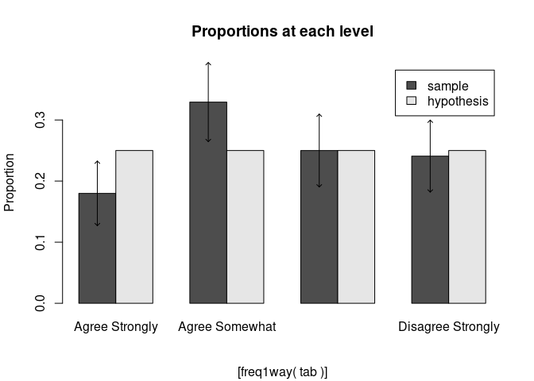
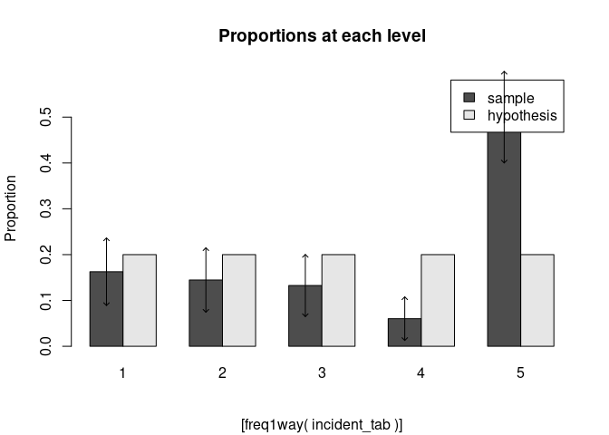
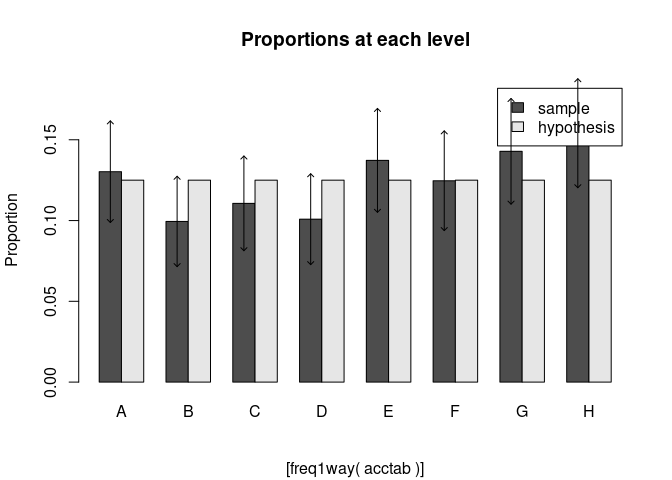

# Number of questions fully completed: 13/14


# 1 Q 9.2

a.) construct a one-way table


```r
library(readxl)
mobile <- read_excel("/home/collindabbieri/Documents/AppliedRegressionAnalysis/Dataxls/Excel/MOBILE.xls")

#head(mobile)
nf=mobile$STYLE
f=mobile$NUMBER
m=rep(nf,f)
mobtab=table(m)
mobtab
```

```
## m
## BH/BT BH/RT LH/LT LH/RI Other RH/RT 
##   396    39    70    18    25   311
```


b.) Estimate the proportion of mobile device users who hold the device with one hand, with a 95% confidence interval


```r
mycip=function(x,n,alpha){
  phat=x/n
  z=qnorm(1-alpha/2,0,1)
  mp=c(-1,1)

  
  #more rigorous version 
  ci=(phat+z^2/(2*n))/(1+z^2/n)+mp*((z)/(1+z^2/n))*sqrt((phat*(1-phat))/(n)+(z^2)/(4*n^2))
  
  return(ci)
}

mycip(70+18+311,396+39+70+18+25+311,0.05)
```

```
## [1] 0.4313735 0.4979299
```

Using a 95% confidence interval, the proportion of mobile device users who hold the device with one hand is 0.4314-0.4979

c.) estimate the difference in proportions for both thumbs and right thumb, using a 95% confidence interval. Interpret the results


```r
mypipj=function(xi,xj,n,alpha){
  pihat=xi/n
  pjhat=xj/n
  z=qnorm(1-alpha/2,0,1)
  pt_est=pihat-pjhat
  total_points=n
  
  radicand=(pihat*(1-pihat)+pjhat*(1-pjhat)+2*pihat*pjhat)/(total_points)
  lower=pt_est-z*sqrt(radicand)
  upper=pt_est+z*sqrt(radicand)
  ci=c(lower,upper)
  
  return(ci)
}

mypipj(396,39+311,396+39+70+18+25+311,0.05)
```

```
## [1] -0.008665938  0.115767219
```

The difference in proportions of people who type with both thumbs and those who type with their right thumb, with a 95% confidence interval, is -0.0087-0.11576. This means that at a 95% confidence level, we can not say that the two proportions are different.

# 2 Q 9.8

A, B, C, D, E
17,27,22,15,19

a.) Find a 90% confidence interval for the true proportion of agricultural engineers who recommend strategy C


```r
mycip(22,17+27+22+15+19,0.1)
```

```
## [1] 0.1597386 0.2950133
```


b.) Find a 90% confidence interval for the difference between the two proportions of agricultural engineers who recommend strategies E and B


```r
mypipj(19,27,17+27+22+15+19,0.1)
```

```
## [1] -0.19078062  0.03078062
```


c.) Find a 90% confidence interval for the true difference between the percentages of A and D


```r
mypipj(17,15,17+27+22+15+19,0.1)
```

```
## [1] -0.0729888  0.1129888
```


# 3 Q 9.12

Agree strongly, Agree somewhat, Disagree somewhat, Disagree strongly
59,108,82,79

a.) Specify the NULL and alternate hypotheses you would use to determine if the opinions of Internet users are evenly divided among the four categories

$H_0$: The true population of the opinions of Internet users are evenly distributed among the four categories

$H_a$: At least two of the categories have different proportions

b.) conduct the test of part a using alpha = 0.05


```r
tab=c(59,108,82,79)
names(tab)=c("Agree Strongly","Agree Somewhat","Disagree Somewhat","Disagree Strongly")
tab
```

```
##    Agree Strongly    Agree Somewhat Disagree Somewhat Disagree Strongly 
##                59               108                82                79
```


```r
library(s20x)
ff=freq1way(tab,hypothprob=rep(1/4,4),conf.level=0.95)
```

```
## data:  tab    n = 328 
## 
## Individual (large sample) 95% CIs 
##  (adjusted for 4 multiple comparisons) 
##                   sample prop conf.lower conf.upper hypoth prob
## Agree Strongly          0.180      0.127      0.233        0.25
## Agree Somewhat          0.329      0.264      0.394        0.25
## Disagree Somewhat       0.250      0.190      0.310        0.25
## Disagree Strongly       0.241      0.182      0.300        0.25
## 
## Chi-square test for hypothesized probabilities 
##     X-squared = 14.8049, df = 3, p-value = 0.001991
```

<!-- -->

We can reject the NULL as implausible at the 95% confidence level

c.) In the context of this problem, what is a Type 1 error? A type 2 error?
A type 1 error is the rejection of a true NULL, so claiming the proportions are not the same when they truly are
A type 2 error is the non-rejection of a false NULL, so claiming the propotions are the same when they are not

d.) what assumptions must hold in order to ensure the validity of the test?
$E(n_i)\geq 5$ for all $n_i$

# 4 Q 9.14

Engineering&Design,Procedures&Practices,Management&Oversight,Training&Communication
27,24,22,10,83

Are there significant differences in the proportion of incidents? Use alpha=0.05


```r
incident_tab=c(27,24,22,10,83)
ff=freq1way(incident_tab,hypothprob=rep(1/5,5),conf.level=0.95)
```

```
## data:  incident_tab    n = 166 
## 
## Individual (large sample) 95% CIs 
##  (adjusted for 5 multiple comparisons) 
##   sample prop conf.lower conf.upper hypoth prob
## 1       0.163      0.089      0.236         0.2
## 2       0.145      0.074      0.215         0.2
## 3       0.133      0.065      0.200         0.2
## 4       0.060      0.013      0.108         0.2
## 5       0.500      0.400      0.600         0.2
## 
## Chi-square test for hypothesized probabilities 
##     X-squared = 98.3976, df = 4, p-value = < 2.2e-16
```

<!-- -->

At a 95% confidence level, we can say that there are differences in the proportion of incidents.

# 5 Q 9.20

$$Z=\frac{Y-np}{\sqrt{npq}}$$

$$Z^2=\frac{(Y-np)^2}{npq}$$

show algebraically that for k=2, $\chi^2=Z^2$

$$\chi^2=\sum_{i=1}^k \frac{[n_i-E(n_i)]^2}{E(n_i)}$$

$$\chi^2 (k=2)=\frac{[n_1-E(n_1)]^2}{E(n_1)}+\frac{[n_2-E(n_2)]^2}{E(n_2)}$$

$$n_1=Y, n_2=n-Y,p_2=q=1-p$$

$$ \chi^2 = \frac{[Y-np]^2}{np} + \frac{[n-Y-n(1-p)]^2}{nq} $$

$$ \chi^2 =\frac{[Y-np]^2}{np} + \frac{[n-Y-n+np]^2}{nq} $$

$$ \chi^2 = \frac{[Y-np]^2}{np} + \frac{[-Y+np]^2}{nq}$$

$$\chi^2 = \frac{[Y-np]^2}{np}+ \frac{[Y-np]^2}{nq}$$

$$ \chi^2 = \frac{q[Y-np]^2}{npq} +\frac{p[Y-np]^2}{npq} $$

$$ \chi^2 = \frac{[Y-np]^2(p+q)}{npq}$$

$$\chi^2=\frac{[Y-np]^2}{npq}$$

$$\chi^2 (k=2)=Z^2$$

# 6 Q 9.22
Males
BH/BT,RH/RT,LH/LT,BH/RT,LH/RI,other
161,118,29,10,6,11

Females
BH/BT,RH/RT,LH/LT,BH/RT,LH/RI,other
235,193,41,29,12,14

Is there significant evidence that the proportions of mobile device users in six texting style categories depends on gender? Use alpha=0.1


```r
mobile=matrix(c(161,118,29,10,6,11,235,193,41,29,12,14),nrow=6,ncol=2)
colnames(mobile)=c("Males","Females")
rownames(mobile)=c("BH/BT","RH/RT","LH/LT","BH/RT","LH/RI","Other")
mobile
```

```
##       Males Females
## BH/BT   161     235
## RH/RT   118     193
## LH/LT    29      41
## BH/RT    10      29
## LH/RI     6      12
## Other    11      14
```


```r
mobtab=as.table(mobile)
chisq.test(mobtab,correct = FALSE)
```

```
## 
## 	Pearson's Chi-squared test
## 
## data:  mobtab
## X-squared = 4.208, df = 5, p-value = 0.5199
```
According to the $\chi^2$ test, we can not reject the NULL, that gender is independent of texting style, as implausible.

# 7 Q 9.24

                                
                                Life as an Employee
                                
                            satisfied    dissatisfied

Job Challenge satisfied        364          33
Job Challenge dissatisfied      24          26

What conclusion can you draw regarding the association between satifaction with job challenge and satisfaction with life?


```r
job=matrix(c(364,33,24,26),nrow=2,ncol=2)
colnames(job)=c("Life satisfied", "Life dissatisfied")
rownames(job)=c("Job Challenge satisfied","Job Challenge dissatisfied")

job
```

```
##                            Life satisfied Life dissatisfied
## Job Challenge satisfied               364                24
## Job Challenge dissatisfied             33                26
```


```r
jobtab=as.table(job)
chisq.test(jobtab,correct = FALSE)
```

```
## 
## 	Pearson's Chi-squared test
## 
## data:  jobtab
## X-squared = 73.978, df = 1, p-value < 2.2e-16
```
According to the $\chi^2$ test, we reject the NULL, that satisfaction with life as an employee is independent of satisfaction with job challenge, as implausible.

# 8 Q 9.26


```r
pacgeese <- read_excel("/home/collindabbieri/Documents/AppliedRegressionAnalysis/Dataxls/Excel/PACGEESE.XLS")
print(pacgeese)
```

```
## # A tibble: 464 x 4
##    FLIGHT ALTITUDE LATERAL RESPONSE
##     <dbl>    <dbl>   <dbl>    <dbl>
##  1      1     0.91    4.99        1
##  2      2     0.91    8.21        1
##  3      3     0.91    3.38        1
##  4      4     9.14   21.1         0
##  5      5     1.52    6.6         1
##  6      6     0.91    3.38        1
##  7      7     3.05    0.16        1
##  8      8     6.1     3.38        1
##  9      9     3.05    6.6         1
## 10     10    12.2     6.6         1
## # … with 454 more rows
```


a.) The researchers categorized altitude as follows: <300,300-600,>600
create a contingency table for altitude category and flight response


```r
alt=pacgeese$ALTITUDE
resp=pacgeese$RESPONSE
alt1_resp0=0
alt1_resp1=0
alt2_resp0=0
alt2_resp1=0
alt3_resp0=0
alt3_resp1=0

for(i in 1:length(alt)){
  if(alt[i]<3.0 & resp[i]==0){
    alt1_resp0=alt1_resp0+1
  }
  if(alt[i]<3.0 & resp[i]==1){
    alt1_resp1=alt1_resp1+1
  }
  if(alt[i]>3.0 & alt[i]<6.0){
    if(resp[i]==0){
      alt2_resp0=alt2_resp0+1
    }
    if(resp[i]==1){
      alt2_resp1=alt2_resp1+1
    }
  }
  if(alt[i]>6.0){
    if(resp[i]==0){
      alt3_resp0=alt3_resp0+1
    }
    if(resp[i]==1){
      alt3_resp1=alt3_resp1+1
    }
  }
}

print(alt1_resp0)
```

```
## [1] 85
```

```r
print(alt1_resp1)
```

```
## [1] 105
```

```r
print(alt2_resp0)
```

```
## [1] 77
```

```r
print(alt2_resp1)
```

```
## [1] 121
```

```r
print(alt3_resp0)
```

```
## [1] 17
```

```r
print(alt3_resp1)
```

```
## [1] 59
```

```r
goosetab=matrix(c(alt1_resp0,alt2_resp0,alt3_resp0,alt1_resp1,alt2_resp1,alt3_resp1),nrow=3,ncol=2)
colnames(goosetab)=c("Response=0","Response=1")
rownames(goosetab)=c("Altitude 1","Altitude 2","Altitude 3")

goosetab
```

```
##            Response=0 Response=1
## Altitude 1         85        105
## Altitude 2         77        121
## Altitude 3         17         59
```


b.) Conduct a test to determine if the flight response of the geese depends on altitude of the helicopter. Use alpha=0.01


```r
tabgoose=as.table(goosetab)
chisq.test(tabgoose,correct=FALSE)
```

```
## 
## 	Pearson's Chi-squared test
## 
## data:  tabgoose
## X-squared = 11.477, df = 2, p-value = 0.00322
```
With 99% confidence, we reject the NULL that flight response is independent of altitude of the helicopter as implausible.

c.) The researchers categorized lateral distance as follows: <1000 m, 1,000-2,000 m, 2,000-3000m and >3,000m. Create a contingency table for lateral distance and flight response


```r
lat=pacgeese$LATERAL
resp=pacgeese$RESPONSE
lat1_resp0=0
lat1_resp1=0
lat2_resp0=0
lat2_resp1=0
lat3_resp0=0
lat3_resp1=0
lat4_resp0=0
lat4_resp1=0

for(i in 1:length(lat)){
  if(lat[i]<10.0 & resp[i]==0){
    lat1_resp0=lat1_resp0+1
  }
  if(lat[i]<10.0 & resp[i]==1){
    lat1_resp1=lat1_resp1+1
  }
  if(lat[i]>10.0 & lat[i]<20.0){
    if(resp[i]==0){
      lat2_resp0=lat2_resp0+1
    }
    if(resp[i]==1){
      lat2_resp1=lat2_resp1+1
    }
  }
  if(lat[i]>20.0&lat[i]<30.0){
    if(resp[i]==0){
      lat3_resp0=lat3_resp0+1
    }
    if(resp[i]==1){
      lat3_resp1=lat3_resp1+1
    }
  }
  if(lat[i]>30.0){
    if(resp[i]==0){
      lat4_resp0=lat4_resp0+1
    }
    if(resp[i]==1){
      lat4_resp1=lat4_resp1+1
    }
  }
}

goosetab=matrix(c(lat1_resp0,lat2_resp0,lat3_resp0,lat4_resp0,lat1_resp1,lat2_resp1,lat3_resp1,lat4_resp1),nrow=4,ncol=2)
colnames(goosetab)=c("Response=0","Response=1")
rownames(goosetab)=c("Lateral Distance 1","Lateral Distance 2","Lateral Distance 3","Lateral Distance 4")
goosetab
```

```
##                    Response=0 Response=1
## Lateral Distance 1         37        243
## Lateral Distance 2         68         37
## Lateral Distance 3         44          4
## Lateral Distance 4         30          1
```


d.) Conduct a test to determine if flight response of the geese depends on lateral distance. Use alpha=0.01

```r
tabgoose=as.table(goosetab)
chisq.test(tabgoose,correct=FALSE)
```

```
## 
## 	Pearson's Chi-squared test
## 
## data:  tabgoose
## X-squared = 207.8, df = 3, p-value < 2.2e-16
```

According to the $\chi^2$ test, we reject the NULL that flight response is independent of lateral distance as implausible, at the 99% confidence level.

e.) The current Federal Aviation Authority minimum altitude standard for flying over the estuary is 610 meters. Based on the results parts a-d, what changes to the FAA regulations do you recommend in order to minimize the effects to Pacific brant geese?

The data suggests that flight response of the geese is dependent on altitude of the helicopters. Additionally, we see flight responses from the geese at altitudes > 610m. Therefore, in order to minimize the effects to Pacific brant geese, the FAA should increase the minimum altitude standard.

# 9 Q 9.30
                Injuries     Total Claims
Conventional    5364              50132
Hybrid           137               1505

a.) identify the two qualitative variables measured for each Honda Accord collision claim

Type of car, and whether or not a claim resulted in an injury.

b.) Form a contingency table giving the number of claims in each combination of the qualitative variable categories


```r
car=matrix(c(5364, 137,50132-5364,1505-137),nrow=2,ncol=2)
colnames(car)=c("Injury","Non-injury")
rownames(car)=c("Conventional","Hybrid")
car
```

```
##              Injury Non-injury
## Conventional   5364      44768
## Hybrid          137       1368
```


c.) Give $H_0$ and $H_a$ for testing whether injury rate for collision claims depends on car model

$H_0$: Injury rate is independent of car model
$H_a$: Injury rate is dependent on car model

d.) Find the expected number of claims in each cell of the contingency table, assuming $H_0$ is true

$E(n_{ij})=\frac{n_{i*}n_{j*}}{n}$


```r
En=matrix(,nrow=2,ncol=2)

for(i in 1:2){
  for(j in 1:2){
    ni_all=car[i,1]+car[i,2]
    nj_all=car[1,j]+car[2,j]
    n_tot=sum(car)
    En[i,j]=ni_all*nj_all/n_tot
  }
}
print(En)
```

```
##           [,1]      [,2]
## [1,] 5340.6691 44791.331
## [2,]  160.3309  1344.669
```


e.) Compute the $\chi^2$ test statistic and compare your answer to the test statistic shown (1346.0996, p<0.0001)


```r
cartab=as.table(car)
chisq.test(cartab,correct=FALSE)
```

```
## 
## 	Pearson's Chi-squared test
## 
## data:  cartab
## X-squared = 3.9139, df = 1, p-value = 0.04789
```
My $\chi^2$ test statistic is different than the $\chi^2$ value given in the book. This is probably because the contingency table in the book has different values than the contingency table given in the words of this problem. This problem says "in a sample of 1505 collision claims for hybrid Accords, 137 involved injuries" meaning the total number of claims was 1505, with 137 of those involving injuries and 1368 with no injury. However the table in the book lists 5364 total claims for hybrid cars with 1505 involving injury and 3859 with no injury. I think the book used the wrong table.

f.) Find the rejection region for the test using alpha=0.05 and compare your answer to the value shown


```r
qchisq(0.05/2,df=1)
```

```
## [1] 0.0009820691
```

```r
qchisq(1-0.05/2,df=1)
```

```
## [1] 5.023886
```

The rejection region for $\chi^2$ with alpha=0.05 is $\chi^2<0.00098$ and $\chi^2>5.0239$

g.) Make the appropriate conclusion using both the rejection region method and the p-value

We can not reject the NULL hypothesis, that the car model and the injury rate are independent, as implausible at the 95% confidence level.

h.) Find a 95% confidence interval for the difference between the injury rates of conventional and hybrid Honda Accords. Use the interval to determine whether the injury rate for hybrid Accords is less than the injury rate for conventional Accords

I wasn't able to figure out how to get confidence intervals for a difference in proportions of a two way table


# 10 Q 9.36

                                           Bacteria Detected in Conventional Test
                                                           
                                               Yes             No

$H_2S$ Test Result   Blackened                7                4                   

                    Not Blackened             0                6
                    
                    
a.) Explain why Fisher's exact test should be used to determine whether the $H_2S$ test result depends on whether or not bacteria is present in the water spectrum
This problem violates the assumption of the $\chi^2$ test.

b.) Construct all possible contingency tables with the same marginal totals as the observed table


```r
for(i in 1:7){
  val=i-1
  c=matrix(c(7-val,val,7-val+val,4+val,6-val,4+6+val-val,7+4,6+0,10+7),nrow=3,ncol=3)
  colnames(c)=c("Yes","No","Total")
  rownames(c)=c("Blackened","Not Blackened","Total")
  print(c)
}
```

```
##               Yes No Total
## Blackened       7  4    11
## Not Blackened   0  6     6
## Total           7 10    17
##               Yes No Total
## Blackened       6  5    11
## Not Blackened   1  5     6
## Total           7 10    17
##               Yes No Total
## Blackened       5  6    11
## Not Blackened   2  4     6
## Total           7 10    17
##               Yes No Total
## Blackened       4  7    11
## Not Blackened   3  3     6
## Total           7 10    17
##               Yes No Total
## Blackened       3  8    11
## Not Blackened   4  2     6
## Total           7 10    17
##               Yes No Total
## Blackened       2  9    11
## Not Blackened   5  1     6
## Total           7 10    17
##               Yes No Total
## Blackened       1 10    11
## Not Blackened   6  0     6
## Total           7 10    17
```


c.) Use the hypergeometric formula to find the probability of each of the tables. Identify the tables that have probabilities less than or equal to the observed.


```r
for(i in 1:7){
  val=i-1
  
  print(dhyper(val,6,11,7))
}
```

```
## [1] 0.01696833
## [1] 0.1425339
## [1] 0.3563348
## [1] 0.3393665
## [1] 0.1272624
## [1] 0.01696833
## [1] 0.0005656109
```

Using a one-sided test, the last two values will contribute to the p-value

d.) Sum the hypergeometric probabilities of the tables identified in c. This is the p-value


```r
p=0
for(i in 6:7){
  val=i-1
  p=p+dhyper(val,6,11,7)
}
print(p)
```

```
## [1] 0.01753394
```


e.) The researchers conclude "the $H_2S$ test showed good agreement with the conventional fecal coliform test." Do you agree? Use alpha=0.1

For alpha=0.1, we reject the NULL hypothesis that the two variables are independent. The $H_2S$ showing agreement with the conventional fecal coliform test is one potential option for the two variables being dependent. However, we do not know if the variables are correlated or anticorrelated. Because of this I do not disagree with the researchers' statement, although I do not know if it is accurate.

# 11 Q 9.50

Does temporarily stopping the simulation affect pilot performance?

                  Number of Kills 
             0   1   2   3   4   Totals
Stops       32  33  19  5   2
No stops   24   36  18  8   3
Totals

Conduct a contingency table analysis and fully interpret the results


```r
pilot=matrix(c(32,24,33,36,19,18,5,8,2,3),nrow=2,ncol=5)
rownames(pilot)=c("Stops","No Stops")
colnames(pilot)=c("0 kills","1 kill","2 kills","3 kills","4 kills")
print(pilot)
```

```
##          0 kills 1 kill 2 kills 3 kills 4 kills
## Stops         32     33      19       5       2
## No Stops      24     36      18       8       3
```

```r
pilottab=as.table(pilot)
fisher.test(pilottab)
```

```
## 
## 	Fisher's Exact Test for Count Data
## 
## data:  pilottab
## p-value = 0.7199
## alternative hypothesis: two.sided
```

We can not reject the NULL hypothesis, that stopping the simulation is independent of pilot performance, as implausible.

# 12 Q 9.52

Fidelity and selectivity of radio receivers
                     Selectivity
                    Low     High
Fidelity   Low     10        6
           High     12      2
           
Using alpha=0.05 is there evidence to suggest the two are dependent?


```r
radio=matrix(c(10,12,6,2),nrow=2,ncol=2)
rownames(radio)=c("Low Fidelity","High Fidelity")
colnames(radio)=c("Low Selectivity","High Selectivity")
print(radio)
```

```
##               Low Selectivity High Selectivity
## Low Fidelity               10                6
## High Fidelity              12                2
```

```r
radtab=as.table(radio)
fisher.test(radtab)
```

```
## 
## 	Fisher's Exact Test for Count Data
## 
## data:  radtab
## p-value = 0.2255
## alternative hypothesis: true odds ratio is not equal to 1
## 95 percent confidence interval:
##  0.02360131 2.10545674
## sample estimates:
## odds ratio 
##  0.2897736
```

There is not sufficient evidence to suggest that selectivity and fidelity are dependent.

# 13 Q 9.54 

Hour of Shift        1  2  3  4  5  6   7   8
Number of Accidents  93 71 79 72 98 89 102 110


a.) Do the data imply that the probabilities of worker accidents are higher in some time periods than in others? Use alpha=0.1


```r
accident=c(93,71,79,72,98,89,102,110)
acctab=as.table(accident)
ff=freq1way(acctab,hypothprob=rep(1/8,8),conf.level=0.9)
```

```
## data:  acctab    n = 714 
## 
## Individual (large sample) 90% CIs 
##  (adjusted for 8 multiple comparisons) 
##   sample prop conf.lower conf.upper hypoth prob
## A       0.130      0.099      0.162       0.125
## B       0.099      0.071      0.127       0.125
## C       0.111      0.081      0.140       0.125
## D       0.101      0.073      0.129       0.125
## E       0.137      0.105      0.169       0.125
## F       0.125      0.094      0.156       0.125
## G       0.143      0.110      0.176       0.125
## H       0.154      0.120      0.188       0.125
## 
## Chi-square test for hypothesized probabilities 
##     X-squared = 15.9048, df = 7, p-value = 0.026
```

<!-- -->

The data does not imply that the probabilities of worker accidents are higher in some time periods at the 90% confidence level.

b.) Do the data provide sufficient evidence to indicate that the probability of an accident during the last 4 hours is greater than the first 4 hours? Use alpha=0.1 (Test $H_0$:$p_1$=0.5 where $p_1$ is the probability of an accident during the last 4 hours)


```r
mycip(98+89+102+110,93+71+79+72+98+89+102+110,0.1)
```

```
## [1] 0.5280936 0.5891093
```

A 90% confidence interval for the proportion of accidents occuring during the last 4 hours is entirely greater than 0.5, suggesting with 90% confidence that the probability of an accident during the last 4 hours is greater than the probability of an accident during the first 4 hours.

# 14 Q 9.55

Is there sufficient evidence to indicate that the probability of finding Manganese nodules in the deep-sea Earth's crust is dependent on the magnetic age of the crust? Use alpha =0.05


                              Number of Specimens  Percentage with Manganese Nodules

Miocene-recent                  389                 5.9
Oligocene                       140                 17.9
Eocene                          214                 16.4
Paleocene                       84                  21.4
Late Cretaceous                 247                 21.1
Early and Middle Cretaceous     1120                14.2
Jurassic                        99                  11.0


```r
Mn=matrix(c(389*0.059,140*0.179,214*0.164,84*0.214,247*0.211,1120*0.142,99*0.110,389-389*0.059,140-140*0.179,214-214*0.164,84-84*0.214,247-247*0.211,1120-1120*0.142,99-99*0.11),nrow=7,ncol=2)
rownames(Mn)=c("Miocene-recent","Oligocene","Eocene","Paleocene","Late Cretaceous","Early and Middle Cretaceous","Jurassic")
colnames(Mn)=c("Yes","No")
mode(Mn) <- "integer"
Mn
```

```
##                             Yes  No
## Miocene-recent               22 366
## Oligocene                    25 114
## Eocene                       35 178
## Paleocene                    17  66
## Late Cretaceous              52 194
## Early and Middle Cretaceous 159 960
## Jurassic                     10  88
```


```r
Mntab=as.table(Mn)
chisq.test(Mntab,correct=FALSE)
```

```
## 
## 	Pearson's Chi-squared test
## 
## data:  Mntab
## X-squared = 39.766, df = 6, p-value = 5.064e-07
```
According to the $\chi^2$ test, we can reject the NULL hypothesis, that the geologic age and the likelihood of finding Manganese are independent, as implausible at the 95% confidence level.
