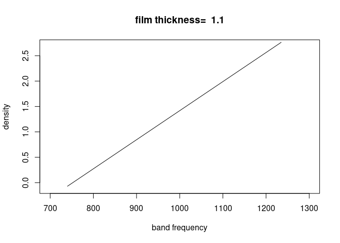
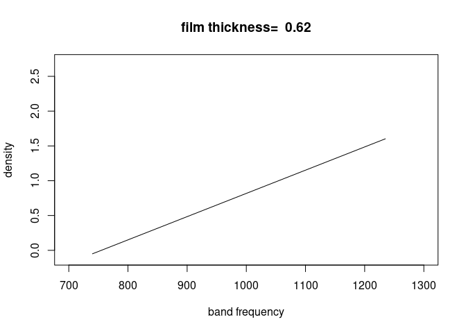
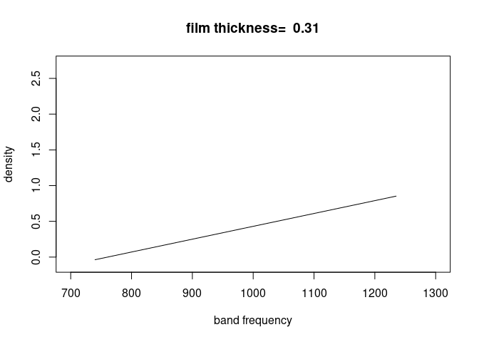
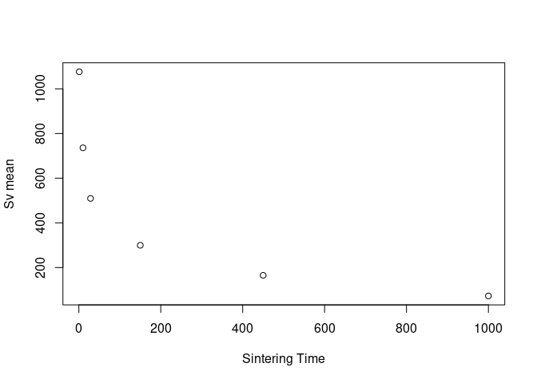
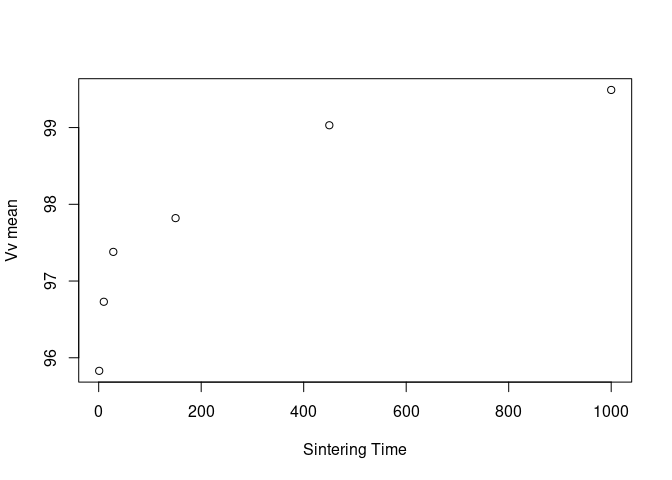
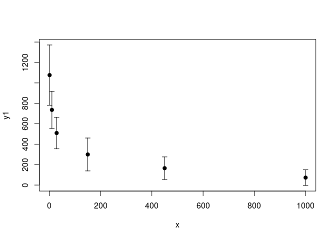

# Number of questions complete: 6/6

# Functions {.tabset .tabset-pills .tabset-fade}

## Myy()


```r
myy=function(x,Y,X,alpha){
  n=nrow(X)
  k=ncol(X)-1
  model=lm(Y~X[,-1])
  r=model$residuals
  coeff=model$coefficients
  yhat=coeff[1]
  for(i in 1:k){
    yhat=yhat+(coeff[i+1]*x[i])
  }

  SSE=sum(r^2)
  s=sqrt(SSE/(n-(k+1)))
  t=qt(1-alpha/2,n-(k+1))
  pm=c(-1,1)
  
  ci=yhat+pm*t*s*sqrt(1+t(x)%*%solve(t(X)%*%X)%*%x)
  
  return(list(yhat=yhat,ci=ci))
}
```


## Myl()


```r
myl=function(Y,X,alpha,a,l){
  
  n=nrow(X)
  k=ncol(X)-1
  t=qt(1-alpha/2,n-(k+1))
  pm=c(-1,1)
  
  model=lm(Y~X[,-1])
  coeff=model$coefficients
  
  betahat=matrix(data=coeff,nrow=k+1,ncol=1)
  
  coeff=model$coefficients
  r=model$residuals
  SSE=sum(r^2)
  s=sqrt(SSE/(n-(k+1)))
  
  ci=l+pm*t*s*sqrt(t(a)%*%solve(t(X)%*%X)%*%a)

  return(list(ci=ci))
  
}
```


# 1 Q 11.62
The data on number of vehicles (x) and congestion time (y) are reproduced in the table. Consider the straight-line model $E(y)=\beta_0+\beta_1x$.


```r
tab=matrix(c(1,2,3,4,5,6,7,8,9,10,11,12,13,14,15,0,0,2,1,1,1,3,3,2,4,4,4,3,4,5),nrow=15,ncol=2)
colnames(tab)=c("Number of vehicles, x","Congestion Time, y")
tab
```

```
##       Number of vehicles, x Congestion Time, y
##  [1,]                     1                  0
##  [2,]                     2                  0
##  [3,]                     3                  2
##  [4,]                     4                  1
##  [5,]                     5                  1
##  [6,]                     6                  1
##  [7,]                     7                  3
##  [8,]                     8                  3
##  [9,]                     9                  2
## [10,]                    10                  4
## [11,]                    11                  4
## [12,]                    12                  4
## [13,]                    13                  3
## [14,]                    14                  4
## [15,]                    15                  5
```

a) Construct Y and X matrices for the data


```r
Y=matrix(tab[,2],nrow=15,ncol=1)

X=matrix(,nrow=15,ncol=2)
X[,1]=1
X[,2]=tab[,1]

Y
```

```
##       [,1]
##  [1,]    0
##  [2,]    0
##  [3,]    2
##  [4,]    1
##  [5,]    1
##  [6,]    1
##  [7,]    3
##  [8,]    3
##  [9,]    2
## [10,]    4
## [11,]    4
## [12,]    4
## [13,]    3
## [14,]    4
## [15,]    5
```

```r
X
```

```
##       [,1] [,2]
##  [1,]    1    1
##  [2,]    1    2
##  [3,]    1    3
##  [4,]    1    4
##  [5,]    1    5
##  [6,]    1    6
##  [7,]    1    7
##  [8,]    1    8
##  [9,]    1    9
## [10,]    1   10
## [11,]    1   11
## [12,]    1   12
## [13,]    1   13
## [14,]    1   14
## [15,]    1   15
```

b) Find X'X and X'Y


```r
t(X)%*%X
```

```
##      [,1] [,2]
## [1,]   15  120
## [2,]  120 1240
```

```r
t(X)%*%Y
```

```
##      [,1]
## [1,]   37
## [2,]  386
```

c) Find the least-squares estimates $\hat{\beta}=(X'X)^{-1}X'Y$


```r
betahat=solve(t(X)%*%X)%*%t(X)%*%Y
betahat
```

```
##            [,1]
## [1,] -0.1047619
## [2,]  0.3214286
```

d) Find SSE and $s^2$


```r
n=nrow(X)
k=ncol(X)-1


model=lm(Y~X[,-1])
coeff=model$coefficients

betahat=matrix(data=coeff,nrow=k+1,ncol=1)

coeff=model$coefficients
r=model$residuals
SSE=sum(r^2)
s2=SSE/(n-(k+1))
s=sqrt(s2)

SSE
```

```
## [1] 6.804762
```

```r
s2
```

```
## [1] 0.5234432
```


e) Conduct the test $H_0:\beta_1=0$ vs. $H_a:\beta_1>0$ at $\alpha=0.01$


```r
pm=c(-1,1)
alpha=0.01
n=nrow(X)
k=ncol(X)-1
t=qt(1-alpha/2,n-(k+1))
a=matrix(c(0,1),nrow=k+1,ncol=1)

l=t(a)%*%betahat

ci=l+pm*t*s*sqrt(t(a)%*%solve(t(X)%*%X)%*%a)
```

```
## Warning in pm * t * s * sqrt(t(a) %*% solve(t(X) %*% X) %*% a): Recycling array of length 1 in vector-array arithmetic is deprecated.
##   Use c() or as.vector() instead.
```

```
## Warning in l + pm * t * s * sqrt(t(a) %*% solve(t(X) %*% X) %*% a): Recycling array of length 1 in array-vector arithmetic is deprecated.
##   Use c() or as.vector() instead.
```

```r
ci
```

```
## [1] 0.1911867 0.4516704
```

We do not have significant evidence that $\beta_1$ does not equal zero because our confidence interval for $\beta_1$ includes 0. Therefore we can not reject the NULL at the 0.01 level

f) Find and interpret $R^2$

```r
summary(model)
```

```
## 
## Call:
## lm(formula = Y ~ X[, -1])
## 
## Residuals:
##     Min      1Q  Median      3Q     Max 
## -1.0738 -0.5202 -0.1809  0.5512  1.1405 
## 
## Coefficients:
##             Estimate Std. Error t value Pr(>|t|)    
## (Intercept) -0.10476    0.39312  -0.266    0.794    
## X[, -1]      0.32143    0.04324   7.434 4.95e-06 ***
## ---
## Signif. codes:  0 '***' 0.001 '**' 0.01 '*' 0.05 '.' 0.1 ' ' 1
## 
## Residual standard error: 0.7235 on 13 degrees of freedom
## Multiple R-squared:  0.8096,	Adjusted R-squared:  0.7949 
## F-statistic: 55.27 on 1 and 13 DF,  p-value: 4.946e-06
```

$R^2$ is 0.8096. This is the model sum of squares divided by the total sum of squares and so it gives an idea of how much of the data is explained by the model. Good models have values close to 1. However $R^2$ has no penalty for the complexity of the model so models with good $R^2$ and a lot of parameters might be overfit.

g) Find and interpret a 99% prediction interval for y when x=5


```r
x=matrix(c(1,5),nrow=k+1,ncol=1)

ci=myy(x,Y,X,0.01)
```

```
## Warning in pm * t * s * sqrt(1 + t(x) %*% solve(t(X) %*% X) %*% x): Recycling array of length 1 in vector-array arithmetic is deprecated.
##   Use c() or as.vector() instead.
```

```r
ci
```

```
## $yhat
## (Intercept) 
##   0.2166667 
## 
## $ci
## [1] -2.067831  2.501164
```

When the number of vehicles is 5, we can say with 99% confidence that the congestion time will be in the interval given by ci.

# 2 Q 11.64


Refer to the Applied Spectroscopy study of the optical density (y) for infrared absorption of the liquid PPFPO. In addition to optical density, band frequency ($x_1$) and film thickness ($x_2$) were measured for 12 experiments


```r
library(readxl)
ppfpo=read_excel("../../Dataxls/Excel/PPFPO.XLS")
head(ppfpo)
```

```
## # A tibble: 6 x 3
##   DENSITY BANDFREQ THICKNESS
##     <dbl>    <dbl>     <dbl>
## 1   0.231      740      1.1 
## 2   0.107      740      0.62
## 3   0.053      740      0.31
## 4   0.129      805      1.1 
## 5   0.069      805      0.62
## 6   0.03       805      0.31
```


a) Write an interaction model for optical density (y) as a function of band frequency ($x_1$) and film thickness ($x_2$)

$$E(y)=\beta_0 + \beta_1x_1+\beta_2x_2 +\beta_3x_1x_2$$

b) Give a practical explanation of the statement, "band frequency ($x_1$) and film thickness ($x_2$) interact."

This means that the effect on E(y) of a change in $x_1$ depends on the value of $x_2$. And vice versa, the effect on E(y) of a change in $x_2$ depends on the value of $x_1$.

c) A MINITAB printout for the interaction model, part a), is shown at the bottom of the page. Give the least-squares prediction equation

$E(y)=-0.214+0.000257x_1 -3.72 x_2 + 0.00497x_1x_2$

d) Is there sufficient evidence (at $\alpha=0.01$) of interaction between band frequency and film thickness?
Yes, the FREQ_THICK term in the MINITAB plot has a p-value of 0.001, meaning there is sufficient evidence for the significance of that term.

e) For each level of film thickness ($x_2$), use the $\beta$ estimates of the model to sketch the relationship between optical density (y) and band frequency ($x_1$).


```r
library(ggplot2)
y=ppfpo[,1]
x1=ppfpo[,2]
x2=ppfpo[,3]


#Ey=-0.214+0.000257*x1

#print(x2[1,1])

#print(0.00497*x1%*%x2[1,1])
for(i in 1:3){
  x_plot=c()
  y_plot=c()
  for(j in 1:12){
    val=ppfpo[i,3]
    x=ppfpo[j,2]
    Ey=-0.214+0.000257*x-3.72*val+0.00497*x*val
    x_plot=append(x_plot,x)
    y_plot=append(y_plot,Ey)
  }
  names(y_plot)="optical density"
  names(x_plot)="band frequency"
  plot(x_plot,y_plot,type="l",xlab="band frequency",ylab="density",xlim=c(700,1300),ylim=c(-0.1,2.7),main=paste("film thickness= ",toString(ppfpo[i,3])))
}
```

<!-- --><!-- --><!-- -->


f) Do the analysis in R and give summary output


```r
y=unlist(ppfpo[,1])
x1=unlist(ppfpo[,2])
x2=unlist(ppfpo[,3])
model=lm(y~x1+x2+x1:x2)
summary(model)
```

```
## 
## Call:
## lm(formula = y ~ x1 + x2 + x1:x2)
## 
## Residuals:
##       Min        1Q    Median        3Q       Max 
## -0.293152 -0.113553 -0.006905  0.108435  0.305357 
## 
## Coefficients:
##               Estimate Std. Error t value Pr(>|t|)    
## (Intercept) -0.2142726  0.6866298  -0.312 0.762970    
## x1           0.0002567  0.0007157   0.359 0.729120    
## x2          -3.7199883  0.9146937  -4.067 0.003599 ** 
## x1:x2        0.0049655  0.0009535   5.208 0.000815 ***
## ---
## Signif. codes:  0 '***' 0.001 '**' 0.01 '*' 0.05 '.' 0.1 ' ' 1
## 
## Residual standard error: 0.2057 on 8 degrees of freedom
## Multiple R-squared:  0.9596,	Adjusted R-squared:  0.9445 
## F-statistic: 63.42 on 3 and 8 DF,  p-value: 6.419e-06
```


# 3 Q 11.68

The Journal of Applied Ecology published a study of the feeding habits of baby snow geese. The data on gosling weight change, digestion efficiency, acid-detergent fiber (all measured as percentages) and diet (plants or duck chow) for 42 feeding trials are saved in the SNOWGEESE file. Selected observations are shown in the following table. The botanists were interested in predicting weight change (y) as a function of the other variables. Consider the first-order model $E(y)=\beta_0+\beta_1x_1+\beta_2x_2$, where $x_1$ is digestion efficiency and $x_2$ is acid-detergent fiber.


```r
snowgeese=read_excel("../../Dataxls/Excel/SNOWGEESE.xls")
head(snowgeese)
```

```
## # A tibble: 6 x 5
##   Trial Diet   WtChange DigEff ADFiber
##   <dbl> <chr>     <dbl>  <dbl>   <dbl>
## 1     1 Plants     -6      0      28.5
## 2     2 Plants     -5      2.5    27.5
## 3     3 Plants     -4.5    5      27.5
## 4     4 Plants      0      0      32.5
## 5     5 Plants      2      0      32  
## 6     6 Plants      3.5    1      30
```

a) Find the least-squares prediction equation for weight change, y


```r
y=unlist(snowgeese$WtChange)
x1=unlist(snowgeese$DigEff)
x2=unlist(snowgeese$ADFiber)
model=lm(y~x1+x2)
model$coefficients
```

```
## (Intercept)          x1          x2 
## 12.18043771 -0.02653926 -0.45783404
```


$$E(y)=12.18-0.027x_1-0.46x_2$$
where $x_1$ is digestion efficiency and $x_2$ is acid-detergent fiber.

b) Interpret the $\beta$-estimates in the equation, part a.

The beta matrix gives the values for the coefficients of the line of best fit for predicting y.

c) Conduct a test to determine if digestion efficiency, $x_1$, is a useful linear predictor of weight change. Use $\alpha=0.01$


```r
y=unlist(snowgeese$WtChange)
x1=unlist(snowgeese$DigEff)
x2=unlist(snowgeese$ADFiber)
n=length(snowgeese$WtChange)
k=2
Y=matrix(snowgeese$WtChange,nrow=n,ncol=1)
X=matrix(,nrow=n,ncol=k+1)
X[,1]=1
X[,2]=snowgeese$DigEff
X[,3]=snowgeese$ADFiber

a=matrix(c(0,1,0),nrow=k+1,ncol=1)

model=lm(y~x1+x2)
betahat=matrix(model$coefficients,nrow=k+1,ncol=1)
l=t(a)%*%betahat
alpha=0.01

ci=myl(Y,X,alpha,a,l)
```

```
## Warning in pm * t * s * sqrt(t(a) %*% solve(t(X) %*% X) %*% a): Recycling array of length 1 in vector-array arithmetic is deprecated.
##   Use c() or as.vector() instead.
```

```
## Warning in l + pm * t * s * sqrt(t(a) %*% solve(t(X) %*% X) %*% a): Recycling array of length 1 in array-vector arithmetic is deprecated.
##   Use c() or as.vector() instead.
```

```r
ci
```

```
## $ci
## [1] -0.1713790  0.1183005
```

At the 99% confidence level, we can not claim to have evidence against the NULL hypothesis that $\beta_1$=0. We can not claim that $x_1$ is a useful linear predictor of weight change.

d) Form a 99% confidence interval for $\beta_2$. Interpret the result.


```r
a=matrix(c(0,0,1),nrow=k+1,ncol=1)
l=t(a)%*%betahat
ci=myl(Y,X,alpha,a,l)
```

```
## Warning in pm * t * s * sqrt(t(a) %*% solve(t(X) %*% X) %*% a): Recycling array of length 1 in vector-array arithmetic is deprecated.
##   Use c() or as.vector() instead.
```

```
## Warning in l + pm * t * s * sqrt(t(a) %*% solve(t(X) %*% X) %*% a): Recycling array of length 1 in array-vector arithmetic is deprecated.
##   Use c() or as.vector() instead.
```

```r
ci
```

```
## $ci
## [1] -0.8051939 -0.1104742
```
we can say with 99% confidence that $\beta_2$ will fall in that range.

e) Find and interpret $R^2$ and $R_a^2$. Which statistic is the preferred measure of model fit? Explain.


```r
summary(model)
```

```
## 
## Call:
## lm(formula = y ~ x1 + x2)
## 
## Residuals:
##     Min      1Q  Median      3Q     Max 
## -7.0649 -2.0241  0.5645  2.4590  6.8556 
## 
## Coefficients:
##             Estimate Std. Error t value Pr(>|t|)    
## (Intercept) 12.18044    4.40236   2.767 0.008610 ** 
## x1          -0.02654    0.05349  -0.496 0.622555    
## x2          -0.45783    0.12828  -3.569 0.000969 ***
## ---
## Signif. codes:  0 '***' 0.001 '**' 0.01 '*' 0.05 '.' 0.1 ' ' 1
## 
## Residual standard error: 3.519 on 39 degrees of freedom
## Multiple R-squared:  0.5288,	Adjusted R-squared:  0.5046 
## F-statistic: 21.88 on 2 and 39 DF,  p-value: 4.25e-07
```

$R^2=0.5288$, $R^2_a=0.5046$. This means that about half of the total variation in the data is explained by the model. Adjusted $R^2$ is the preferred measure of model fit because it contains a penalty for the complexity of the model, which helps combat overfitting.

f) Is the overall model statistically useful for predicting weight change? Test using $\alpha=0.05$


```r
summary(model)
```

```
## 
## Call:
## lm(formula = y ~ x1 + x2)
## 
## Residuals:
##     Min      1Q  Median      3Q     Max 
## -7.0649 -2.0241  0.5645  2.4590  6.8556 
## 
## Coefficients:
##             Estimate Std. Error t value Pr(>|t|)    
## (Intercept) 12.18044    4.40236   2.767 0.008610 ** 
## x1          -0.02654    0.05349  -0.496 0.622555    
## x2          -0.45783    0.12828  -3.569 0.000969 ***
## ---
## Signif. codes:  0 '***' 0.001 '**' 0.01 '*' 0.05 '.' 0.1 ' ' 1
## 
## Residual standard error: 3.519 on 39 degrees of freedom
## Multiple R-squared:  0.5288,	Adjusted R-squared:  0.5046 
## F-statistic: 21.88 on 2 and 39 DF,  p-value: 4.25e-07
```

We can see that the F test returns a p-value<0.05. Meaning we can reject the Null $H_0:\beta_1=\beta_2=0$. Therefore, the model is adequate at the 95% confidence level.

# 4 Q 11.70

An experiment was conducted to investigate the effect of extrusion pressure P and temperature at extrusion T on the strength y of a new type of plastic. Two plastic specimens were prepared for each of five combinations of pressure and temperature. The specimens were then tested in random order, and the breaking strength for each specimen was recorded. The independent variables were coded as follows to simplify computations

$$x_1=\frac{P-200}{10}$$
$$x_2=\frac{T-400}{25}$$
The n=10 data points are listed in the table


```r
plastic=matrix(c(5.2,0.3,-1.2,2.2,6.2,5.0,-0.1,-1.1,2.0,6.1,-2,-1,0,1,2,2,-1,-2,-1,2),nrow=5,ncol=4)
colnames(plastic)=c("y1","y2","x1","x2")
plastic
```

```
##        y1   y2 x1 x2
## [1,]  5.2  5.0 -2  2
## [2,]  0.3 -0.1 -1 -1
## [3,] -1.2 -1.1  0 -2
## [4,]  2.2  2.0  1 -1
## [5,]  6.2  6.1  2  2
```

a) Give the Y and X matrices needed to fit the model $y=\beta_0+\beta_1x_1+\beta_2x_2+\epsilon$


```r
X=matrix(,nrow=5,ncol=3)
X[,1]=1
X[,2]=plastic[,3]
X[,3]=plastic[,4]
X
```

```
##      [,1] [,2] [,3]
## [1,]    1   -2    2
## [2,]    1   -1   -1
## [3,]    1    0   -2
## [4,]    1    1   -1
## [5,]    1    2    2
```

```r
Y1=matrix(plastic[,1],nrow=5,ncol=1)
Y2=matrix(plastic[,2],nrow=5,ncol=1)

Y=(Y1+Y2)/2
Y
```

```
##       [,1]
## [1,]  5.10
## [2,]  0.10
## [3,] -1.15
## [4,]  2.10
## [5,]  6.15
```


b) Find the least-squares prediction equation. Interpret the $\beta$ estimates.


```r
x1=unlist(plastic[,3])
x2=unlist(plastic[,4])
model=lm(Y~x1+x2)
model$coefficients
```

```
## (Intercept)          x1          x2 
##    2.460000    0.410000    1.614286
```

$$E(y)=2.46+0.41x_1+1.61x_2$$

The beta matrix gives the values for the coefficients of the line of best fit for predicting y.

c) Find SSE, $s^2$, and s. Interpret the value of s.


```r
n=nrow(X)
k=ncol(X)-1
r=model$residuals
SSE=sum(r^2)
s=sqrt(SSE/(n-(k+1)))
s2=s^2
SSE
```

```
## [1] 1.153143
```

```r
s
```

```
## [1] 0.759323
```
s is the standard deviation of the 3 dimensional line of best fit for the data

d) Does the model contribute information for the prediction of y? Test using $\alpha=0.05$.


```r
summary(model)
```

```
## 
## Call:
## lm(formula = Y ~ x1 + x2)
## 
## Residuals:
##       1       2       3       4       5 
##  0.2314 -0.3357 -0.3814  0.8443 -0.3586 
## 
## Coefficients:
##             Estimate Std. Error t value Pr(>|t|)  
## (Intercept)   2.4600     0.3396   7.244   0.0185 *
## x1            0.4100     0.2401   1.707   0.2299  
## x2            1.6143     0.2029   7.955   0.0154 *
## ---
## Signif. codes:  0 '***' 0.001 '**' 0.01 '*' 0.05 '.' 0.1 ' ' 1
## 
## Residual standard error: 0.7593 on 2 degrees of freedom
## Multiple R-squared:  0.9707,	Adjusted R-squared:  0.9413 
## F-statistic:  33.1 on 2 and 2 DF,  p-value: 0.02933
```
The p-value for the F-test is less than 0.05, so the model provides information for the prediction of y at the 95% confidence level.

e) Find $R^2$ and interpret its value. 


```r
summary(model)
```

```
## 
## Call:
## lm(formula = Y ~ x1 + x2)
## 
## Residuals:
##       1       2       3       4       5 
##  0.2314 -0.3357 -0.3814  0.8443 -0.3586 
## 
## Coefficients:
##             Estimate Std. Error t value Pr(>|t|)  
## (Intercept)   2.4600     0.3396   7.244   0.0185 *
## x1            0.4100     0.2401   1.707   0.2299  
## x2            1.6143     0.2029   7.955   0.0154 *
## ---
## Signif. codes:  0 '***' 0.001 '**' 0.01 '*' 0.05 '.' 0.1 ' ' 1
## 
## Residual standard error: 0.7593 on 2 degrees of freedom
## Multiple R-squared:  0.9707,	Adjusted R-squared:  0.9413 
## F-statistic:  33.1 on 2 and 2 DF,  p-value: 0.02933
```
$R^2=0.9707$ suggesting that the model represents the data very well. 

f) Test the NULL hypothesis that $\beta_1=0$. Use $\alpha=0.05$. What is the practical implication of the test?


```r
alpha=0.05
a=matrix(c(0,1,0),nrow=3,ncol=1)
betahat=matrix(model$coefficients,nrow=3,ncol=1)
l=t(a)%*%betahat
ci=myl(Y,X,alpha,a,l)
```

```
## Warning in pm * t * s * sqrt(t(a) %*% solve(t(X) %*% X) %*% a): Recycling array of length 1 in vector-array arithmetic is deprecated.
##   Use c() or as.vector() instead.
```

```
## Warning in l + pm * t * s * sqrt(t(a) %*% solve(t(X) %*% X) %*% a): Recycling array of length 1 in array-vector arithmetic is deprecated.
##   Use c() or as.vector() instead.
```

```r
ci
```

```
## $ci
## [1] -0.6231487  1.4431487
```
We can not reject the NULL hypothesis that $\beta_1=0$. Practically speaking this means that $x_1$ might not be necessary for predicting y.

g) Find a 90% confidence interval for the mean strength of the plastic for $x_1=-2$ and $x_2=2$


```r
alpha=0.1
x=matrix(c(1,-2,2),nrow=3,ncol=1)
ci=myy(x,Y,X,alpha)
```

```
## Warning in pm * t * s * sqrt(1 + t(x) %*% solve(t(X) %*% X) %*% x): Recycling array of length 1 in vector-array arithmetic is deprecated.
##   Use c() or as.vector() instead.
```

```r
ci
```

```
## $yhat
## (Intercept) 
##  -0.3585714 
## 
## $ci
## [1] -3.403276  2.686134
```


h) Suppose a single specimen of the plastic is to be installed in the entire mount of a Douglas DC-10 aircraft. Find a 90% prediction interval for the strength of this specimen if $x_1=-2$ and $x_2=2$.


```r
alpha=0.1
x=matrix(c(1,-2,2),nrow=3,ncol=1)
ci=myy(x,Y,X,alpha)
```

```
## Warning in pm * t * s * sqrt(1 + t(x) %*% solve(t(X) %*% X) %*% x): Recycling array of length 1 in vector-array arithmetic is deprecated.
##   Use c() or as.vector() instead.
```

```r
ci
```

```
## $yhat
## (Intercept) 
##  -0.3585714 
## 
## $ci
## [1] -3.403276  2.686134
```


# 5 Q 11.72

A quasar is a distant celestial object that provides a powerful source of radio energy. The Astronomical Journal reported on a study of 90 quasars detected by a deep space survey. The survey enabled astronomers to measure several different quantitative characteristics of each quasar, including redshift range, line flux (erg $cm^{-2}$ $s^{-1}$), line luminosity (erg $s^{-1}$), $AB_{1450}$ magnitude, absolute magnitude, and rest frame equivalent width. The data for a sample of 25 large redshift quasars are saved in the QUASAR file


```r
quasar=read_excel('../../Dataxls/Excel/QUASAR.XLS')
head(quasar)
```

```
## # A tibble: 6 x 7
##   QUASAR REDSHIFT LINEFLUX LUMINOSITY AB1450 ABSMAG RFEWIDTH
##    <dbl>    <dbl>    <dbl>      <dbl>  <dbl>  <dbl>    <dbl>
## 1      1     2.81    -13.5       45.3   19.5  -26.3      117
## 2      2     3.07    -13.7       45.1   19.6  -26.3       82
## 3      3     3.45    -13.9       45.1   18.9  -27.2       33
## 4      4     3.19    -13.3       45.6   18.6  -27.4       92
## 5      5     3.07    -13.6       45.3   19.6  -26.3      114
## 6      6     4.15    -14.0       45.2   19.4  -27.0       50
```

a) Hypothesize a first-order model for equivalent width, y, as a function of the first four variables in the table.

$$E(y)=\beta_0+\beta_1x_1+\beta_2x_2+\beta_3x_3+\beta_4x_4$$

Where y is the rest frame equivalent width, $x_1$ is the redshift, $x_2$ is the line flux, $x_3$ is the luminosity, and $x_4$ is the magnitude at 1450 angstroms.

b) Fit the first-order model to the data. Give the least-squares prediction estimation.


```r
y=unlist(quasar$RFEWIDTH)
x1=unlist(quasar$REDSHIFT)
x2=unlist(quasar$LINEFLUX)
x3=unlist(quasar$LUMINOSITY)
x4=unlist(quasar$AB1450)
model=lm(y~x1+x2+x3+x4)
model$coefficients
```

```
## (Intercept)          x1          x2          x3          x4 
## 21087.95124   108.45084   557.90980  -340.16553    85.68102
```

$$E(y)=21087.95 + 108.45x_1+557.91x_2-340.17x_3+85.68x_4$$

c) Interpret the $\beta$ estimates in the model.

reshift, line flux, and magnitude seem to be correlated with equivalent width, while luminosity is anticorrelated.

d) Test the overall adequacy of the model using $\alpha=0.05$.


```r
summary(model)
```

```
## 
## Call:
## lm(formula = y ~ x1 + x2 + x3 + x4)
## 
## Residuals:
##     Min      1Q  Median      3Q     Max 
## -19.757  -9.039  -2.250   1.756  48.628 
## 
## Coefficients:
##              Estimate Std. Error t value Pr(>|t|)    
## (Intercept) 21087.951  18553.161   1.137   0.2691    
## x1            108.451     88.740   1.222   0.2359    
## x2            557.910    315.990   1.766   0.0927 .  
## x3           -340.166    320.763  -1.060   0.3016    
## x4             85.681      6.273  13.658 1.34e-11 ***
## ---
## Signif. codes:  0 '***' 0.001 '**' 0.01 '*' 0.05 '.' 0.1 ' ' 1
## 
## Residual standard error: 15.42 on 20 degrees of freedom
## Multiple R-squared:  0.9118,	Adjusted R-squared:  0.8942 
## F-statistic: 51.72 on 4 and 20 DF,  p-value: 2.867e-10
```
The p-value for the F-test is less than 0.05, so the model is adequate at the 95% confidence level.

e) Test to determine whether redshift ($x_1$) is a useful linear predictor of equivalent width (y), using $\alpha=0.05$.


```r
alpha=0.05
n=length(quasar$RFEWIDTH)
k=4
X=matrix(,nrow=n,ncol=k+1)
X[,1]=1
X[,2]=quasar$REDSHIFT
X[,3]=quasar$LINEFLUX
X[,4]=quasar$LUMINOSITY
X[,5]=quasar$AB1450
Y=matrix(quasar$RFEWIDTH,nrow=n,ncol=1)
betahat=matrix(model$coefficients,nrow=k+1,ncol=1)
a=matrix(c(0,1,0,0,0),nrow=k+1,ncol=1)
l=t(a)%*%betahat
myl(Y,X,alpha,a,l)
```

```
## Warning in pm * t * s * sqrt(t(a) %*% solve(t(X) %*% X) %*% a): Recycling array of length 1 in vector-array arithmetic is deprecated.
##   Use c() or as.vector() instead.
```

```
## Warning in l + pm * t * s * sqrt(t(a) %*% solve(t(X) %*% X) %*% a): Recycling array of length 1 in array-vector arithmetic is deprecated.
##   Use c() or as.vector() instead.
```

```
## $ci
## [1] -76.65711 293.55879
```
At the 95% confidence level, we can not claim that redshift is a useful linear predictor of equivalent width. The confidence interval for redshift contains 0.

f) Find and interpret a 95% prediction interval for equivalent width (y) for the first quasar listed in the QUASAR file.


```r
x=matrix(X[1,],nrow=k+1,ncol=1)


myy(x,Y,X,alpha=0.05)
```

```
## Warning in pm * t * s * sqrt(1 + t(x) %*% solve(t(X) %*% X) %*% x): Recycling array of length 1 in vector-array arithmetic is deprecated.
##   Use c() or as.vector() instead.
```

```
## $yhat
## (Intercept) 
##    31230.05 
## 
## $ci
## [1] 31194.59 31265.52
```


# 6 Q 11.79

Sintering, one of the most important techniques of materials science, is used to convert a powdered material into a porous solid body. The following two measures characterize the final product: $V_v$= Percentage of total volume of final product that is solid

$$V_v=\frac{Solid\:volume}{Porous\:volume +Solid \: volume}*100$$

$S_v$= Solid-pore interface area per unit volumne of the product.

When $V_v$=100%, the product is completely solid-i.e., it contains no pores. Both $V_v$ and $S_v$ are estimated by a microscopic examination of polished cross sections of sintered material. Generally, the longer a powdered material is sintered, the more solid will be the product. Thus, we would expect $S_v$ to decrease and $V_v$ to increase as the sintering time is increased. The table below gives the mean and standard deviation of the values of $S_v$ and $V_v$ for 100 specimens of sintered nickel for six different sintering times.


```r
sinter=matrix(c(1.0,10.0,28.5,150.0,450.0,1000.0,1076.5,736.0,509.4,299.5,165.0,72.9,295.0,181.9,154.7,161.0,110.4,76.6,95.83,96.73,97.38,97.82,99.03,99.49,1.2,2.1,2.1,1.5,1.3,1.1),nrow=6,ncol=5)
colnames(sinter)=c("Time (m)","Sv mean","Sv sd", "Vv mean","Vv sd")
sinter
```

```
##      Time (m) Sv mean Sv sd Vv mean Vv sd
## [1,]      1.0  1076.5 295.0   95.83   1.2
## [2,]     10.0   736.0 181.9   96.73   2.1
## [3,]     28.5   509.4 154.7   97.38   2.1
## [4,]    150.0   299.5 161.0   97.82   1.5
## [5,]    450.0   165.0 110.4   99.03   1.3
## [6,]   1000.0    72.9  76.6   99.49   1.1
```

a) Plot the sample means of the $S_v$ measurements vs sintering time. Hypothesize a linear model relating mean $S_v$ to sintering time x.


```r
plot(sinter[,1],sinter[,2],xlab="Sintering Time",ylab="Sv mean")
```

<!-- -->

The data appears to be of second order

$$E(y)=\beta_0+\beta_1x_1^{2}$$

b) Plot the sample means of the $V_v$ measurements vs sintering time. Hypothesize a linear model relating mean $V_v$ to sintering time x.


```r
plot(sinter[,1],sinter[,4],xlab="Sintering Time",ylab="Vv mean")
```

<!-- -->

This also appears to be second order.

$$E(y)=\beta_0+\beta_1x_1^2$$
c) Fit a linear model relating E($S_v$) to sintering time x. Show that the data may violate the assumptions of section 11.2. What model modifications do you suggest?


```r
x=unlist(sinter[,1])
y1=unlist(sinter[,2])
y2=unlist(sinter[,4])
y1_err=unlist(sinter[,3])
y2_err=unlist(sinter[,5])

model=lm(y1~x)
summary(model)
```

```
## 
## Call:
## lm(formula = y1 ~ x)
## 
## Residuals:
##       1       2       3       4       5       6 
##  401.77   67.82 -145.31 -266.77 -182.89  125.38 
## 
## Coefficients:
##             Estimate Std. Error t value Pr(>|t|)   
## (Intercept) 675.4580   142.0875   4.754  0.00895 **
## x            -0.7279     0.3143  -2.316  0.08152 . 
## ---
## Signif. codes:  0 '***' 0.001 '**' 0.01 '*' 0.05 '.' 0.1 ' ' 1
## 
## Residual standard error: 277.2 on 4 degrees of freedom
## Multiple R-squared:  0.5728,	Adjusted R-squared:  0.466 
## F-statistic: 5.363 on 1 and 4 DF,  p-value: 0.08152
```


```r
plot(x, y1,
    ylim=range(c(y1-y1_err, y1+y1_err)),
    pch=19
)
# hack: we draw arrows but with very special "arrowheads"
arrows(x, y1-y1_err, x, y1+y1_err, length=0.05, angle=90, code=3)
```

<!-- -->
The data appears to have nonconstant variance. I would suggest taking the natrual log of y1.


d) Consider a second-order model relating $V_v$ to sintering time x. Fit the model $E(V_v)=\beta_0+\beta_1x+\beta_2x^2$ to the data and conduct a complete regression analysis. Ultimately, you want to predict the value of $V_v$ at sintering time 150 minutes.


```r
model=lm(y2~x^2)
summary(model)
```

```
## 
## Call:
## lm(formula = y2 ~ x^2)
## 
## Residuals:
##       1       2       3       4       5       6 
## -1.0560 -0.1834  0.4104  0.4812  0.7796 -0.4318 
## 
## Coefficients:
##              Estimate Std. Error t value Pr(>|t|)    
## (Intercept) 9.688e+01  3.922e-01 247.007 1.61e-09 ***
## x           3.039e-03  8.677e-04   3.502   0.0249 *  
## ---
## Signif. codes:  0 '***' 0.001 '**' 0.01 '*' 0.05 '.' 0.1 ' ' 1
## 
## Residual standard error: 0.7653 on 4 degrees of freedom
## Multiple R-squared:  0.7541,	Adjusted R-squared:  0.6926 
## F-statistic: 12.26 on 1 and 4 DF,  p-value: 0.02485
```


e) The unstable values of the standard deviations for $S_v$ shown in the table indicate a strong possibility that the standard regression assumption of equal variance is violated for the model of part c). We can satisfy this assumption by transforming the response to a new response that has constant variance. Consider the natural log transform $S_v^*=ln(S_v)$. Fit the model $E(S_v^*)=\beta_0+\beta_1x$ to the data and give the least-squares prediction estimation.


```r
ystar=log(y1,base=exp(1))
model=lm(ystar~x)
summary(model)
```

```
## 
## Call:
## lm(formula = ystar ~ x)
## 
## Residuals:
##       1       2       3       4       5       6 
##  0.5161  0.1573 -0.1668 -0.4094 -0.2932  0.1960 
## 
## Coefficients:
##               Estimate Std. Error t value Pr(>|t|)    
## (Intercept)  6.4677168  0.2002875  32.292 5.48e-06 ***
## x           -0.0023746  0.0004431  -5.359  0.00585 ** 
## ---
## Signif. codes:  0 '***' 0.001 '**' 0.01 '*' 0.05 '.' 0.1 ' ' 1
## 
## Residual standard error: 0.3908 on 4 degrees of freedom
## Multiple R-squared:  0.8778,	Adjusted R-squared:  0.8472 
## F-statistic: 28.72 on 1 and 4 DF,  p-value: 0.00585
```
$$E(S_v^*)=6.47-0.0024x$$


f) Is the model in part e) adequate for predicting $ln(S_v)$? Test using $\alpha=0.05$.

Yes, The F-test gives a p-value <0.05. The model is adequate at the 95% confidence level

g) Refer to the model, part e). The predicted value of $S_v$ is the antilog, $\hat{S_v}=e^{\hat{ln(S_v)}}$. To obtain a prediction interval for $S_v$, you need to take the antilogs of the endpoints of the prediction interval for $S_v^*$. Find a 95% prediction interval for $S_v$ when the sintering time is 150 minutes.


```r
alpha=0.05
Y=matrix(ystar,nrow=length(ystar),ncol=1)
X=matrix(,nrow=length(ystar),ncol=2)
X[,1]=1
X[,2]=x
x=matrix(c(1,150),nrow=2,ncol=1)

ci=myy(x,Y,X,alpha)
```

```
## Warning in pm * t * s * sqrt(1 + t(x) %*% solve(t(X) %*% X) %*% x): Recycling array of length 1 in vector-array arithmetic is deprecated.
##   Use c() or as.vector() instead.
```

```r
ci_antilog=exp(ci$ci)
ci_antilog
```

```
## [1]  197.072 2094.594
```


