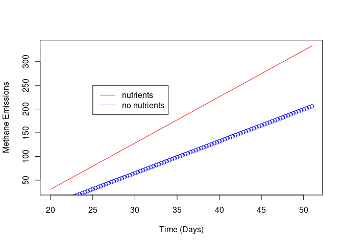

# Number of Questions Completed: 6/6

# 1 Q 12.40

## a)

Suppose you want to use repellant type to model the cost per use (y). Create the appropriate number of dummy variables for repellant type and write the model.

There's only two levels (Lotion/Cream and Aerosol/Spray) so we only need 1 dummy variable

$x_1=0$ if lotion/cream
$x_1=1$ if aerosol/spray

$E(y)=\beta_0+\beta_1x_1$

## b) 

Fit the model to the data


```r
x1=c(0,1,0,0,0,1,1,1,1,1,1,0,0,1)
y=c(2.08,0.67,1.00,0.75,0.46,0.11,0.22,0.19,0.24,0.27,1.77,0.67,0.36,2.75)

model=lm(y~x1)
summary(model)
```

```
## 
## Call:
## lm(formula = y ~ x1)
## 
## Residuals:
##      Min       1Q   Median       3Q      Max 
## -0.66750 -0.53479 -0.32167  0.05813  1.97250 
## 
## Coefficients:
##             Estimate Std. Error t value Pr(>|t|)  
## (Intercept)   0.8867     0.3435   2.581   0.0241 *
## x1           -0.1092     0.4545  -0.240   0.8142  
## ---
## Signif. codes:  0 '***' 0.001 '**' 0.01 '*' 0.05 '.' 0.1 ' ' 1
## 
## Residual standard error: 0.8415 on 12 degrees of freedom
## Multiple R-squared:  0.004786,	Adjusted R-squared:  -0.07815 
## F-statistic: 0.0577 on 1 and 12 DF,  p-value: 0.8142
```


## c) 

Give the NULL hypothesis for testing whether repellant type is a useful predictor of cost per use (y)

$$H_0:\beta_1=0$$

## d) 

Conduct the test, part c, and give the appropriate conclusion. Use $\alpha=0.1$.


```r
summary(model)
```

```
## 
## Call:
## lm(formula = y ~ x1)
## 
## Residuals:
##      Min       1Q   Median       3Q      Max 
## -0.66750 -0.53479 -0.32167  0.05813  1.97250 
## 
## Coefficients:
##             Estimate Std. Error t value Pr(>|t|)  
## (Intercept)   0.8867     0.3435   2.581   0.0241 *
## x1           -0.1092     0.4545  -0.240   0.8142  
## ---
## Signif. codes:  0 '***' 0.001 '**' 0.01 '*' 0.05 '.' 0.1 ' ' 1
## 
## Residual standard error: 0.8415 on 12 degrees of freedom
## Multiple R-squared:  0.004786,	Adjusted R-squared:  -0.07815 
## F-statistic: 0.0577 on 1 and 12 DF,  p-value: 0.8142
```


The p-value from the F test is significantly greater than 0.1. We can not reject the NULL meaning we can not say with confidence that repellant type is a useful predictor of cost per use.

## e)

Repeat parts a-d if the dependent variable is maximum number of hours of protection (y)

$x_1$ is the same as in part a)


```r
x1=c(0,1,0,0,0,1,1,1,1,1,1,0,0,1)
y=c(13.5,0.5,2.0,7.0,3.0,6.0,3.0,5.5,6.5,1.0,14.0,3.0,7.0,24.0)
model=lm(y~x1)
```

The NULL hypothesis for testing whether repellant type is a useful predictor of maximum number of hours of protection is

$$H_0:\beta_1=0$$

```r
summary(model)
```

```
## 
## Call:
## lm(formula = y ~ x1)
## 
## Residuals:
##    Min     1Q Median     3Q    Max 
## -7.062 -3.667 -1.812  1.083 16.438 
## 
## Coefficients:
##             Estimate Std. Error t value Pr(>|t|)  
## (Intercept)    5.917      2.701   2.190    0.049 *
## x1             1.646      3.574   0.461    0.653  
## ---
## Signif. codes:  0 '***' 0.001 '**' 0.01 '*' 0.05 '.' 0.1 ' ' 1
## 
## Residual standard error: 6.617 on 12 degrees of freedom
## Multiple R-squared:  0.01737,	Adjusted R-squared:  -0.06452 
## F-statistic: 0.2121 on 1 and 12 DF,  p-value: 0.6534
```

Again our p-value for the F test is significantly greater than 0.1 meaning we cannot reject the NULL. We cannot say with confidence that repellant type is a useful predictor of maximum number of hours of protection.

# 2 Q 12.42

Wastewater treatment plants emit greenhouse gases like methane. Methane emissions were surveyed for sludge with and without nutrients added. The length of time (in days) the sludge was processed is also given. Use regression to determine if the mean amount of methane gas emitted differs for the two types of sludge, and if so, provide a 95% confidence interval for the magnitude of the difference.

Seeing as how the next problem has us incorporate the time data, I assume we're supposed to ignore it here. You would never do this in a real analysis because the amount of greenhouse gas emitted would be strongly dependent on the amount of time passed during processing.

We have two levels for our categorical data, so we only need 1 dummy variable. $x_1=0$ if no nutrients added and $x_1=1$ if nutrients added.


```r
methane=c(5,9,18,35,61,65,105,120,117,154,200,198,203,21,25,61,75,102,150,183,194,245,308,295,272,280,287)
x1=c(0,0,0,0,0,0,0,0,0,0,0,0,0,1,1,1,1,1,1,1,1,1,1,1,1,1,1)
model=lm(methane~x1)
summary(model)
```

```
## 
## Call:
## lm(formula = methane ~ x1)
## 
## Residuals:
##      Min       1Q   Median       3Q      Max 
## -157.429  -78.830    5.769   96.170  129.571 
## 
## Coefficients:
##             Estimate Std. Error t value Pr(>|t|)    
## (Intercept)    99.23      25.43   3.902 0.000638 ***
## x1             79.20      35.32   2.242 0.034055 *  
## ---
## Signif. codes:  0 '***' 0.001 '**' 0.01 '*' 0.05 '.' 0.1 ' ' 1
## 
## Residual standard error: 91.7 on 25 degrees of freedom
## Multiple R-squared:  0.1674,	Adjusted R-squared:  0.1341 
## F-statistic: 5.028 on 1 and 25 DF,  p-value: 0.03406
```

The NULL hypothesis for our F statistic is 

$$H_0:\beta_1=0$$

We can see the p-value for our F-test is significantly less than 0.05 so we can say, with 95% confidence, that the mean amount of methane gas differs for the two types of sludge. The data suggests that sludge with nutrients emits more greenhouse gases.

$\beta_1=\mu_1-\mu_0$ so a 95% confidence interval for $\beta_1$ gives us an interval estimate for the difference in the mean amount of methane gas emitted over time for the two types of sludge.


```r
library(s20x)

ciReg(model)
```

```
##             95 % C.I.lower    95 % C.I.upper
## (Intercept)       46.84958          151.6120
## x1                 6.45447          151.9411
```


So a 95% confidence interval for the difference in the amount of methane gas emitted over time for sludge with nutrients and sludge without nutrients is (6.454,151.941).


# 3 Q 12.51

Now include time data. Use regression to determine if the emission rates differ for the two types of sludge, and if so, provide an estimate of each emission rate.

What we care about here is the slope, for the slopes to differ we'll need to include an interaction term.

$$E(y)=\beta_0+\beta_1t+\beta_2x_1+\beta_3tx_1$$


```r
methane=c(5,9,18,35,61,65,105,120,117,154,200,198,203,21,25,61,75,102,150,183,194,245,308,295,272,280,287)
time=c(20,21,24,26,29,32,35,37,42,44,47,49,51,20,21,24,26,29,32,34,36,37,42,44,47,49,51)
x1=c(0,0,0,0,0,0,0,0,0,0,0,0,0,1,1,1,1,1,1,1,1,1,1,1,1,1,1)

model=lm(methane~time+x1+time:x1)
summary(model)
```

```
## 
## Call:
## lm(formula = methane ~ time + x1 + time:x1)
## 
## Residuals:
##     Min      1Q  Median      3Q     Max 
## -46.160 -13.627  -2.706   7.400  62.661 
## 
## Coefficients:
##              Estimate Std. Error t value Pr(>|t|)    
## (Intercept) -136.9791    24.0584  -5.694 8.49e-06 ***
## time           6.7193     0.6564  10.236 4.91e-10 ***
## x1           -27.5096    33.9588  -0.810  0.42619    
## time:x1        3.0385     0.9280   3.274  0.00333 ** 
## ---
## Signif. codes:  0 '***' 0.001 '**' 0.01 '*' 0.05 '.' 0.1 ' ' 1
## 
## Residual standard error: 24.54 on 23 degrees of freedom
## Multiple R-squared:  0.9451,	Adjusted R-squared:  0.938 
## F-statistic: 132.1 on 3 and 23 DF,  p-value: 1.22e-14
```

Let's plot the response curves to get an idea of the effect of nutrients on the slope

$$E(y)_{nutrients}=(\beta_0+\beta_2)+(\beta_1+\beta_3)t$$

$$E(y)_{no\:nutirents}=\beta_0+\beta_1t$$


```r
B0=model$coefficients[1]
B1=model$coefficients[2]
B2=model$coefficients[3]
B3=model$coefficients[4]

t=seq(min(time),max(time),length.out=100)

y_nut=(B0+B2)+(B1+B3)*t
y_nonut=B0+B1*t

plot(t,y_nut,type='l',col='red',ylab="Methane Emissions",xlab="Time (Days)")
lines(t,y_nonut,type='p',col='blue')

legend(25,250,legend=c("nutrients","no nutrients"),col=c("red","blue"),lty=c(1,3))
```

<!-- -->

The NULL hypothesis for the slopes to be the same is 

$$H_0:\beta_3=0$$

The p-value from our T-statistic is less than 0.05. So we can say with 95% confidence that the emission rates are different.

A point estimate for the emission rates is given by $\hat{\beta_1}+\hat{\beta_3}$ for nutrients added and $\hat{\beta_1}$ for no nutrients added.

For nutrients added, an estimate for the emission rate is 9.7578077.

For no nutrients added, an estimate for the emission rate is 6.7193176.

# 4 Q 12.59

An exploration seismologist wants to develop a regression model for estimating the mean signal-to-noise ratio of seismic waves from earthquakes. The model under consideration is a complete second-order model

$$E(y)=\beta_0+\beta_1x_1+\beta_2x_2+\beta_3x_1x_2+\beta_4x_1^2+\beta_5x_2^2$$

Where y=Signal-to-noise ratio, x1=Frequency of wavelet, and x2=Amplitude of wavelet. Both the complete model and the reduced model, $E(y)=\beta_0+\beta_1x_1+\beta_2x_2$ were fit to n=12 data points, with the following results: $SSE_c=159.94$, $MSE_c=26.66$, $SSE_r=2094.4$, $MSE_r=232.7$. Compare the two models using a nested model F test at $\alpha=0.05$. What do you conclude?

The F statistic is given by

$$F=\frac{\frac{SSE_r-SSE_c}{Difference\:in\:number\:of\:\beta 's\:tested}}{MSE_c}$$

Which we'll compare against the F distribution with $\nu_1=3,\nu_2=12$


```r
F_val=((2094.4-159.94)/3)/(26.66)
F_reject=qf(0.95,3,12)

F_val
```

```
## [1] 24.1868
```

```r
F_reject
```

```
## [1] 3.490295
```


We can see that we are in the rejection region. We can reject the NULL

$$H_0:\beta_3=\beta_4=\beta_5=0$$

Meaning we can conclude that the interaction and quadratic terms contribute information to the prediction of mean signal-to-noise ratio of seismic waves from earthquakes.

# 5 Q 12.79

y=natural logarithm of supply price

$x_1$=Distance shipped (hundreds of miles)

$x_2$=Weight of the product shipped (thousands of pounds)

$x_3$=1 if deregulation in effect, 0 if not

$x_4$=1 if trip originates in Miami, 0 if in Jacksonville

$$\hat{y}=12.192-0.598x_1-0.00598x_2-0.01078x_1x_2+0.086x_1^2+0.00014x_2^2+0.677x_4-0.275x_1x_4-0.026x_2x_4+0.013x_1x_2x_4-0.782x_3+0.0399x_1x_3-0.021x_2x_3-0.0033x_1x_2x_3$$

## a)

Based on the equation, give an estimate of the difference between the predicted regulated price and predicted deregulated price for any fixed value of mileage, weight, and origin.

Let's set origin to Jacksonville so the $x_4$ terms drop out.

Regulated has $x_3$=0 so regulated prices will have $x_3$ terms drop out

$$E(y)_{regulated}=\beta_0+\beta_1x_1+\beta_2x_2+\beta_3x_1x_2+\beta_4x_1^2+\beta_5x_2^2$$

Deregulated has $x_3=1$

$$E(y)_{deregulated}=\beta_0+\beta_1x_1+\beta_2x_2+\beta_3x_1x_2+\beta_4x_1^2+\beta_5x_2^2+\beta_{10}+\beta_{11}x_1+\beta_{12}x_2+\beta_{13}x_1x_2$$

Setting $x_1=20$, $x_2=4$


```r
x1=0.5
x2=4
Ey_reg=12.192-0.598*x1-0.00598*x2-0.01078*x1*x2+0.086*x1^2+0.00014*x2^2

Ey_dereg=12.192-0.598*x1-0.00598*x2-0.01078*x1*x2+0.086*x1^2+0.00014*x2^2-0.782+0.0399*x1-0.021*x2-0.0033*x1*x2

exp(Ey_reg)
```

```
## [1] 143094.4
```

```r
exp(Ey_dereg)
```

```
## [1] 60998.83
```


## b)

Demonstrate the impact of deregulation on price charged using the estimated $\beta$'s, but now hold distance fixed at 100 miles, origin fixed at Miami, and weight fixed at 10,000 pounds


```r
x1=1
x2=10

Ey_reg=12.192-0.598*x1-0.00598*x2-0.01078*x1*x2+0.086*x1^2+0.00014*x2^2+0.677-0.275*x1-0.026*x2+0.013*x1*x2

Ey_dereg=12.192-0.598*x1-0.00598*x2-0.01078*x1*x2+0.086*x1^2+0.00014*x2^2+0.677-0.275*x1-0.026*x2+0.013*x1*x2-0.782+0.0399*x1-0.021*x2-0.0033*x1*x2

exp(Ey_reg)
```

```
## [1] 133039.3
```

```r
exp(Ey_dereg)
```

```
## [1] 49677.13
```

## c)

The data file TRUCKING contains data on trucking prices for four Florida carriers (A,B,C, and D). These carriers are identified by the variable CARRIER. Using the above model as a base model, add terms that allow for different response curves for the four carriers. Conduct the appropriate test to determine if the curves differ.


```r
library(readxl)

trucking=read_excel("../../Dataxls/Excel/TRUCKING.XLS")
head(trucking)
```

```
## # A tibble: 6 x 10
##   PRICPTM MILEAGE SHIPMENT PCTLOAD ORIGIN `MKT-SIZE` DEREG CARRIER HAUL 
##     <dbl>   <dbl>    <dbl>   <dbl> <chr>  <chr>      <chr> <chr>   <chr>
## 1  31344.    3.6      3       12.5 MIA    LARGE      YES   A       MEDI…
## 2 225676.    0.25     0.75     3.1 MIA    LARGE      YES   A       SHORT
## 3 172973.    0.25     3       12.5 MIA    LARGE      YES   A       SHORT
## 4  47167.    2.6      0.25     1   MIA    LARGE      YES   A       MEDI…
## 5  30795.    2.6     15       62.5 MIA    LARGE      YES   A       MEDI…
## 6  51126.    1.5      3       12.5 MIA    SMALL      YES   A       MEDI…
## # … with 1 more variable: PRODUCT <dbl>
```
Our categorical data has 4 levels so we'll need 3 dummy variables

y=ln(price)
x1=mileage (hundreds of miles)
x2=weight (thousands of pounds)
if A: x3=0, x4=0, x5=0
if B: x3=0, x4=0, x5=1
if C: x3=0, x4=1, x5=0
if D: x3=1, x4=0, x5=0


```r
y=log(trucking[,1])
x1=trucking[,2]
x2=trucking[,3]
x12=x1^2
x22=x2^2

x3=c()
x4=c()
x5=c()

for(i in 1:dim(trucking)[1]){
  if(toString(trucking[i,8])=="A"){
    x3=append(x3,0)
    x4=append(x4,0)
    x5=append(x5,0)
  }
  if(toString(trucking[i,8])=="B"){
    x3=append(x3,0)
    x4=append(x4,0)
    x5=append(x5,1)
  }
  if(toString(trucking[i,8])=="C"){
    x3=append(x3,0)
    x4=append(x4,1)
    x5=append(x5,0)
  }
  if(toString(trucking[i,8])=="D"){
    x3=append(x3,1)
    x4=append(x4,0)
    x5=append(x5,0)
  }
}

y=unlist(y)
x1=unlist(x1)
x12=unlist(x12)
x2=unlist(x2)
x22=unlist(x22)
x3=unlist(x3)
x4=unlist(x4)
x5=unlist(x5)
```


```r
model=lm(y~x1+x2+x1:x2+x12+x22+x3+x1:x3+x2:x3+x1:x2:x3+x4+x1:x4+x2:x4+x1:x2:x4+x5+x1:x5+x2:x5+x1:x2:x5)
summary(model)
```

```
## 
## Call:
## lm(formula = y ~ x1 + x2 + x1:x2 + x12 + x22 + x3 + x1:x3 + x2:x3 + 
##     x1:x2:x3 + x4 + x1:x4 + x2:x4 + x1:x2:x4 + x5 + x1:x5 + x2:x5 + 
##     x1:x2:x5)
## 
## Residuals:
##      Min       1Q   Median       3Q      Max 
## -0.99231 -0.32340  0.00149  0.28801  1.28055 
## 
## Coefficients:
##               Estimate Std. Error t value Pr(>|t|)    
## (Intercept) 12.7312061  0.1267278 100.461   <2e-16 ***
## x1          -0.8127609  0.0551611 -14.734   <2e-16 ***
## x2          -0.0391886  0.0129866  -3.018   0.0027 ** 
## x12          0.0811142  0.0070752  11.465   <2e-16 ***
## x22          0.0002780  0.0003559   0.781   0.4351    
## x3          -0.0313460  0.2123628  -0.148   0.8827    
## x4          -0.0217354  0.1767015  -0.123   0.9022    
## x5          -0.3577528  0.1613394  -2.217   0.0271 *  
## x1:x2        0.0020498  0.0031892   0.643   0.5207    
## x1:x3        0.0424970  0.0638419   0.666   0.5060    
## x2:x3        0.0189564  0.0164858   1.150   0.2508    
## x1:x4        0.0352830  0.0548658   0.643   0.5205    
## x2:x4        0.0016998  0.0169845   0.100   0.9203    
## x1:x5        0.0221311  0.0509426   0.434   0.6642    
## x2:x5       -0.0065799  0.0134199  -0.490   0.6242    
## x1:x2:x3    -0.0054668  0.0049327  -1.108   0.2684    
## x1:x2:x4    -0.0037393  0.0051254  -0.730   0.4660    
## x1:x2:x5    -0.0020054  0.0040973  -0.489   0.6248    
## ---
## Signif. codes:  0 '***' 0.001 '**' 0.01 '*' 0.05 '.' 0.1 ' ' 1
## 
## Residual standard error: 0.4068 on 430 degrees of freedom
## Multiple R-squared:  0.672,	Adjusted R-squared:  0.659 
## F-statistic: 51.81 on 17 and 430 DF,  p-value: < 2.2e-16
```


We want to know if the response curves differ. If Carrier is A our response curve is given by

$$E(y)=\beta_0+\beta_1x_1+\beta_2x_2+\beta_3x_1^2+\beta_4x_2^2+\beta_8x_1x_2$$

However, if Carrier is B our response curve is 

$$E(y)=\beta_0+\beta_1x_1+\beta_2x_2+\beta_3x_1^2+\beta_4x_2^2+\beta_7x_5+\beta_8x_1x_2+\beta_{13}x_1x_5+\beta_{14}x_2x_5+\beta_{17}x_1x_2x_5$$

$$E(y)=(\beta_0+\beta_7)+(\beta_1+\beta_{13})x_1+(\beta_2+\beta_{14})x_2+\beta_3x_1^2+\beta_4x_2^2+(\beta_8+\beta_{17})x_1x_2$$

So to see if this response curve is different than our baseline, we need to test the NULL

$$H_0:\beta_7=\beta_{13}=\beta_{14}=\beta_{17}=0$$


We could accomplish this with a nested model that does not include the $\beta_7,\beta_{13},\beta_{14},\beta_{17}$ terms.

Here our F statistic 
$$F=\frac{\frac{SSE_r-SSE_c}{Difference\:in\:number\:of\:\beta 's\:tested}}{MSE_c}$$
again proves useful.

I'll also generate reduced models for the other CARRIER values.


```r
# Ok this function takes two quantitative variables and our three dummy variables, as well as the price
# It also takes which CARRIER value we want to test for
# It will return an F statistic generated by using a reduced model that does not include the terms utilized by that CARRIER value
#choice = B","C" or "D"
myF=function(y,x1,x2,x3,x4,x5,choice){
  x12=x1^2
  x22=x2^2
  
  modelc=lm(y~x1+x2+x1:x2+x12+x22+x3+x1:x3+x2:x3+x1:x2:x3+x4+x1:x4+x2:x4+x1:x2:x4+x5+x1:x5+x2:x5+x1:x2:x5)
  
  if(choice=="B"){
    #x5 is important, so it is removed
    modelr=lm(y~x1+x2+x1:x2+x12+x22+x3+x1:x3+x2:x3+x1:x2:x3+x4+x1:x4+x1:x2:x4)
  }
  if(choice=="C"){
    #x4 is important, so it is removed
    modelr=lm(y~x1+x2+x1:x2+x12+x22+x3+x1:x3+x2:x3+x1:x2:x3+x5+x1:x5+x1:x2:x5)
  }
  if(choice=="D"){
    #x3 is important, so it is removed
    modelr=lm(y~x1+x2+x1:x2+x12+x22+x4+x1:x4+x2:x4+x1:x2:x4+x5+x1:x5+x1:x2:x5)
  }
  
  diffbeta=length(modelc$coefficients)-length(modelr$coefficients)
  
  resc=modelc$residuals
  resc2=resc^2
  resr=modelr$residuals
  resr2=resr^2
  SSEr=sum(resr2)
  SSEc=sum(resc2)
  MSEc=mean(resc2)
  
  F_val=((SSEr-SSEc)/diffbeta)/(MSEc)
  
  return(list(F_statistic=F_val))
  
  
}
```

Let's determine the F value for the rejection region

```r
k=length(model$coefficients)
qf(0.95,4,dim(trucking)[1]-(k+1))
```

```
## [1] 2.392733
```

Now for the F values for each CARRIER (remember these are testing for a difference in the responsive curve with respect to the baseline, CARRIER A)

```r
myF(y,x1,x2,x3,x4,x5,"B")
```

```
## $F_statistic
## [1] 14.75661
```

```r
myF(y,x1,x2,x3,x4,x5,"C")
```

```
## $F_statistic
## [1] 0.6222064
```

```r
myF(y,x1,x2,x3,x4,x5,"D")
```

```
## $F_statistic
## [1] 1.540422
```


So only CARRIER B is in the rejection region. For CARRIER B, we can reject the NULL $H_0:\beta_7=\beta_{13}=\beta_{14}=\beta_{17}=0$ and say with 95% confidence that the response curve for B differs from our baseline, CARRIER A.

I also just realized that the NULL

$$H_0:\beta_7=\beta_{13}=\beta_{14}=\beta_{17}=0$$

could be much more easily tested with the T-statistic given in the summary output


```r
model=lm(y~x1+x2+x1:x2+x12+x22+x3+x1:x3+x2:x3+x1:x2:x3+x4+x1:x4+x2:x4+x1:x2:x4+x5+x1:x5+x2:x5+x1:x2:x5)
summary(model)
```

```
## 
## Call:
## lm(formula = y ~ x1 + x2 + x1:x2 + x12 + x22 + x3 + x1:x3 + x2:x3 + 
##     x1:x2:x3 + x4 + x1:x4 + x2:x4 + x1:x2:x4 + x5 + x1:x5 + x2:x5 + 
##     x1:x2:x5)
## 
## Residuals:
##      Min       1Q   Median       3Q      Max 
## -0.99231 -0.32340  0.00149  0.28801  1.28055 
## 
## Coefficients:
##               Estimate Std. Error t value Pr(>|t|)    
## (Intercept) 12.7312061  0.1267278 100.461   <2e-16 ***
## x1          -0.8127609  0.0551611 -14.734   <2e-16 ***
## x2          -0.0391886  0.0129866  -3.018   0.0027 ** 
## x12          0.0811142  0.0070752  11.465   <2e-16 ***
## x22          0.0002780  0.0003559   0.781   0.4351    
## x3          -0.0313460  0.2123628  -0.148   0.8827    
## x4          -0.0217354  0.1767015  -0.123   0.9022    
## x5          -0.3577528  0.1613394  -2.217   0.0271 *  
## x1:x2        0.0020498  0.0031892   0.643   0.5207    
## x1:x3        0.0424970  0.0638419   0.666   0.5060    
## x2:x3        0.0189564  0.0164858   1.150   0.2508    
## x1:x4        0.0352830  0.0548658   0.643   0.5205    
## x2:x4        0.0016998  0.0169845   0.100   0.9203    
## x1:x5        0.0221311  0.0509426   0.434   0.6642    
## x2:x5       -0.0065799  0.0134199  -0.490   0.6242    
## x1:x2:x3    -0.0054668  0.0049327  -1.108   0.2684    
## x1:x2:x4    -0.0037393  0.0051254  -0.730   0.4660    
## x1:x2:x5    -0.0020054  0.0040973  -0.489   0.6248    
## ---
## Signif. codes:  0 '***' 0.001 '**' 0.01 '*' 0.05 '.' 0.1 ' ' 1
## 
## Residual standard error: 0.4068 on 430 degrees of freedom
## Multiple R-squared:  0.672,	Adjusted R-squared:  0.659 
## F-statistic: 51.81 on 17 and 430 DF,  p-value: < 2.2e-16
```
We can see that the $x_5$ term, corresponding to CARRIER B, is the only one with a p-value for the T-statistic less than 0.05. So only for CARRIER B can we say with confidence that the response curve is different than our baseline.

# 6 Q 12.80

do in R as well as look at SAS output

y= Mass burning rate

$x_1$=Brake power

$x_2$=1 if DF-2 fuel, 0 if not

$x_3$=1 if blended fuel, 0 if not

$$E(y)=\beta_0+\beta_1x_1+\beta_2x_2+\beta_3x_3+\beta_4x_1x_2+\beta_5x_1x_3$$

## a) 

Conduct a test to determine whether brake power and fuel type interact. Test using $\alpha=0.01$.

Our NULL is 

$$H_0:\beta_4=\beta_5=0$$


```r
y=c(13.2,17.5,17.5,26.1,32.7,43.5,25.9,46.3,45.6,30.7,50.8,68.9,32.3,57.1)
x1=c(4,4,4,6,6,6,8,8,8,10,10,10,12,12)
x2=c(1,0,0,1,0,0,1,0,0,1,0,0,1,0)
x3=c(0,1,0,0,1,0,0,1,0,0,1,0,0,1)

model=lm(y~x1+x2+x3+x1:x2+x1:x3)
summary(model)
```

```
## 
## Call:
## lm(formula = y ~ x1 + x2 + x3 + x1:x2 + x1:x3)
## 
## Residuals:
##    Min     1Q Median     3Q    Max 
## -6.090 -3.163  0.225  1.573  7.440 
## 
## Coefficients:
##             Estimate Std. Error t value Pr(>|t|)    
## (Intercept)  -10.830      8.277  -1.308  0.22708    
## x1             7.815      1.126   6.938  0.00012 ***
## x2            19.350     10.686   1.811  0.10777    
## x3            12.790     10.686   1.197  0.26561    
## x1:x2         -5.675      1.380  -4.114  0.00337 ** 
## x1:x3         -2.950      1.380  -2.138  0.06494 .  
## ---
## Signif. codes:  0 '***' 0.001 '**' 0.01 '*' 0.05 '.' 0.1 ' ' 1
## 
## Residual standard error: 5.037 on 8 degrees of freedom
## Multiple R-squared:  0.9413,	Adjusted R-squared:  0.9046 
## F-statistic: 25.65 on 5 and 8 DF,  p-value: 9.984e-05
```

```r
beta0=model$coefficients[1]
beta1=model$coefficients[2]
beta2=model$coefficients[3]
beta3=model$coefficients[4]
beta4=model$coefficients[5]
beta5=model$coefficients[6]
```

The p-value for the T-statistic for the $x_1x_2$ term is less than 0.01. We can say with 99% confidence that brake power and fuel type interact.

## b) 

Refer to the model, part a. Give the estimates of the slope of the y-$x_1$ line for each of the three fuel types.

For Advanced Timing (our baseline)

$$E(y)=\beta_0+\beta_1x_1$$

The slope is given by $\beta_1$=7.815

For DF-2 Fuel ($x_2$=1)

$$E(y)=\beta_0+\beta_1x_1+\beta_2+\beta_4x_1$$

$$E(y)=(\beta_0+\beta_2)+(\beta_1+\beta_4)x_1$$

The slope is given by $\beta_1+\beta_4$=2.14

Finally, for blended fuel ($x_3$=1)

$$E(y)=\beta_0+\beta_1x_1+\beta_3+\beta_5x_1$$

$$E(y)=(\beta_0+\beta_3)+(\beta_1+\beta_5)x_1$$

The slope is given by $\beta_1+\beta_5$=4.865


