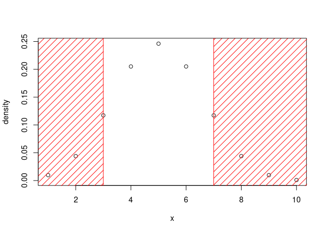
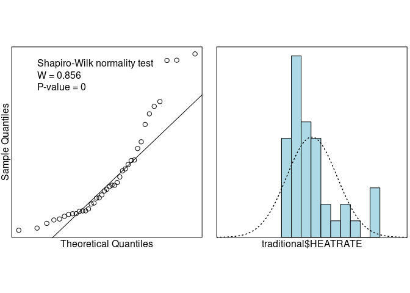

# Fraction Completed: 8/8

# 1. 15.1

Scientists at the University of Florida College of Medicine investigated the level of caffeine in 16-ounce cups of Starbucks' coffee. In one phase of the experiment, cups of Starbucks Breakfast Blend were purchased on six consecutive days from a single specialty coffee shop. The amount of caffeine in each of the 6 cups (measured in milligrams) is provided.


```r
caffeine=c(564,498,259,303,300,307)
```


## a.

Suppose scientists are interested in determining whether the median amount of caffeine in Breakfast Blend coffee exceeds 300 milligrams. Set up the null and alternate hypotheses of interest

$$H_0: median\:amount\:of\:caffeine = 300 mg$$

$$H_a: median\:amount\:of\:caffeine > 300 mg$$

S=number of cups with caffeine > 300 mg

p-value=P(x$\geq$S) where x~binomial n=6, p=0.5

## b. 

How many cups in the sample have a caffeine content that exceeds 300 milligrams?

4 out of the 6 cups

## c.

Assuming p=0.5, find the probability that at least 4 of the 6 cups have caffeine amounts that exceed 300 milligrams.

$$P(at\:least\:4\:cups>300mg)=1-P(3\:or\:fewer\:cups>300mg)$$


```r
1-pbinom(3,6,0.5)
```

```
## [1] 0.34375
```

## d.

Based on the probability, what do you conclude about $H_0$ and $H_a$?

Using $\alpha=0.05$, we can not reject the null that the median amount of caffeine in Breakfast Blend equals 300 mg.


# 2. 15.2

Refer to the American Journal of Physical Anthropology study of the characteristics of cheek teeth in an extinct primate species. Recall that the researchers measured the dentary depth of molars for 18 cheek teeth extracted from skulls. These depth measurements are reproduced below. The researchers are interested in the median molar depth of all cheek teeth from this extinct primate species. In particular, they want to know if the population median differs from 15 mm.


```r
cheekteeth=c(18.12,19.48,19.36,15.94,15.83,19.70,15.76,17.00,16.20,13.96,16.55,15.70,17.83,13.25,16.12,18.13,14.02,14.04)
```


## a.

Specify the null and alternate hypothesis of interest to the researchers


$$H_0:\tau=15 mm$$

$$H_a:\tau \neq 15 mm$$

where $\tau$ is the population median molar depth.

## b. 

Explain why the sign test is appropriate to apply in this case.

We want to know whether the median population differs from a given value based on the values in a sample. This is the definition of a two-tailed sign test.

## c.

A printout of the analysis is shown below. Locate the test statistic.


```r
S=4 #number below 15
2*pbinom(4,18,0.5)
```

```
## [1] 0.03088379
```
The test statistic is S, the number of sample observations less than 15 mm

## d. 

locate the p-value, use it to draw a conclusion. Use $\alpha$=0.05

the p-value is 0.03, since this is less than $\alpha$, we can reject the null hypothesis that the population median molar depth is 15 mm 

# 3. 15.10

Suppose we want to test $H_0:\tau=\tau_0$ against $H_a:\tau \neq \tau_0$ using the sign test, where $S_1$=Number of sample observations greater than $\tau_0$ and $S_2$=Number of sample observations less than $\tau_0$.

Show that $P(S_1 \geq c)=P(S_2 \leq n-c)$ where $0 \leq c \leq n$

If we assume n is our number of sample observations, then $S_1 \geq c$ if and only if $S_2 \leq n-c$, therefore $P(S_1\geq c)=P(S_2\leq n-c)$.

We know $S_1+S_2 \leq n$, since some observations can be equal to $\tau_0$. This shows us that if $S_1\geq c$, then $S_2\leq n-c$ and vice versa.

# 4. 15.11

Refer to the two-tailed test of Exercise 15.10. Use the result of that exercise to show that the observed significance level for the test is p-value=$2P(S_1\geq c)$

This test has a binomial distribution of size n and prob 0.5. Since we have a two-tailed test, we want the probability of the upper tail plus the probability of the lower tail. 


```r
density=c()
x=1:10
for(i in x){
  density=append(density,dbinom(i,10,0.5))
}
c=7
n=10


plot(x,density)
rect(xleft=7,xright = 12,ybottom=-1,ytop=1,col="red",density=10)
rect(xleft=-1,xright=3,ybottom=-1,ytop=1,col="red",density=10)
```

<!-- -->


So what we want is 

$$p-value=P(S_1\geq c)+P(S_2\leq n-c)$$

Using the result from 15.10

$$p-value=2P(S_1\geq c)$$

# 5. 15.13

Polyethylene terephthalate (PET) bottles are used for carbonated beverages. A critical property of PET bottles is their bursting strength. In the Journal of Data Science, researchers measured the bursting strength of PET bottles made from two different designs-an old design and a new design. The data for 10 bottles of each design are shown. Suppose you want to compare the distributions of bursting strengths for the two designs


```r
old=c(210,212,211,211,190,213,212,211,164,209)
new=c(216,217,162,137,219,216,179,153,152,217)
```

## a. 

Rank all 20 observed pressures from smallest to largest, and assign ranks from 1 to 20


```r
old_ranks=c(9,13,10,11,7,14,13,12,5,8)
new_ranks=c(15,17,4,1,19,16,6,3,2,18)
```


## b. 

Sum the ranks of the observations from the old design


```r
sum(old_ranks)
```

```
## [1] 102
```

## c.

Sum the ranks of the observations from the new design


```r
sum(new_ranks)
```

```
## [1] 101
```


## d. 

Compute the Wilcoxon rank sum statistic

$$Z_C=\frac{T_1-\frac{n_1n_2+n_1(n_1+1)}{2}}{\sqrt{\frac{n_1n_2(n_1+n_2+1)}{12}}}$$


```r
wilcox_stat=function(T1,n1,n2){
  num=T1-((n1*n2+n1*(n1+1))/(2))
  denom=sqrt((n1*n2*(n1+n2+1))/(12))
  
  return(num/denom)
}

wilcox_stat(101,10,10)
```

```
## [1] -0.3023716
```


## e.

Carry out a nonparametric test (at $\alpha=0.05$) to compare the distribution of bursting strengths for the two designs


```r
wilcox.test(old,new)
```

```
## Warning in wilcox.test.default(old, new): cannot compute exact p-value with
## ties
```

```
## 
## 	Wilcoxon rank sum test with continuity correction
## 
## data:  old and new
## W = 49, p-value = 0.9698
## alternative hypothesis: true location shift is not equal to 0
```
We have very little evidence that the distributions are shifted.


# 6. 15.14

Refer to the Journal of Engineering for Gas Turbines and Power study of gas turbines augmented with high-pressure inlet fogging, Exercise 8.29. The data on engine heat rate is saved in the GASTURBINE file. Recall that the researchers classified gas turbines into three categories: traditional, advanced, and aeroderivative. Suppose you want to compare the heat rate distributions for traditional and aeroderivative turbine engines.


```r
library(readxl)
turbine=read_excel('../../Dataxls/Excel/GASTURBINE.XLS')
head(turbine)
```

```
## # A tibble: 6 x 11
##   ENGINE SHAFTS   RPM CPRATIO `INLET-TEMP` `EXH-TEMP` AIRFLOW POWER
##   <chr>   <dbl> <dbl>   <dbl>        <dbl>      <dbl>   <dbl> <dbl>
## 1 Tradi…      1 27245     9.2         1134        602       7  1630
## 2 Tradi…      1 14000    12.2          950        446      15  2726
## 3 Tradi…      1 17384    14.8         1149        537      20  5247
## 4 Tradi…      1 11085    11.8         1024        478      27  6726
## 5 Tradi…      1 14045    13.2         1149        553      29  7726
## 6 Tradi…      1  6211    15.7         1172        517     176 52600
## # … with 3 more variables: HEATRATE <dbl>, `LHV%` <dbl>, ISOWORK <dbl>
```

```r
traditional=subset(turbine,ENGINE=="Traditional")
aeroderiv=subset(turbine,ENGINE=="Aeroderiv")
```

## a.

Demonstrate that the assumptions required to compare the mean heat rates using a t-test are likely to be violated.


```r
library(s20x)
normcheck(traditional$HEATRATE,shapiro.wilk=TRUE)
```

<!-- -->

The data appears to not be normally distributed.

## b.


```r
wilcox.test(traditional$HEATRATE,aeroderiv$HEATRATE)
```

```
## Warning in wilcox.test.default(traditional$HEATRATE, aeroderiv$HEATRATE):
## cannot compute exact p-value with ties
```

```
## 
## 	Wilcoxon rank sum test with continuity correction
## 
## data:  traditional$HEATRATE and aeroderiv$HEATRATE
## W = 105, p-value = 0.3431
## alternative hypothesis: true location shift is not equal to 0
```

With a p-value of 0.3431, we can not reject the null hypothesis that the two distributions are equal.

# 7. 15.23

Refer to the Exploration and Mining Geology study of drill twinned holes, Exercise 8.47. Recall that the drilling of a new hole, or "twin", next to an earlier drill hole is a traditional method of verifying mineralization grades. The data in the table represent total amount of heavy minerals (THM) percentages for a sample of 15 twinned holes drilled at a diamond mine in Africa. In Exercise 8.47 you used a student's T-test to check for a difference in the true THM means of all original holes and their twin holes drilled at the mine.


```r
first=c(5.5,11.0,5.9,8.2,10.0,7.9,10.1,7.4,7.0,9.2,8.3,8.6,10.5,5.5,10.0)
second=c(5.7,11.2,6.0,5.6,9.3,7.0,8.4,9.0,6.0,8.1,10.0,8.1,10.4,7.0,11.2)
length(second)
```

```
## [1] 15
```

## a.

Explain why the results of the t-test may be invalid.

Different observations of first-second may not be independent of each other due to proximity of sites.

## b. 

What is the appropriate nonparametric test to apply? State $H_0$ and $H_a$ for the test.

The Wilcoxon Signed Ranks Test is appropriate. $H_0:D_1\:and\:D_2\:are\:identical$, $H_a:D_1\:is\:shifted\:to\:the\:right\:of\:D_2$ (or $H_a:D_1\:is\:shifted\:to\:the\:left\:of\:D_2$)

## c.

Compute the difference between the first hole and the second hole measurements at each drilling location


```r
diff=first-second
diff
```

```
##  [1] -0.2 -0.2 -0.1  2.6  0.7  0.9  1.7 -1.6  1.0  1.1 -1.7  0.5  0.1 -1.5
## [15] -1.2
```

## d.

Rank the differences


```r
diff_rank=rank(diff)
diff_rank
```

```
##  [1]  5  6  7 15 10 11 14  2 12 13  1  9  8  3  4
```

## e.

Compute the rank sums of the positive and negative differences


```r
neg_sum=0
pos_sum=0

for(i in 1:15){
  if(diff[i]<0){
    neg_sum=neg_sum+diff_rank[i]
    
  }else{
    pos_sum=pos_sum+diff_rank[i]
    
  }
}
print(neg_sum)
```

```
## [1] 28
```

```r
print(pos_sum)
```

```
## [1] 92
```

## f. 

Use the rank sums to conduct the nonparametric test at $\alpha=0.05$. Can the geologists conclude that there is no evidence of a difference in the THM distributions of all original holes and their twin holes drilled at the mine?

For a two-tailed test at $\alpha=0.05$ with n=15, Table 16 in Appendix B gives $T_0=25$. For a two-tailed test your test statistic is the smaller of $T_-$ or $T_+$ and the rejection region is $T\leq T_0$. Our negative rank sum is 28 so we are not in the rejection region. This means that we cannot reject the null that the distributions are equal. Geologists can conclude that there is insufficient evidence for a difference in the THM distributions of all original holes and their twin holes.


# 8. 15.35

Refer to the Behavioral Neuroscience study of the drug scopolamine's effects on memory for word-pair associates, Exercise 14.13. Recall that a completely randomized design with three groups was used-group 1 subjects were injected with scopolamine, group 2 subjects were injected with a placebo, and group 3 subjects were not given any drug. The response variable was number of word pairs recalled.


```r
group1=c(5,8,8,6,6,6,6,8,6,4,5,6)
group2=c(5,10,12,10,9,7,9,10)
group3=c(8,9,11,12,11,10,12,12)
```

## a.

Rank the data for all 28 observations from smallest to largest.


```r
rank1=c(2,12,12,5,5,5,5,12,5,1,2,5)
rank2=c(2,19,25,19,16,11,16,19)
rank3=c(12,16,23,25,23,19,25,25)
```

## b.

Sum the ranks from group 1


```r
sum(rank1)
```

```
## [1] 71
```

## c. 

Sum the ranks from group 2


```r
sum(rank2)
```

```
## [1] 127
```

## d.

Sum the ranks from group 3


```r
sum(rank3)
```

```
## [1] 168
```


## e.

Use the rank sums to compute the Kruskal-Wallis H statistic

$$H=\frac{12}{n(n+1)}\sum_{i=1}^k \frac{T_i^2}{n_i}-3(n+1)$$


```r
n=28

term1=12/(n*(n+1))
term2=sum(rank1)^2/length(rank1)+sum(rank2)^2/length(rank2)+sum(rank3)^2/length(rank3)
term3=3*(n+1)

H=term1*term2-term3
H
```

```
## [1] 1.14101
```


## f.

Carry out the Kruskal-Wallis nonparametric test (at $\alpha=0.05$) to compare the distributions of number of word pairs recalled for the three groups.


```r
kruskal.test(list(group1,group2,group3))
```

```
## 
## 	Kruskal-Wallis rank sum test
## 
## data:  list(group1, group2, group3)
## Kruskal-Wallis chi-squared = 16.235, df = 2, p-value = 0.0002983
```

We can reject the null that the three population probability distributions are the same. We can conclude that at least 2 of the populations differ in location.

## g.

Use the Wilcoxon rank sum test to compare the word recall for group 1 and group 2


```r
wilcox.test(group1,group2)
```

```
## Warning in wilcox.test.default(group1, group2): cannot compute exact p-
## value with ties
```

```
## 
## 	Wilcoxon rank sum test with continuity correction
## 
## data:  group1 and group2
## W = 13, p-value = 0.006706
## alternative hypothesis: true location shift is not equal to 0
```

We can conclude that group 1 and group 2 have different distributions.


