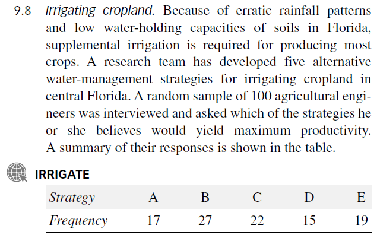
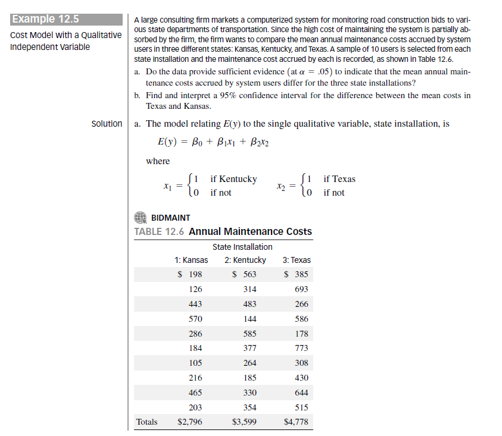

```{r setup, include=FALSE}
dird="./"
#my function to read data 
myread=function(xls){
  fl=paste0(dird,xls)
  readxl::read_xls(fl)
}

knitr::opts_chunk$set(echo = TRUE)
```

\pagebreak


# Question 1


$$
\begin{array}{|c|c|c|c|}\hline
A & B & \cdots & K\\ \hline
n_1 & n_2 & \cdots & n_k\\ \hline
\end{array}
$$

where $A,B ,\cdots, K$ are categories and $n_i$ are frequencies such that $n=\sum_i n_i$.


Please answer the following using the CLT and any other relevant results.

## a)

If $\hat{p}_i=\frac{n_i}{n}$ find:

  1. $E(\hat{p}_i)$ 
  
  $E(\hat{p_i})=E(\frac{n_i}{n})=\frac{1}{n}E(n_i)=\frac{1}{n}np_i=p_i$
  
  2. $E(\hat{p}_i-\hat{p}_j)$
  
  $E(\hat{p_i}-\hat{p_j})=E(\hat{p_i})-E(\hat{p_j})=E(\frac{n_i}{n})-E(\frac{n_j}{n})=\frac{1}{n}E(n_i)-\frac{1}{n}E(n_j)=\frac{1}{n}np_i-\frac{1}{n}np_j=p_i-p_j$
  
  

## b)

Derive the formula for $V(\hat{p}_i)$

$$V(\hat{p_i})=V(\frac{n_i}{n})=\frac{1}{n^2}V(n_i)=\frac{1}{n^2}np_i(1-p_i)=\frac{p_i(1-p_i)}{n}$$


## c)

Derive the expression for $V(\hat{p}_i-\hat{p}_j)$ by showing all intermediate steps and explaining each step. The final expression must be in terms of $n$ and $\hat{p}^{'}s$.
You may use the result that $Cov(\hat{p}_i,\hat{p}_j)=\frac{-p_ip_j}{n}$

$$V(\hat{p_i}-\hat{p_j})=V(\hat{p_i})+V(\hat{p_j})-2Cov(\hat{p}_i,\hat{p}_j)$$
$$V(\hat{p_i}-\hat{p_j})=\frac{p_i(1-p_i)}{n}+\frac{p_j(1-p_j)}{n}-2\frac{-p_ip_j}{n}$$

$$V(\hat{p_i}-\hat{p_j})=\frac{p_i(1-p_i)}{n}+\frac{p_j(1-p_j)}{n}+\frac{2p_ip_j}{n}$$

## d)

Using the above, prove the following result:

A large sample $(1-\alpha)100\%$ confidence interval for $p_i -p_j$ in a one way table is

$$(\hat{p}_i-\hat{p}_j)\pm z_{\alpha/2}\sqrt{\frac{\hat{p}_{i}(1-\hat{p}_{i})+\hat{p}_{j}(1-\hat{p}_{j})+2\hat{p}_{i}\hat{p}_{j}}{n}}$$

You MUST give explanations for each step and without explanation there will be NO points!


By the Central Limit Theorem for a large sample

$\hat{p_i}-\hat{p_j}$ ~$N(p_i-p_j,\frac{p_i(1-p_i)}{n}+\frac{p_j(1-p_j)}{n}+\frac{2p_ip_j}{n})$


## e)

Answer the questions following the description below: 


{ width=70% }

```{r}
irr=myread("irrigate.xls")
head(irr)
irv=with(irr, rep(STRATEGY,FREQ))
tab=table(irv)
tab
s20x::freq1way(tab, conf.level = .88)
```

  a) Find the Pvalue for testing $H_0:p_1=p_2=p_3=p_4=p_5=1/5$ 
  b) What do you conclude concerning the NULL hypothesis?
  b) Find all pairwise cis, $p_i-p_j$ with 88\% confidence adjusted for multiple comparisons.
  c) Using the pairwise cis generated above find the confidence interval for $p_2-p_4$

\pagebreak

# Question 2

The following questions relate mostly to projection matrices and the notation is that which we have discussed in class:

## a)

After drawing the apropriate picture, derive the expression for $H$.

## b)

Show that $HX=X$ where $X=\text{The Design Matrix}$


## c)

Show that $I-H$ is idempotent.


Suppose that $H_{w}$ projects $Y$ onto the subspace spanned by the columns of the reduced design matrix $X_{r}$ and $H_{\Omega}$ projects $Y$ onto the space spanned by the columns of the complete design matrix $X_{c}$.

Show $H_{\Omega}-H_{w}$ is idempotent -- you must justify any statement made!

## d)

Prove that $$SSE = \epsilon^{'}(I-H)\epsilon$$

## e)
If $TSS=\sum_{i=1}^n (y_i-\bar{y})^2$
Show that 
$$TSS=Y^{'}(I-\frac{1}{n}J_n)Y$$

where $J_n=(1)_{n\times n}$
\pagebreak

# Question 3

The following has to do with expressions for estimators and covariance logic.

## a)

Using $cov(CY)=Ccov(Y)C^{'}$ prove that 

$$cov(\hat{\beta}) = \sigma^2 (X^{'}X)^{-1}$$

## b)

$\newcommand{\myslrX}{
\begin{pmatrix}
1 & x_1\\
1 & x_2\\
\vdots & \vdots \\
1 & x_n
\end{pmatrix}
}$

Suppose we have an **SLR** model 

$$ X=
\begin{pmatrix}
1 & x_1\\
1 & x_2\\
\vdots & \vdots \\
1 & x_n
\end{pmatrix}
$$
Find the 2 by 2 matrix expression for the $cov(\hat{\beta})$

## c)

What is the expression for $Var(\hat{\beta_0})$


## d)

If $\bar{x}=0$ what is the numerical value of $cov(\hat{\beta_0},\hat{\beta_1})$?


## e)

What is the algebraic expression for $\sigma^2_{\hat{\beta}_1}$


\pagebreak

# Question 4

The following question comes from Example 12.5 in the text MS 6th edition. You can use the s20x library to calculate interval estimates ciReg() etc.
Use my transformation of the variables to ensure consistency. There are parts a) and b) from the text as well as c) d) and e) supplied by me. These will need to be answered completely.


{ width=80% }


## a) 

See above

## b) 

See above

## c) 

Is the model adequate?
 
## d) 

What is the estimate of the model standard deviation?

## e) 

What is the value of the $F$ statistic that will produce the rejection region for the F-test on the last line of the summary(ylm) output?
 
 

```{r}
bid=myread("BIDMAINT.xls")
#head(bid)
bid = within(bid,{
  y<-COST
  x1<-as.integer(X1)
  x2<-as.integer(X2)
})
ylm = lm(y~x1+x2, bid)
summary(ylm)
qf(1-0.05,2,27 )
```

