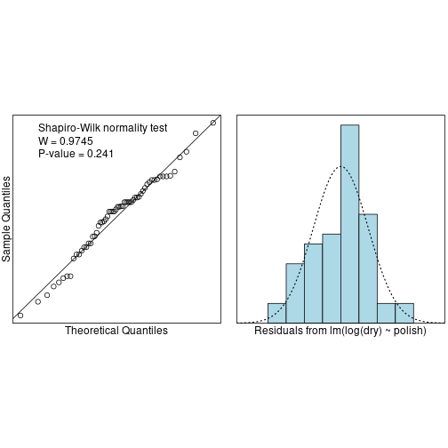

Case Study 35 
========================================================
author: Collin Dabbieri
date: 
autosize: true

Dataset
========================================================

Nail

The drying time for quick drying nail polish and regular nail polish are recorded. Goal is to determine which nail polish dries faster.

60 observations total


Plot Data
========================================================


Summary
========================================================


```
        Sample Size     Mean Median   Std Dev Midspread
Quick            30 55.76667   57.0  8.451416      7.25
Regular          30 82.86667   82.5 12.181765     16.75
```


Model
========================================================

$$E(y)=\beta_0+\beta_1x_1$$

where $x_1=1$ if regular nail polish


```r
nail.fit<-lm(dry~polish,data=nail.df)
summary(nail.fit)
```

```

Call:
lm(formula = dry ~ polish, data = nail.df)

Residuals:
    Min      1Q  Median      3Q     Max 
-21.867  -7.342   1.183   6.458  33.133 

Coefficients:
              Estimate Std. Error t value Pr(>|t|)    
(Intercept)     55.767      1.914   29.14  < 2e-16 ***
polishRegular   27.100      2.707   10.01 2.98e-14 ***
---
Signif. codes:  0 '***' 0.001 '**' 0.01 '*' 0.05 '.' 0.1 ' ' 1

Residual standard error: 10.48 on 58 degrees of freedom
Multiple R-squared:  0.6334,	Adjusted R-squared:  0.6271 
F-statistic: 100.2 on 1 and 58 DF,  p-value: 2.976e-14
```


Equality of Variance
========================================================


```r
eovcheck(nail.fit)
```


Transform Response
========================================================


```r
lognail.fit<-lm(log(dry)~polish,data=nail.df)
eovcheck(lognail.fit)
```


Normality of Errors
========================================================

```r
normcheck(nail.fit,shapiro.wilk=TRUE)
```


Normality of Errors
========================================================


```r
normcheck(lognail.fit,shapiro.wilk=TRUE)
```



T-test
========================================================

We can say with 95% confidence that the underlying means are not equal.

Data suggests that the quick drying nail polish does dry more quickly.


```r
t.test(dry~polish,var.equal=F,data=nail.df)
```

```

	Welch Two Sample t-test

data:  dry by polish
t = -10.011, df = 51.666, p-value = 1.074e-13
alternative hypothesis: true difference in means is not equal to 0
95 percent confidence interval:
 -32.53266 -21.66734
sample estimates:
  mean in group Quick mean in group Regular 
             55.76667              82.86667 
```


