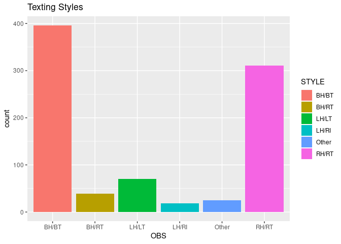
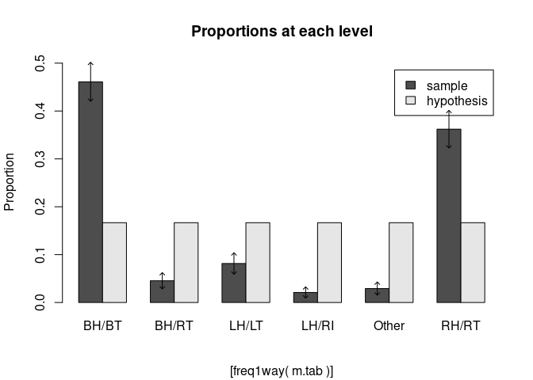
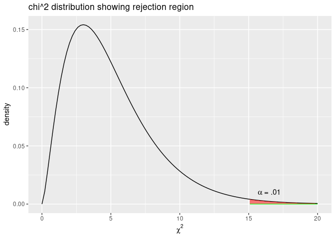
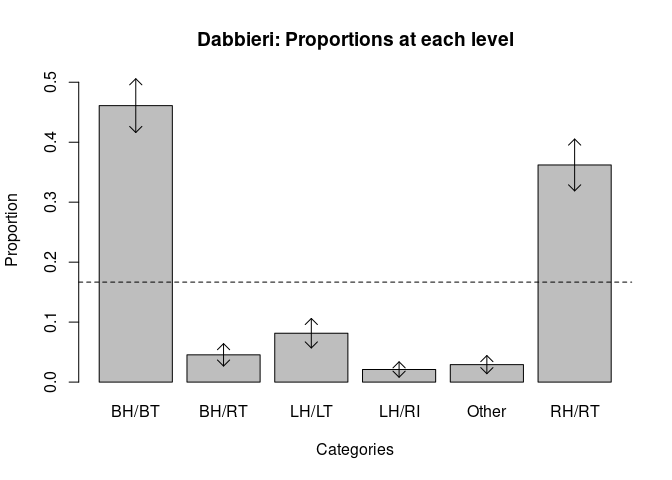

# Task 1

Find working directory


```r
getwd()
```

```
## [1] "/home/collindabbieri/Documents/AppliedRegressionAnalysis/Labs/Lab1"
```

# Task 2


```r
library(readxl)
MOBILE <- read_excel("../../Dataxls/Excel/MOBILE.xls")
head(MOBILE,font="courier new")
```

```
## # A tibble: 6 x 3
##   STYLE NUMBER HYPPROP
##   <chr>  <dbl>   <dbl>
## 1 BH/BT    396   0.167
## 2 RH/RT    311   0.167
## 3 LH/LT     70   0.167
## 4 BH/RT     39   0.167
## 5 LH/RI     18   0.167
## 6 Other     25   0.167
```

# Task 3


```r
f=MOBILE$NUMBER
nf=MOBILE$STYLE
m=rep(nf,f)
m.tab=table(m)
m.tab
```

```
## m
## BH/BT BH/RT LH/LT LH/RI Other RH/RT 
##   396    39    70    18    25   311
```


```r
#takes a filename and creates a data frame
mydata=function(filename){
  data=read_excel(filename)
  
  # f needs to have the frequencies of each category
  f=data$NUMBER
  nf=data$STYLE
  m=rep(nf,f)
  xldf=data.frame(OBS = m)
 
  return(xldf)
}


fff=mydata("../../Dataxls/Excel/MOBILE.xls")
head(fff)
```

```
##     OBS
## 1 BH/BT
## 2 BH/BT
## 3 BH/BT
## 4 BH/BT
## 5 BH/BT
## 6 BH/BT
```

### Explain the story behind the data by reading 9.11, page 451


The MOBILE dataset comes from a study of typing styles of mobile device users. BH/BT are users who hold the device with both hands and type with both thumbs. BH/RT are users who hold the device with both hands and type with their right thumb. LH/LT are users who hold the device with their left hand and type with their left thumb. LH/RI are users who hold the device with their left hand and type with their right index finger. RH/RT are users who hold the device with their right hand and type with their right thumb. Other are users who use some other method.

### Make a barplot


```r
library(ggplot2)
P=ggplot(data=fff, aes(x=OBS,fill=OBS))+geom_bar()+labs(fill='STYLE')+ggtitle("Texting Styles")
P
```

<!-- -->


# Task 4


```r
library(s20x)
```

## State the NULL hypothesis

The NULL hypothesis is that the proportion of texting styles do not differ.
$H_0 = p_{1,0}=p_{2,0}=p_{3,0}=p_{4,0}=p_{5,0}=p_{6,0}$

## Using alpha = 0.10 conduct the test using freq1way() function in s20x library


```r
#rep(1/6,6) takes 1/6 and repeats it 6 times
ff=freq1way(m.tab,hypothprob=rep(1/6,6),conf.level=0.90)
```

```
## data:  m.tab    n = 859 
## 
## Individual (large sample) 90% CIs 
##  (adjusted for 6 multiple comparisons) 
##       sample prop conf.lower conf.upper hypoth prob
## BH/BT       0.461      0.420      0.502       0.167
## BH/RT       0.045      0.028      0.062       0.167
## LH/LT       0.081      0.059      0.104       0.167
## LH/RI       0.021      0.009      0.033       0.167
## Other       0.029      0.015      0.043       0.167
## RH/RT       0.362      0.323      0.401       0.167
## 
## Chi-square test for hypothesized probabilities 
##     X-squared = 963.4005, df = 5, p-value = < 2.2e-16
```

<!-- -->

## What is the p-value for evidence against the NULL

The p-value from the chi-squared test is <2.2e-16


## Interpret the p-value

We can say with 90% confidence that the NULL hypothesis is plausibly incorrect


## Produce a plot of the chi square distribution that has the rejection region corresponding to $\alpha=0.01$ on it


```r
p <- ggplot(NULL, aes(x = c(0,20))) + 
  stat_function(fun = dchisq, args = list(df = 5))+
  geom_area(stat="function",fun = dchisq, args=list(df=5),fill="red", alpha=0.5,xlim = c(qchisq(1-0.01,5),20)) + 
  geom_segment(aes(x=qchisq(1-0.01,5),y=0,xend=20,yend=0),col ="Green",alpha=0.8, size = 0.5) +
  xlab(expression(chi^2)) +
  ylab("density") +
  labs(title = paste("chi^2", "distribution showing rejection region")) +
  annotate("text", x = 16.5, y = 0.01,  label = "paste(alpha, \" = .01\")", parse = TRUE)
p
```

<!-- -->


# Task 5

## Find the chi^2 statistic for each category and state which one gives the greatest departure from the NULL


```r
qchisq(1-0.05,5)
```

```
## [1] 11.0705
```


```r
ff$chi
```

```
## m
##     BH/BT     BH/RT     LH/LT     LH/RI     Other     RH/RT 
## 446.50543  75.79065  37.39251 109.42976  97.53221 196.74990
```

BH/BT gives the greatest departure from the NULL


## Give interval estimates for underlying proportions


```r
ff$CIs
```

```
##       sample prop  conf.lower conf.upper
## BH/BT  0.46100116 0.420284816 0.50171751
## BH/RT  0.04540163 0.028396891 0.06240637
## LH/LT  0.08149010 0.059143155 0.10383705
## LH/RI  0.02095460 0.009255161 0.03265404
## Other  0.02910361 0.015373191 0.04283403
## RH/RT  0.36204889 0.322793331 0.40130446
```


# Task 6

## Alter freq1way() function and call it myfreq1way() so the heading of the plot contains your last name


```r
myfreq1way = function (counts, hypothprob, conf.level = 0.95, addCIs = TRUE, 
          digits = 4, arrowwid = 0.1, estimated = 0){
    varname = deparse(substitute(counts))
    if (length(dim(counts)) > 1) 
        stop(paste("freq1way: Dimension of", varname, "greater than 1"))
    if (as.integer(estimated) != estimated) 
        stop("freq1way: estimated must be an integer")
    dfs = length(counts) - 1
    if ((estimated < 0) | (estimated > dfs)) 
        stop(paste("freq1way: estimated must be between 0 and", 
            dfs))
    n = sum(as.vector(counts))
    cat("data: ", varname, "   n =", n, "\n\n")
    ncats = length(counts)
    ncatsC2 = choose(ncats, 2)
    if ((any(counts != trunc(counts))) | (n < max(30, 5 * ncats))) 
        warning("Expecting a vector of counts")
    if (is.null(names(counts))) 
        names(counts) = 1:ncats
    conf.pc = 100 * conf.level
    phat = counts/n
    qval = abs(qnorm((1 - conf.level)/(2 * ncats)))
    se = sqrt(phat * (1 - phat)/n)
    CIs = matrix(c(phat, phat - qval * se, phat + qval * se), 
        ncol = 3, dimnames = list(names(counts), c("sample prop", 
            "conf.lower", "conf.upper")))
    if (!missing(hypothprob)) {
        if (length(hypothprob) != ncats) 
            stop("counts and hypothprob must have same length")
        CIs = cbind(CIs, hypothprob)
        colnames(CIs)[4] = "hypoth prob"
    }
    cat("Individual (large sample)", paste(conf.pc, "%", sep = ""), 
        "CIs", "\n", "(adjusted for", ncats, "multiple comparisons)", 
        "\n")
    print(round(CIs, 3), quote = FALSE)
    cat("\n")
    if (missing(hypothprob)) {
        chitest = chisq.test(counts, p = rep(1, ncats)/ncats)
        chitest$p.value = 1 - pchisq(chitest$statistic, dfs - 
            estimated)
        cat("Chi-square test for uniformity", "\n    ")
    }
    else {
        chitest = chisq.test(counts, p = hypothprob)
        chitest$p.value = 1 - pchisq(chitest$statistic, dfs - 
            estimated)
        names(hypothprob) = names(counts)
        cat("Chi-square test for hypothesized probabilities", 
            "\n    ")
    }
    cat(names(chitest$statistic), " = ", format(round(chitest$statistic, 
        4)), ", ", sep = "")
    cat(paste(names(chitest$parameter), " = ", format(round(chitest$parameter - 
        estimated, 3)), ",", sep = ""), "")
    cat("p-value =", format.pval(chitest$p.value, digits = digits), 
        "\n")
    if (any(chitest$exp < 5)) 
        warning("Chi-square approximation may be incorrect")
    cat("\n")
    uplim = ifelse(addCIs, max(phat + qval * se), max(phat))
    disp = 0
    modlength = 1
    if (missing(hypothprob)) {
        midp = barplot(phat, xlab="Categories",ylab = "Proportion", main = "Dabbieri: Proportions at each level", 
             ylim = c(0, 
                uplim))
        if (addCIs) 
            abline(h = 1/ncats, lty = 2)
    }
    else {
        midp = barplot(rbind(phat, hypothprob), beside = TRUE, 
            xlab="Categories",ylab = "Proportion", main = "Dabbieri: Proportions at each level", 
            ylim = c(0, 
                uplim), legend = c("sample", "hypothesis"))[1, 
            ]
        disp = 0
        modlength = 2
    }
    if (addCIs) 
        for (i in 1:length(midp)) arrows(midp[i] - disp, phat[i] - 
            qval * se[i], midp[i] - disp, phat[i] + qval * se[i], 
            code = 3, angle = 45, length = 0.9 * arrowwid/modlength)
    if (missing(hypothprob)) {
        matw = matrix(NA, ncats - 1, ncats - 1)
        namew = names(phat)
        dimnames(matw) = list(namew[-length(namew)], namew[-1])
        for (i1 in 1:(ncats - 1)) {
            for (i2 in 2:ncats) {
                tempw = phat[i1] - phat[i2] + abs(qnorm((1 - 
                  conf.level)/(2 * ncatsC2))) * c(-1, 1) * sqrt(((phat[i1] + 
                  phat[i2]) - ((phat[i1] - phat[i2])^2))/n)
                tempw = round(tempw, 3)
                matw[i1, i2 - 1] = ifelse((i1 < i2), paste("(", 
                  tempw[1], ",", tempw[2], ")", sep = ""), " ")
                if ((0 <= tempw[1] | 0 >= tempw[2]) & (i1 < i2)) 
                  matw[i1, i2 - 1] = paste(matw[i1, i2 - 1], 
                    "*", sep = "")
            }
        }
        cat(paste(conf.pc, "%", sep = ""), "CIs for differences in true proportions (rowname-colname)", 
            "\n", "(adjusted for", ncatsC2, "multiple comparisons)", 
            "\n")
        print(matw, quote = FALSE)
    }
    invisible(list(CIs = CIs[, 1:3], exp = chitest$exp, chi = (counts - 
        chitest$exp)^2/chitest$exp))
}
myfreq1way(m.tab)
```

```
## data:  m.tab    n = 859 
## 
## Individual (large sample) 95% CIs 
##  (adjusted for 6 multiple comparisons) 
##       sample prop conf.lower conf.upper
## BH/BT       0.461      0.416      0.506
## BH/RT       0.045      0.027      0.064
## LH/LT       0.081      0.057      0.106
## LH/RI       0.021      0.008      0.034
## Other       0.029      0.014      0.044
## RH/RT       0.362      0.319      0.405
## 
## Chi-square test for uniformity 
##     X-squared = 963.4005, df = 5, p-value = < 2.2e-16
```

<!-- -->

```
## 95% CIs for differences in true proportions (rowname-colname) 
##  (adjusted for 15 multiple comparisons) 
##       BH/RT          LH/LT            LH/RI          Other         
## BH/BT (0.358,0.473)* (0.316,0.443)*   (0.386,0.494)* (0.377,0.487)*
## BH/RT                (-0.072,-0.001)* (-0.001,0.05)  (-0.011,0.044)
## LH/LT                                 (0.029,0.092)* (0.019,0.085)*
## LH/RI                                                (-0.031,0.014)
## Other                                                              
##       RH/RT           
## BH/BT (0.009,0.189)*  
## BH/RT (-0.372,-0.261)*
## LH/LT (-0.341,-0.22)* 
## LH/RI (-0.393,-0.289)*
## Other (-0.386,-0.28)*
```


# Task 7

## What are the assumptions for a chi-squared test?
1. The n observed counts are a random sample from the population of interest

2. $E(n_i)\geq 5$ for all $n_i$

## Does the above test satisfy the assumptions?

The test does satisfy the assumptions.


