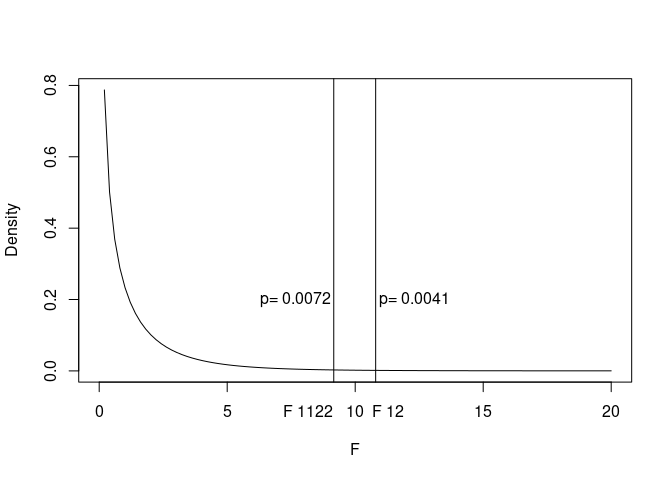

# Task 1


```r
getwd()
```

```
## [1] "/home/collindabbieri/Documents/AppliedRegressionAnalysis/Labs/Lab10"
```

# Task 2


```r
set.seed(12);y1 = rnorm(10,14,5)
set.seed(13);y2 = rnorm(10, 15, 5)

set.seed(12);y11 = rnorm(10,14,10) 
set.seed(13);y22 = rnorm(10, 15, 10)


f = rep(c(1,2), c(10,10))
f = factor(f,levels=c(1,2))

df = data.frame(y = c(y1,y2), x = f)

dev.new(noRStudioGD = TRUE)
plot(c(y1,y2) ~ as.numeric(f), type = "p", pch =21, bg = "Blue", ylim = c(-5,35),main="Collin Dabbieri")
abline(h = c(mean(y1),mean(y2)))
```


```r
df = data.frame(y = c(y11,y22), x = f)

dev.new(noRStudioGD = TRUE)
plot(c(y11,y22) ~ as.numeric(f), type = "p", pch =21, bg = "Red", ylim = c(-5,35),main="Collin Dabbieri")
abline(h = c(mean(y11),mean(y22)))
```


Using Pg 745, calculate

  -Within-sample variation: $s^2$ for each of the above
  
$$ s^2=\frac{\sum_{i=1}^{n_1}(y_{i1}-\bar{y}_1)^2+\sum_{i=1}^{n_2}(y_{i2}-\bar{y}_2)^2}{n_1+n_2-2}=\frac{SSE}{n_1+n_2-2} $$
First for y1 and y2

```r
n1=length(y1)
n2=length(y2)
y1bar=mean(y1)
y2bar=mean(y2)

sum1=0
for(i in y1){
  square=(i-y1bar)^2
  sum1=sum1+square
}
sum2=0
for(i in y2){
  square=(i-y2bar)^2
  sum2=sum2+square
}

SSE=sum1+sum2

s2_12=SSE/(n1+n2-2)
s2_12
```

```
## [1] 18.58873
```

Next for y11 and y22


```r
n11=length(y11)
n22=length(y22)
y11bar=mean(y11)
y22bar=mean(y22)

sum1=0
for(i in y11){
  square=(i-y11bar)^2
  sum1=sum1+square
}
sum2=0
for(i in y22){
  square=(i-y22bar)^2
  sum2=sum2+square
}

SSE=sum1+sum2

s2_1122=SSE/(n11+n22-2)
s2_1122
```

```
## [1] 74.35491
```

  
  -Between-sample variation: $\frac{SST}{1}$ for each of the above
  
$$ \frac{n_1(\bar{y}_1-\bar{y})^2+n_2(\bar{y}_2-\bar{y})^2}{2-1}=\frac{SST}{1} $$

First for y1 and y2


```r
y12=cbind(y1,y2)
ybar=mean(y12)
SST_12=n1*(y1bar-ybar)^2+n2*(y2bar-ybar)^2
SST_12
```

```
## [1] 200.7459
```

Next for y11 and y22


```r
y1122=cbind(y11,y22)
ybar=mean(y1122)
SST_1122=n11*(y11bar-ybar)^2+n22*(y22bar-ybar)^2
SST_1122
```

```
## [1] 681.257
```

  
  
Using pg 745 create $F=\frac{\frac{SST}{1}}{\frac{SSE}{n_1+n_2-2}}$ for both plots

First for y1 and y2


```r
f_12=SST_12/s2_12
f_12
```

```
## [1] 10.79934
```

Next for y11 and y22


```r
f_1122=SST_1122/s2_1122
f_1122
```

```
## [1] 9.162233
```


What do you conclude from the F statistic?


```r
1-pf(f_12,1,n1+n2-2)
```

```
## [1] 0.004104104
```

```r
1-pf(f_1122,1,n11+n22-2)
```

```
## [1] 0.007248096
```


I would expect y1 and y2 to create a higher F statistic because the lower variance values make it easier to determine that the underlying variances are different (since in this case we know that they are different). That was the case. Although both cases allow us to reject the NULL of the underlying means being the same at the 95% confidence level.


# Task 3

Summarize the F test for comparing nested models. Pg 686

For a complete model

$$E(y)=\beta_0+\beta_1x_1+\beta_2x_2+...+\beta_gx_g+...\beta_kx_k$$

If you want to check whether the terms $x_{g+1},x_{g+2},...,x_k$ contribute meaningfully to the model, you would use a reduced model

$$E(y)=\beta_0+\beta_1x_1+\beta_2x_2+...+\beta_gx_g$$

Where the F test for comparing nested models would have the NULL

$$H_0:\beta_{g+1}=\beta_{g+2}=...=\beta_k=0$$

What is the algebraic expression for $F_C$

$$F_C=\frac{\frac{SSE_R-SSE_C}{k-g}}{\frac{SSE_C}{n-(k+1)}}=\frac{\frac{SSE_R-SSE_C}{\# \: of \: \beta 's \: tested \: in \: H_0}}{MSE_C}$$

Define all parts of $F_C$

$SSE_R$ is the residual sum of squares for the reduced model. $SSE_C$ is the residual sum of squares for the complete model. $MSE_C$ is the mean square error ($s^2$) for the complete model. k+1 is the number of $\beta$ parameters for the complete model. g+1 is the number of $\beta$ parameters for the reduced model. Therefore k-g is the number of $\beta$ parameters specified in $H_0$. n is the total sample size.

Now apply this to what you did in Task 2 by:
  -Calculating a p-value for the two tests associated with the F values generated
  -Plot the F distribution using the correct degrees of freedom for each test
  -Show the p-values for each plot (shade with 4 dec values for p value)
  
  

```r
#n1=n2=n11=n22 so degrees of freedom are the same
p_12=1-pf(f_12,1,n1+n2-2)
p_1122=1-pf(f_1122,1,n11+n22-2)

temp=toString(p_12)
str_p12=substr(p_12,1,6)

temp=toString(p_1122)
str_p1122=substr(p_1122,1,6)


x=seq(0,20,length.out=100)

f=c()
for(i in x){
  f=append(f,df(i,1,n1+n2-2))
}

plot(x,f,type='l',ylab="Density",xlab="F")
text(x=f_12+1.5,y=0.2,labels=paste("p=",str_p12))
text(x=f_1122-1.5,y=0.2,labels=paste("p=",str_p1122))
mtext('F 12', side=1, line=1.0, at=f_12+0.5)
mtext('F 1122', side=1, line=1.0, at=f_1122-1)
abline(v=f_12)
abline(v=f_1122)
```

<!-- -->

  
  
# Task 4

Do example 14.3 in R

An experiment was conducted to compare the wearing qualities of three types of paint when subjected to the abrasive action of a slowly rotating cloth-surfaced wheel. Ten paint specimens were tested for each paint type, and the number of hours until visible abrasion was apparent was recorded for each specimen. The data (with totals) are shown. Is there sufficient evidence to indicate a difference in the mean time until abrasion is visibly evident for the three paint types? Test using $\alpha=0.05$


```r
paint=matrix(data=c(148,76,393,520,236,134,55,166,415,153,513,264,433,94,535,327,214,135,280,304,335,643,216,536,128,723,258,380,594,465),nrow=10,ncol=3)
colnames(paint)=c("1","2","3")
paint
```

```
##         1   2   3
##  [1,] 148 513 335
##  [2,]  76 264 643
##  [3,] 393 433 216
##  [4,] 520  94 536
##  [5,] 236 535 128
##  [6,] 134 327 723
##  [7,]  55 214 258
##  [8,] 166 135 380
##  [9,] 415 280 594
## [10,] 153 304 465
```
We want to test this NULL
$$H_0: \mu_1=\mu_2=\mu_3$$

We can use this model

$$E(y)=\beta_0+\beta_1x_1+\beta_2x_2$$

where $x_1=1$ if paint type 1 and $x_2=1$ if paint type 2.

Therefore the NULL we want to test is equivalent to 

$$H_0:\beta_1=\beta_2=0$$

But in the interest of continuing the work we did in earlier sections we could also calculate our F value directly


```r
y1=paint[,1]
y2=paint[,2]
y3=paint[,3]
n1=length(y1)
n2=length(y2)
n3=length(y3)
y1bar=mean(y1)
y2bar=mean(y2)
y3bar=mean(y3)
n=n1+n2+n3
k=2

sum1=0
for(i in y1){
  square=(i-y1bar)^2
  sum1=sum1+square
}
sum2=0
for(i in y2){
  square=(i-y2bar)^2
  sum2=sum2+square
}
sum3=0
for(i in y3){
  square=(i-y3bar)^2
  sum2=sum2+square
}

SSE=sum1+sum2+sum3

s2=SSE/(n-(k+1))

#denominator for between samples variation is number of samples-1 so it should be 2 in this case
y123=cbind(y1,y2,y3)
ybar=mean(y123)
SST=n1*(y1bar-ybar)^2+n2*(y2bar-ybar)^2+n3*(y3bar-ybar)^2
between=SST/2


f=between/s2
f
```

```
## [1] 3.481938
```

```r
1-pf(f,2,n-(k+1))
```

```
## [1] 0.0451521
```

Our p-value is less than 0.05 so we can say with 95% confidence that the underlying means are different.

