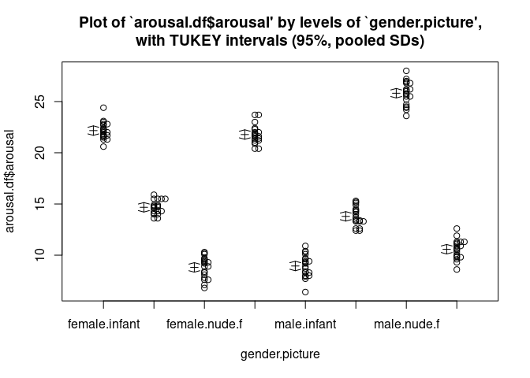

# Task 1


```r
getwd()
```

```
## [1] "/home/collindabbieri/Documents/AppliedRegressionAnalysis/Labs/Lab11"
```

# Task 2

Using the package s20x load the data arousal.df


```r
library(s20x)

data(arousal.df)
head(arousal.df)
```

```
##   gender picture arousal
## 1   male  nude.m    10.5
## 2   male  nude.m     9.6
## 3   male  nude.m     9.8
## 4   male  nude.m     9.8
## 5   male  nude.m    10.3
## 6   male  nude.m    10.9
```


Write a paragraph on what the data and experiment concerns.

Emotional arousal levels were quantified for males and females by measuring changes in their pupil diameters. Participants were presented an image of either a nude male, a nude female, a landscape or an infant and their arousal levels were recorded. 20 males and 20 females participated in the study.


Make an interaction plot with gender on the horizontal axis


```r
interactionPlots(arousal~gender+picture,data=arousal.df)
```

<!-- -->


Do the same but with picture on the horizontal axis


```r
interactionPlots(arousal~picture+gender,data=arousal.df)
```

<!-- -->


What do you conclude from the pictures?

The pictures tell me that gender and picture clearly interact, so a gender:picture term will be necessary in the model.


Give the anova table for the interactive model


```r
model=lm(arousal~gender+picture+gender:picture,data=arousal.df)
summary(model)
```

```
## 
## Call:
## lm(formula = arousal ~ gender + picture + gender:picture, data = arousal.df)
## 
## Residuals:
##     Min      1Q  Median      3Q     Max 
## -2.5450 -0.6225  0.0200  0.6350  2.2350 
## 
## Coefficients:
##                             Estimate Std. Error t value Pr(>|t|)    
## (Intercept)                  22.1650     0.2135 103.818  < 2e-16 ***
## gendermale                  -13.2200     0.3019 -43.784  < 2e-16 ***
## picturelandscape             -7.4900     0.3019 -24.807  < 2e-16 ***
## picturenude.f               -13.3600     0.3019 -44.248  < 2e-16 ***
## picturenude.m                -0.3850     0.3019  -1.275    0.204    
## gendermale:picturelandscape  12.3350     0.4270  28.888  < 2e-16 ***
## gendermale:picturenude.f     30.2300     0.4270  70.796  < 2e-16 ***
## gendermale:picturenude.m      2.0200     0.4270   4.731 5.07e-06 ***
## ---
## Signif. codes:  0 '***' 0.001 '**' 0.01 '*' 0.05 '.' 0.1 ' ' 1
## 
## Residual standard error: 0.9548 on 152 degrees of freedom
## Multiple R-squared:  0.9778,	Adjusted R-squared:  0.9768 
## F-statistic:   956 on 7 and 152 DF,  p-value: < 2.2e-16
```

```r
anova(model)
```

```
## Analysis of Variance Table
## 
## Response: arousal
##                 Df Sum Sq Mean Sq  F value    Pr(>F)    
## gender           1  172.0  172.02  188.690 < 2.2e-16 ***
## picture          3  197.6   65.87   72.252 < 2.2e-16 ***
## gender:picture   3 5731.3 1910.43 2095.597 < 2.2e-16 ***
## Residuals      152  138.6    0.91                       
## ---
## Signif. codes:  0 '***' 0.001 '**' 0.01 '*' 0.05 '.' 0.1 ' ' 1
```

Interpret the output

Our model is

$$E(y)=\beta_0+\beta_1x_1+\beta_2x_2+\beta_3x_3+\beta_4x_4+\beta_5x_1x_2+\beta_6x_1x_3+\beta_7x_1x_4$$

Where $x_1=1$ when gender is male. $x_2=1$ when picture is landscape. $x_3=1$ when picture is nude female and $x_4=1$ when picture is nude male. So female gender and infant picture are our baselines.

The anova table tells us that the gender terms, the picture terms, and the interaction terms are significant in our model at the 95% confidence level.


Give the point and 95% interval estimate for male:landscape-female:landscape


```r
gender.picture<-crossFactors(arousal.df$gender,arousal.df$picture)
gender.picture<-factor(gender.picture)
arousal.1way.fit<-lm(arousal.df$arousal~gender.picture)
summary1way(arousal.1way.fit)
```

```
## ANOVA Table:
##                 Df  Sum Squares  Mean Square  F-statistic  p-value   
## Between Groups  7   6100.92044   871.56006    956.03383    0         
## Within Groups   152 138.5695     0.91164                             
## Total           159 6239.48994                                       
## 
## Numeric Summary:
##                   Sample size     Mean  Median  Std Dev  Midspread
## All Data                  160 15.81938   14.30  6.26435     11.750
## female.infant              20 22.16500   22.05  0.82925      1.050
## female.landscape           20 14.67500   14.70  0.66243      0.800
## female.nude.f              20  8.80500    9.05  1.03998      1.500
## female.nude.m              20 21.78000   21.65  0.91341      0.875
## male.infant                20  8.94500    9.05  1.09567      1.400
## male.landscape             20 13.79000   13.60  0.92844      1.125
## male.nude.f                20 25.81500   25.90  1.14030      1.725
## male.nude.m                20 10.58000   10.65  0.94234      1.350
## 
## Table of Effects: (GrandMean and deviations from GM)
##          typ.val    female.infant female.landscape    female.nude.f 
##         15.81938          6.34562         -1.14438         -7.01438 
##    female.nude.m      male.infant   male.landscape      male.nude.f 
##          5.96062         -6.87438         -2.02938          9.99562 
##      male.nude.m 
##         -5.23938
```

<!-- -->

```r
multipleComp(arousal.1way.fit)
```

```
##                                     Estimate Tukey.L Tukey.U Tukey.p
## female.infant  -  female.landscape     7.490   6.562   8.418  0.0000
## female.infant  -  female.nude.f       13.360  12.432  14.288  0.0000
## female.infant  -  female.nude.m        0.385  -0.543   1.313  0.9067
## female.infant  -  male.infant         13.220  12.292  14.148  0.0000
## female.infant  -  male.landscape       8.375   7.447   9.303  0.0000
## female.infant  -  male.nude.f         -3.650  -4.578  -2.722  0.0000
## female.infant  -  male.nude.m         11.585  10.657  12.513  0.0000
## female.landscape  -  female.nude.f     5.870   4.942   6.798  0.0000
## female.landscape  -  female.nude.m    -7.105  -8.033  -6.177  0.0000
## female.landscape  -  male.infant       5.730   4.802   6.658  0.0000
## female.landscape  -  male.landscape    0.885  -0.043   1.813  0.0735
## female.landscape  -  male.nude.f     -11.140 -12.068 -10.212  0.0000
## female.landscape  -  male.nude.m       4.095   3.167   5.023  0.0000
## female.nude.f  -  female.nude.m      -12.975 -13.903 -12.047  0.0000
## female.nude.f  -  male.infant         -0.140  -1.068   0.788  0.9998
## female.nude.f  -  male.landscape      -4.985  -5.913  -4.057  0.0000
## female.nude.f  -  male.nude.f        -17.010 -17.938 -16.082  0.0000
## female.nude.f  -  male.nude.m         -1.775  -2.703  -0.847  0.0000
## female.nude.m  -  male.infant         12.835  11.907  13.763  0.0000
## female.nude.m  -  male.landscape       7.990   7.062   8.918  0.0000
## female.nude.m  -  male.nude.f         -4.035  -4.963  -3.107  0.0000
## female.nude.m  -  male.nude.m         11.200  10.272  12.128  0.0000
## male.infant  -  male.landscape        -4.845  -5.773  -3.917  0.0000
## male.infant  -  male.nude.f          -16.870 -17.798 -15.942  0.0000
## male.infant  -  male.nude.m           -1.635  -2.563  -0.707  0.0000
## male.landscape  -  male.nude.f       -12.025 -12.953 -11.097  0.0000
## male.landscape  -  male.nude.m         3.210   2.282   4.138  0.0000
## male.nude.f  -  male.nude.m           15.235  14.307  16.163  0.0000
```

We can see from the output that the female:landscape-male:landscape has estimate 0.885 with 95% confidence interval (-0.043-1.813)

So male:landscape-female:landscape has estimate -0.885 with confidence interval (-1.813-0.043)

Interpret the  interval

We can see from the interaction plot that males and females seem to have similar arousal levels when presented with a picture of a landscape. This is confirmed by the interval, we can say it is plausible at the 95% confidence level that males and females have the same arousal reaction to a landscape.
