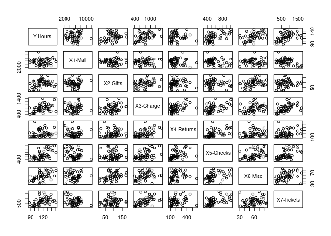
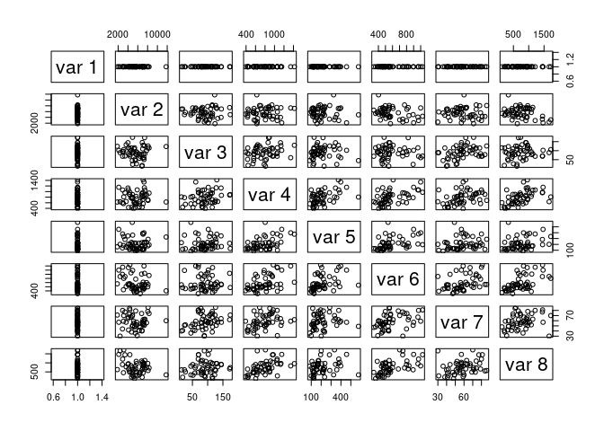
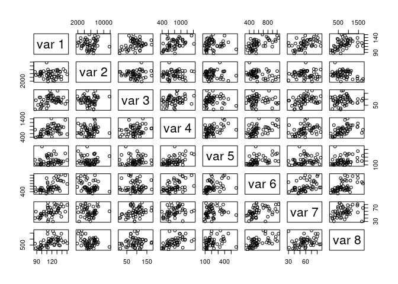
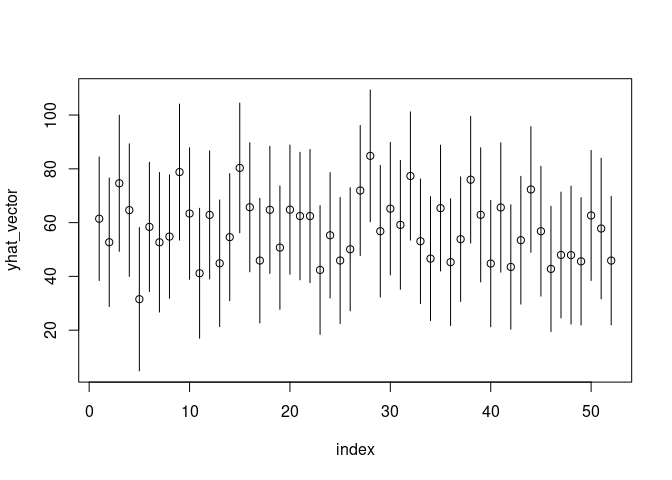

# My functions {.tabset .tabset-pills .tabset-fade}

## myy()

```r
myy=function(Y,X){
  n=nrow(X)
  k=ncol(X)-1
  model=lm(Y~X[,-1])
  r=model$residuals
  coeff=model$coefficients

  SSE=sum(r^2)
  s=sqrt(SSE/(n-(k+1)))
  t=qt(1-alpha/2,n-(k+1))
  pm=c(-1,1)
  
  ci_matrix=matrix(,nrow=n,ncol=2)
  yhat_vector=c()
  for(i in 1:n){
    x=X[i,]

    yhat=0
    for(j in 1:k+1){
      yhat=yhat+(coeff[j]*x[j])
    }

    ci=yhat+pm*t*s*sqrt(1+t(x)%*%solve(t(X)%*%X)%*%x)
    ci_matrix[i,1]=ci[1]
    ci_matrix[i,2]=ci[2]
    yhat_vector=append(yhat_vector,yhat)

  }
  
  
  
  ##### Pairs Plot
  
  pairs_data=X
  pairs_data[,1]=Y

  pairs(pairs_data)
  
  
  
  ###### ggplot of Y vs xi
  # I don't understand what you're asking for here
  
  
  ###### plot of cis and point estimates (x=1:n)
  index=seq(n)
  plot(index,yhat_vector,ylim=c(min(ci_matrix[,1]),max(ci_matrix[,2])))
  for(i in 1:n){
    segments(x0=i,y0=ci_matrix[i,1],y1=ci_matrix[i,2])
  }
  
  
  names(yhat_vector)=seq(n)
  return(list(yhat=yhat_vector,ci=ci_matrix))
}
```


## myl()


```r
myl=function(Y,X,alpha,a,l){
  
  n=nrow(X)
  k=ncol(X)-1
  t=qt(1-alpha/2,n-(k+1))
  pm=c(-1,1)
  
  model=lm(Y~X[,-1])
  coeff=model$coefficients
  
  betahat=matrix(data=coeff,nrow=k+1,ncol=1)
  
  coeff=model$coefficients
  r=model$residuals
  SSE=sum(r^2)
  s=sqrt(SSE/(n-(k+1)))
  
  ci=l+pm*t*s*sqrt(t(a)%*%solve(t(X)%*%X)%*%a)

  pairs(X)
  return(list(ci=ci))
  
}
```


# Task 1


```r
getwd()
```

```
## [1] "/home/collindabbieri/Documents/AppliedRegressionAnalysis/Labs/Lab5"
```


# Task 2 {.tabset .tabset-pills .tabset-fade}


```r
library(readxl)

clerical=read_excel("../../Dataxls/Excel/CLERICAL.XLS")
head(clerical)
```

```
## # A tibble: 6 x 10
##     Obs Day   `Y-Hours` `X1-Mail` `X2-Gifts` `X3-Charge` `X4-Returns`
##   <dbl> <chr>     <dbl>     <dbl>      <dbl>       <dbl>        <dbl>
## 1     1 M          128.      7781        100         886          235
## 2     2 T          114.      7004        110         962          388
## 3     3 W          147.      7267         61        1342          398
## 4     4 Th         124.      2129        102        1153          457
## 5     5 F          100.      4878         45         803          577
## 6     6 S          119.      3999        144        1127          345
## # … with 3 more variables: `X5-Checks` <dbl>, `X6-Misc` <dbl>,
## #   `X7-Tickets` <dbl>
```

Replace the first 4 entries in the column "X5-Checks" with c(600,500,1000,900) 


```r
print(clerical$`X5-Checks`[1:4])
```

```
## [1]  644  589 1081  891
```

```r
clerical$`X5-Checks`[1:4]=c(600,500,1000,900)
print(clerical$`X5-Checks`[1:4])
```

```
## [1]  600  500 1000  900
```

## A. 
Use scattergrams to plot the sample data. Interpret the results.


```r
clerical_plot=subset(clerical,select=-c(Obs,Day))
pairs(clerical_plot)
```

<!-- -->


## B
Use the method of Least Squares to estimate the model parameters. Interpret the $\beta$-estimates.


```r
n=length(clerical$`Y-Hours`)
k=7

model=lm(`Y-Hours`~.,data=clerical_plot)
summary(model)
```

```
## 
## Call:
## lm(formula = `Y-Hours` ~ ., data = clerical_plot)
## 
## Residuals:
##      Min       1Q   Median       3Q      Max 
## -19.1039  -7.2014  -0.6684   6.8009  28.1276 
## 
## Coefficients:
##                Estimate Std. Error t value Pr(>|t|)    
## (Intercept)  59.8295936  9.6887229   6.175 1.86e-07 ***
## `X1-Mail`     0.0014374  0.0009333   1.540 0.130675    
## `X2-Gifts`    0.0857528  0.0487090   1.761 0.085271 .  
## `X3-Charge`   0.0095240  0.0092191   1.033 0.307211    
## `X4-Returns` -0.0407140  0.0174093  -2.339 0.023962 *  
## `X5-Checks`   0.0462151  0.0122947   3.759 0.000499 ***
## `X6-Misc`     0.2046914  0.1321970   1.548 0.128694    
## `X7-Tickets`  0.0049089  0.0055710   0.881 0.383025    
## ---
## Signif. codes:  0 '***' 0.001 '**' 0.01 '*' 0.05 '.' 0.1 ' ' 1
## 
## Residual standard error: 11.1 on 44 degrees of freedom
## Multiple R-squared:   0.56,	Adjusted R-squared:   0.49 
## F-statistic: 8.001 on 7 and 44 DF,  p-value: 3.022e-06
```


A few of the $\beta$ parameters seem important at the start (X4 and X5)

## C
Find the estimate of $\sigma$, the standard deviation of the random error term, and interpret its value.


```r
coeff=model$coefficients
y_fit=coeff[1]+coeff[2]*clerical$`X1-Mail`+coeff[3]*clerical$`X2-Gifts`+coeff[4]*clerical$`X3-Charge`+coeff[5]*clerical$`X4-Returns`+coeff[6]*clerical$`X5-Checks`+coeff[7]*clerical$`X6-Misc`+coeff[8]*clerical$`X7-Tickets`
y=clerical$`Y-Hours`
r=y-y_fit
SSE=sum(r^2)
s=sqrt(SSE/(n-(k+1)))
s
```

```
## [1] 11.0958
```


## D
Assess the adequcy of the model by conducting a test of hypothesis at $\alpha=0.05$


```r
summary(model)
```

```
## 
## Call:
## lm(formula = `Y-Hours` ~ ., data = clerical_plot)
## 
## Residuals:
##      Min       1Q   Median       3Q      Max 
## -19.1039  -7.2014  -0.6684   6.8009  28.1276 
## 
## Coefficients:
##                Estimate Std. Error t value Pr(>|t|)    
## (Intercept)  59.8295936  9.6887229   6.175 1.86e-07 ***
## `X1-Mail`     0.0014374  0.0009333   1.540 0.130675    
## `X2-Gifts`    0.0857528  0.0487090   1.761 0.085271 .  
## `X3-Charge`   0.0095240  0.0092191   1.033 0.307211    
## `X4-Returns` -0.0407140  0.0174093  -2.339 0.023962 *  
## `X5-Checks`   0.0462151  0.0122947   3.759 0.000499 ***
## `X6-Misc`     0.2046914  0.1321970   1.548 0.128694    
## `X7-Tickets`  0.0049089  0.0055710   0.881 0.383025    
## ---
## Signif. codes:  0 '***' 0.001 '**' 0.01 '*' 0.05 '.' 0.1 ' ' 1
## 
## Residual standard error: 11.1 on 44 degrees of freedom
## Multiple R-squared:   0.56,	Adjusted R-squared:   0.49 
## F-statistic: 8.001 on 7 and 44 DF,  p-value: 3.022e-06
```
The NULL for the F test is $H_0:\beta_1=\beta_2=...=\beta_k=0$. We see evidence against this NULL at the 0.05 level. The model is adequate. At least one of the model parameters is nonzero at the 95% confidence level.

## E
Find a 95% confidence interval for $\beta_2$. Interpret the result.


```r
X=matrix(,nrow=n,ncol=k+1)
X[,1]=1
X[,2]=clerical$`X1-Mail`
X[,3]=clerical$`X2-Gifts`
X[,4]=clerical$`X3-Charge`
X[,5]=clerical$`X4-Returns`
X[,6]=clerical$`X5-Checks`
X[,7]=clerical$`X6-Misc`
X[,8]=clerical$`X7-Tickets`

Y=matrix(,nrow=n,ncol=1)
Y[,1]=clerical$`Y-Hours`

betahat=matrix(coeff,nrow=k+1,ncol=1)
a=matrix(c(0,0,1,0,0,0,0,0,0),nrow=k+1,ncol=1)
```

```
## Warning in matrix(c(0, 0, 1, 0, 0, 0, 0, 0, 0), nrow = k + 1, ncol = 1):
## data length [9] is not a sub-multiple or multiple of the number of rows [8]
```

```r
pm=c(-1,1)
alpha=0.05

ci=t(a)%*%betahat+pm*qt(1-alpha/2,n-(k+1))*s*sqrt(t(a)%*%solve(t(X)%*%X)%*%a)
```

```
## Warning in pm * qt(1 - alpha/2, n - (k + 1)) * s * sqrt(t(a) %*% solve(t(X) %*% : Recycling array of length 1 in vector-array arithmetic is deprecated.
##   Use c() or as.vector() instead.
```

```
## Warning in t(a) %*% betahat + pm * qt(1 - alpha/2, n - (k + 1)) * s * sqrt(t(a) %*% : Recycling array of length 1 in array-vector arithmetic is deprecated.
##   Use c() or as.vector() instead.
```

```r
coeff[2]
```

```
##   `X1-Mail` 
## 0.001437441
```

```r
ci
```

```
## [1] -0.01241385  0.18391939
```
We are 95% confident that $\beta_2$ falls within that confidence interval.

## F
Find the adjusted coefficient of determination, $R_a^2$, and interpret the result.


```r
summary(model)
```

```
## 
## Call:
## lm(formula = `Y-Hours` ~ ., data = clerical_plot)
## 
## Residuals:
##      Min       1Q   Median       3Q      Max 
## -19.1039  -7.2014  -0.6684   6.8009  28.1276 
## 
## Coefficients:
##                Estimate Std. Error t value Pr(>|t|)    
## (Intercept)  59.8295936  9.6887229   6.175 1.86e-07 ***
## `X1-Mail`     0.0014374  0.0009333   1.540 0.130675    
## `X2-Gifts`    0.0857528  0.0487090   1.761 0.085271 .  
## `X3-Charge`   0.0095240  0.0092191   1.033 0.307211    
## `X4-Returns` -0.0407140  0.0174093  -2.339 0.023962 *  
## `X5-Checks`   0.0462151  0.0122947   3.759 0.000499 ***
## `X6-Misc`     0.2046914  0.1321970   1.548 0.128694    
## `X7-Tickets`  0.0049089  0.0055710   0.881 0.383025    
## ---
## Signif. codes:  0 '***' 0.001 '**' 0.01 '*' 0.05 '.' 0.1 ' ' 1
## 
## Residual standard error: 11.1 on 44 degrees of freedom
## Multiple R-squared:   0.56,	Adjusted R-squared:   0.49 
## F-statistic: 8.001 on 7 and 44 DF,  p-value: 3.022e-06
```
The Adjusted $R^2$ is 0.49. This value can be used to compare this model with other models of varying complexity because it includes a penalty for complexity of the model.

## G
Find a 95% prediction interval for the number of hours worked on a day when $x_1=5000$ pieces of mail processed, $x_2=75$ gift certificates sold, $x_3=900$ store charge accounts transactions made, $x_4=200$ change order transactions processed, and $x_5=650$ checks cashed. Interpret the result.


```r
a=matrix(c(1,5000,75,900,200,650,0,0,0),nrow=k+1,ncol=1)
```

```
## Warning in matrix(c(1, 5000, 75, 900, 200, 650, 0, 0, 0), nrow = k + 1, :
## data length [9] is not a sub-multiple or multiple of the number of rows [8]
```

```r
ci=t(a)%*%betahat+pm*qt(1-alpha/2,n-(k+1))*s*sqrt(t(a)%*%solve(t(X)%*%X)%*%a)
```

```
## Warning in pm * qt(1 - alpha/2, n - (k + 1)) * s * sqrt(t(a) %*% solve(t(X) %*% : Recycling array of length 1 in vector-array arithmetic is deprecated.
##   Use c() or as.vector() instead.
```

```
## Warning in t(a) %*% betahat + pm * qt(1 - alpha/2, n - (k + 1)) * s * sqrt(t(a) %*% : Recycling array of length 1 in array-vector arithmetic is deprecated.
##   Use c() or as.vector() instead.
```

```r
ci
```

```
## [1]  85.2752 122.5587
```
We can be 95% confident that the number of hours worked on a day with the given specifications will be between 85.3 and 122.6

# Task 3

Using Theorem 11.3 page 574, make a function myl() that produces

-(1-$\alpha$)100% confidence intervals for E(l) given Y, X, $\alpha$, a, l
-a plot using pairs() to show all pairwise plots of the data used in the analysis


```r
myl=function(Y,X,alpha,a,l){
  
  n=nrow(X)
  k=ncol(X)-1
  t=qt(1-alpha/2,n-(k+1))
  pm=c(-1,1)
  
  model=lm(Y~X[,-1])
  coeff=model$coefficients
  
  betahat=matrix(data=coeff,nrow=k+1,ncol=1)
  
  coeff=model$coefficients
  r=model$residuals
  SSE=sum(r^2)
  s=sqrt(SSE/(n-(k+1)))
  
  ci=l+pm*t*s*sqrt(t(a)%*%solve(t(X)%*%X)%*%a)

  pairs(X)
  return(list(ci=ci))
  
}
```


Using the modified CLERICAL data with $\alpha=0.05$, and a such that $E(l)=\beta_1-\beta_2$ call your function and place output here


```r
X=matrix(,nrow=n,ncol=k+1)
X[,1]=1
X[,2]=clerical$`X1-Mail`
X[,3]=clerical$`X2-Gifts`
X[,4]=clerical$`X3-Charge`
X[,5]=clerical$`X4-Returns`
X[,6]=clerical$`X5-Checks`
X[,7]=clerical$`X6-Misc`
X[,8]=clerical$`X7-Tickets`

Y=matrix(,nrow=n,ncol=1)
Y[,1]=clerical$`Y-Hours`

a=matrix(c(0,1,-1,0,0,0,0,0),nrow=k+1,ncol=1)

model=lm(Y~X[,-1])
coeff=model$coefficients
betahat=matrix(coeff,nrow=k+1,ncol=1)
l=t(a)%*%betahat

alpha=0.05
ci=myl(Y,X,alpha,a,l)
```

```
## Warning in pm * t * s * sqrt(t(a) %*% solve(t(X) %*% X) %*% a): Recycling array of length 1 in vector-array arithmetic is deprecated.
##   Use c() or as.vector() instead.
```

```
## Warning in l + pm * t * s * sqrt(t(a) %*% solve(t(X) %*% X) %*% a): Recycling array of length 1 in array-vector arithmetic is deprecated.
##   Use c() or as.vector() instead.
```

<!-- -->

```r
ci
```

```
## $ci
## [1] -0.18233985  0.01370919
```

Interpret the confidence interval that your function produces.

We can say with 95% confidence that $\beta_1-\beta_2$ will fall in this range.

# Task 5

Find a 95% ci for E(Y) when the x variables take the second row of the design matrix


What is the exact expression for a?


```r
a=matrix(data=c(0,1,0,0,0,0,0,0),nrow=8,ncol=1)
a
```

```
##      [,1]
## [1,]    0
## [2,]    1
## [3,]    0
## [4,]    0
## [5,]    0
## [6,]    0
## [7,]    0
## [8,]    0
```


Use your function and page 575, place output here


```r
ci=myl(Y,X,alpha,a,l)
```

```
## Warning in pm * t * s * sqrt(t(a) %*% solve(t(X) %*% X) %*% a): Recycling array of length 1 in vector-array arithmetic is deprecated.
##   Use c() or as.vector() instead.
```

```
## Warning in l + pm * t * s * sqrt(t(a) %*% solve(t(X) %*% X) %*% a): Recycling array of length 1 in array-vector arithmetic is deprecated.
##   Use c() or as.vector() instead.
```

<!-- -->

```r
ci
```

```
## $ci
## [1] -0.08619624 -0.08243442
```

Interpret the confidence interval - be careful!


# Task 6
Make a confidence interval for a new y value

```r
#x is a vector with values of x for the new y value
myy=function(x,Y,X){
  n=nrow(X)
  k=ncol(X)-1
  model=lm(Y~X[,-1])
  r=model$residuals
  coeff=model$coefficients
  yhat=coeff[1]
  for(i in 1:k){
    yhat=yhat+(coeff[i+1]*x[i])
  }

  SSE=sum(r^2)
  s=sqrt(SSE/(n-(k+1)))
  t=qt(1-alpha/2,n-(k+1))
  pm=c(-1,1)
  
  ci=yhat+pm*t*s*sqrt(1+t(x)%*%solve(t(X)%*%X)%*%x)
  
  return(list(yhat=yhat,ci=ci))
}
```

use the second row of the design matrix to predict a new y value and get a ci for the new y value


```r
x=matrix(X[2,],nrow=k+1,ncol=1)
myy(x,Y,X)
```

```
## Warning in pm * t * s * sqrt(1 + t(x) %*% solve(t(X) %*% X) %*% x): Recycling array of length 1 in vector-array arithmetic is deprecated.
##   Use c() or as.vector() instead.
```

```
## $yhat
## (Intercept) 
##    742.8812 
## 
## $ci
## [1] 718.9617 766.8007
```


Alter the function myy() so it produces
-pairs plot
-ggplot of Y vs xi for each i
-a plot of the cis and point estimates (x=1:n)
-a list containing the ci and point estimate for a new y value


```r
myy=function(Y,X){
  n=nrow(X)
  k=ncol(X)-1
  model=lm(Y~X[,-1])
  r=model$residuals
  coeff=model$coefficients

  SSE=sum(r^2)
  s=sqrt(SSE/(n-(k+1)))
  t=qt(1-alpha/2,n-(k+1))
  pm=c(-1,1)
  
  ci_matrix=matrix(,nrow=n,ncol=2)
  yhat_vector=c()
  for(i in 1:n){
    x=X[i,]

    yhat=0
    for(j in 1:k+1){
      yhat=yhat+(coeff[j]*x[j])
    }

    ci=yhat+pm*t*s*sqrt(1+t(x)%*%solve(t(X)%*%X)%*%x)
    ci_matrix[i,1]=ci[1]
    ci_matrix[i,2]=ci[2]
    yhat_vector=append(yhat_vector,yhat)

  }
  
  
  
  ##### Pairs Plot
  
  pairs_data=X
  pairs_data[,1]=Y

  pairs(pairs_data)
  
  
  
  ###### ggplot of Y vs xi
  # I don't understand what you're asking for here
  
  
  ###### plot of cis and point estimates (x=1:n)
  index=seq(n)
  plot(index,yhat_vector,ylim=c(min(ci_matrix[,1]),max(ci_matrix[,2])))
  for(i in 1:n){
    segments(x0=i,y0=ci_matrix[i,1],y1=ci_matrix[i,2])
  }
  
  
  names(yhat_vector)=seq(n)
  return(list(yhat=yhat_vector,ci=ci_matrix))
}
```


```r
options(warn=-1)
list=myy(Y,X)
```

<!-- --><!-- -->

```r
list
```

```
## $yhat
##        1        2        3        4        5        6        7        8 
## 61.44017 52.69196 74.62021 64.64930 31.51845 58.40973 52.67960 54.80940 
##        9       10       11       12       13       14       15       16 
## 78.79207 63.37247 41.15687 62.85807 44.85366 54.58911 80.33171 65.71711 
##       17       18       19       20       21       22       23       24 
## 45.88593 64.75240 50.70373 64.81258 62.44282 62.42799 42.38599 55.28430 
##       25       26       27       28       29       30       31       32 
## 45.89938 50.08316 71.93073 84.82089 56.79844 65.17353 59.15800 77.33566 
##       33       34       35       36       37       38       39       40 
## 53.06514 46.60601 65.38300 45.29345 53.82890 75.95757 62.89160 44.76962 
##       41       42       43       44       45       46       47       48 
## 65.62324 43.51185 53.45894 72.32402 56.79578 42.77406 47.96343 47.91355 
##       49       50       51       52 
## 45.58876 62.65284 57.79961 45.87435 
## 
## $ci
##            [,1]      [,2]
##  [1,] 38.467448  84.41289
##  [2,] 28.772481  76.61145
##  [3,] 49.300118  99.94031
##  [4,] 40.000189  89.29840
##  [5,]  4.865339  58.17156
##  [6,] 34.364644  82.45481
##  [7,] 26.728320  78.63088
##  [8,] 31.842223  77.77658
##  [9,] 53.496445 104.08770
## [10,] 38.887989  87.85694
## [11,] 16.979134  65.33460
## [12,] 39.033964  86.68218
## [13,] 21.291712  68.41560
## [14,] 30.936832  78.24139
## [15,] 56.207136 104.45629
## [16,] 41.696866  89.73735
## [17,] 22.693021  69.07884
## [18,] 41.101419  88.40339
## [19,] 27.744941  73.66252
## [20,] 40.792623  88.83254
## [21,] 38.723217  86.16243
## [22,] 37.666976  87.18900
## [23,] 18.438865  66.33311
## [24,] 31.968077  78.60051
## [25,] 22.463900  69.33486
## [26,] 27.170962  72.99536
## [27,] 47.726607  96.13485
## [28,] 60.308187 109.33359
## [29,] 32.314040  81.28284
## [30,] 40.531804  89.81526
## [31,] 35.210104  83.10591
## [32,] 53.488466 101.18286
## [33,] 29.890898  76.23939
## [34,] 23.557588  69.65443
## [35,] 41.967349  88.79866
## [36,] 21.717368  68.86953
## [37,] 30.662101  76.99569
## [38,] 52.389703  99.52544
## [39,] 37.933257  87.84994
## [40,] 21.267914  68.27134
## [41,] 41.548109  89.69836
## [42,] 20.381371  66.64234
## [43,] 29.698036  77.21984
## [44,] 48.955956  95.69208
## [45,] 32.661151  80.93040
## [46,] 19.483340  66.06478
## [47,] 24.572763  71.35409
## [48,] 22.263115  73.56400
## [49,] 21.890144  69.28738
## [50,] 38.474430  86.83125
## [51,] 31.641809  83.95740
## [52,] 21.974532  69.77416
```

# Task 7

Add the two functions to the ILAS2019 package


```r
library(ILAS2019)
```

```
## 
## Attaching package: 'ILAS2019'
```

```
## The following objects are masked _by_ '.GlobalEnv':
## 
##     myl, myy
```

```r
ILAS2019::myl(Y,X,alpha,a,l)
```

<!-- -->

```
## $ci
## [1] -0.08619624 -0.08243442
```

```r
ILAS2019::myy(Y,X)
```

<!-- --><!-- -->

```
## $yhat
##        1        2        3        4        5        6        7        8 
## 61.44017 52.69196 74.62021 64.64930 31.51845 58.40973 52.67960 54.80940 
##        9       10       11       12       13       14       15       16 
## 78.79207 63.37247 41.15687 62.85807 44.85366 54.58911 80.33171 65.71711 
##       17       18       19       20       21       22       23       24 
## 45.88593 64.75240 50.70373 64.81258 62.44282 62.42799 42.38599 55.28430 
##       25       26       27       28       29       30       31       32 
## 45.89938 50.08316 71.93073 84.82089 56.79844 65.17353 59.15800 77.33566 
##       33       34       35       36       37       38       39       40 
## 53.06514 46.60601 65.38300 45.29345 53.82890 75.95757 62.89160 44.76962 
##       41       42       43       44       45       46       47       48 
## 65.62324 43.51185 53.45894 72.32402 56.79578 42.77406 47.96343 47.91355 
##       49       50       51       52 
## 45.58876 62.65284 57.79961 45.87435 
## 
## $ci
##            [,1]      [,2]
##  [1,] 38.467448  84.41289
##  [2,] 28.772481  76.61145
##  [3,] 49.300118  99.94031
##  [4,] 40.000189  89.29840
##  [5,]  4.865339  58.17156
##  [6,] 34.364644  82.45481
##  [7,] 26.728320  78.63088
##  [8,] 31.842223  77.77658
##  [9,] 53.496445 104.08770
## [10,] 38.887989  87.85694
## [11,] 16.979134  65.33460
## [12,] 39.033964  86.68218
## [13,] 21.291712  68.41560
## [14,] 30.936832  78.24139
## [15,] 56.207136 104.45629
## [16,] 41.696866  89.73735
## [17,] 22.693021  69.07884
## [18,] 41.101419  88.40339
## [19,] 27.744941  73.66252
## [20,] 40.792623  88.83254
## [21,] 38.723217  86.16243
## [22,] 37.666976  87.18900
## [23,] 18.438865  66.33311
## [24,] 31.968077  78.60051
## [25,] 22.463900  69.33486
## [26,] 27.170962  72.99536
## [27,] 47.726607  96.13485
## [28,] 60.308187 109.33359
## [29,] 32.314040  81.28284
## [30,] 40.531804  89.81526
## [31,] 35.210104  83.10591
## [32,] 53.488466 101.18286
## [33,] 29.890898  76.23939
## [34,] 23.557588  69.65443
## [35,] 41.967349  88.79866
## [36,] 21.717368  68.86953
## [37,] 30.662101  76.99569
## [38,] 52.389703  99.52544
## [39,] 37.933257  87.84994
## [40,] 21.267914  68.27134
## [41,] 41.548109  89.69836
## [42,] 20.381371  66.64234
## [43,] 29.698036  77.21984
## [44,] 48.955956  95.69208
## [45,] 32.661151  80.93040
## [46,] 19.483340  66.06478
## [47,] 24.572763  71.35409
## [48,] 22.263115  73.56400
## [49,] 21.890144  69.28738
## [50,] 38.474430  86.83125
## [51,] 31.641809  83.95740
## [52,] 21.974532  69.77416
```


