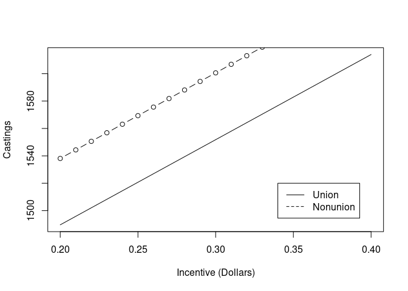
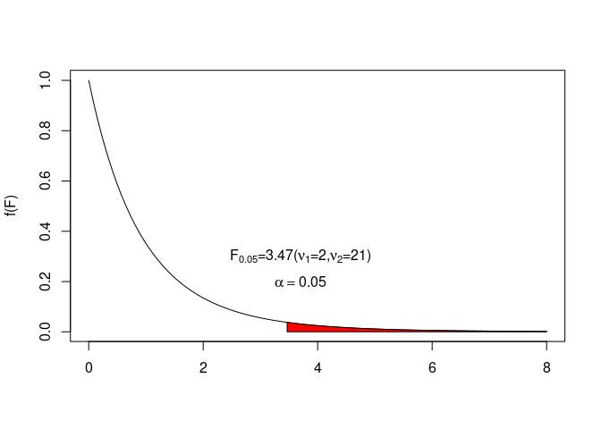

# Task 1


```r
getwd()
```

```
## [1] "/home/collindabbieri/Documents/AppliedRegressionAnalysis/Labs/Lab8"
```

# Task 2

Do example 12.5 in R pg 669, answer parts a and b


```r
Kansas=c(198,126,443,570,286,184,105,216,465,203)
Kentucky=c(563,314,483,144,585,377,264,185,330,354)
Texas=c(385,693,266,586,178,773,308,430,644,515)
x1=c()
x2=c()
cost=c()
for(i in Kansas){
  x1=append(x1,0)
  x2=append(x2,0)
  cost=append(cost,i)
}
for(i in Kentucky){
  x1=append(x1,1)
  x2=append(x2,0)
  cost=append(cost,i)
}
for(i in Texas){
  x1=append(x1,0)
  x2=append(x2,1)
  cost=append(cost,i)
}
head(x1)
```

```
## [1] 0 0 0 0 0 0
```

```r
head(x2)
```

```
## [1] 0 0 0 0 0 0
```

```r
head(cost)
```

```
## [1] 198 126 443 570 286 184
```

```r
tail(x1)
```

```
## [1] 0 0 0 0 0 0
```

```r
tail(x2)
```

```
## [1] 1 1 1 1 1 1
```

```r
tail(cost)
```

```
## [1] 178 773 308 430 644 515
```


## a)

Do the data provide sufficient evidence (at $\alpha=0.05$) to indicate that the mean annual maintenance costs accrued by system users differ for the three state installations


```r
model=lm(cost~x1+x2)
summary(model)
```

```
## 
## Call:
## lm(formula = cost ~ x1 + x2)
## 
## Residuals:
##     Min      1Q  Median      3Q     Max 
## -299.80  -95.83  -37.90  153.32  295.20 
## 
## Coefficients:
##             Estimate Std. Error t value Pr(>|t|)    
## (Intercept)   279.60      53.43   5.233 1.63e-05 ***
## x1             80.30      75.56   1.063   0.2973    
## x2            198.20      75.56   2.623   0.0141 *  
## ---
## Signif. codes:  0 '***' 0.001 '**' 0.01 '*' 0.05 '.' 0.1 ' ' 1
## 
## Residual standard error: 168.9 on 27 degrees of freedom
## Multiple R-squared:  0.205,	Adjusted R-squared:  0.1462 
## F-statistic: 3.482 on 2 and 27 DF,  p-value: 0.04515
```

Because Kansas is our baseline, $\beta_1=\mu_{Kentucky}-\mu_{Kansas}$ and $\beta_2=\mu_{Texas}-\mu_{Kansas}$. The NULL for the F-test is $H_0:\beta_1=\beta_2=0$, plugging in $\beta_1$ and $\beta_2$, $H_0:\mu_{Kentucky}-\mu_{Kansas}=\mu_{Texas}-\mu_{Kansas}$ => $H_0:\mu_{Kentucky}=\mu_{Texas}=\mu_{Kansas}$. So the F test tests the NULL hypothesis that the mean annual maintenance costs accrued are the same for the three locations. Because our p-value is less than 0.05, we can reject the NULL and say with 95% confidence that the mean annual maintenance costs differ for the three state installations.

## b)

Find and interpret a 95% confidence interval for the difference between the mean costs in Texas and Kansas

From a) $\beta_2=\mu_{Texas}-\mu_{Kansas}$, so we need a 95% ci for $\beta_2$.


```r
library(s20x)

ciReg(model)
```

```
##             95 % C.I.lower    95 % C.I.upper
## (Intercept)      169.97892          389.2211
## x1               -74.72762          235.3276
## x2                43.17238          353.2276
```

We can say with 95% confidence that $\beta_2$ lies in the interval (43.172,353.228). We can say with 95% confidence that the mean cost of maintenance in Texas is between 43.17 and 353.23 higher than the mean cost of maintenance in Kansas.

# Task 3

Do example 12.7 pg 678, answer a, b


```r
#x1 is the incentive bonus for each casting
#x2 is 0 for union plant, 1 for nonunion plant
x1=c(0.20,0.20,0.20,0.30,0.30,0.30,0.40,0.40,0.40,0.20,0.20,0.20,0.30,0.30,0.30,0.40,0.40,0.40)
x2=c(0,0,0,0,0,0,0,0,0,1,1,1,1,1,1,1,1,1)
y=c(1435,1512,1491,1583,1529,1610,1601,1574,1636,1575,1512,1488,1635,1589,1661,1645,1616,1689)

print(length(x1))
```

```
## [1] 18
```

```r
print(length(x2))
```

```
## [1] 18
```

```r
print(length(y))
```

```
## [1] 18
```


## a) 

Fit the model to the data and graph the prediction equations for the two productivity lines.


```r
model=lm(y~x1+x2+x1:x2)
summary(model)
```

```
## 
## Call:
## lm(formula = y ~ x1 + x2 + x1:x2)
## 
## Residuals:
##     Min      1Q  Median      3Q     Max 
## -55.167 -25.792  -5.639  29.347  59.889 
## 
## Coefficients:
##             Estimate Std. Error t value Pr(>|t|)    
## (Intercept) 1365.833     51.836  26.349 2.49e-13 ***
## x1           621.667    166.723   3.729  0.00225 ** 
## x2            47.778     73.308   0.652  0.52512    
## x1:x2          3.333    235.782   0.014  0.98892    
## ---
## Signif. codes:  0 '***' 0.001 '**' 0.01 '*' 0.05 '.' 0.1 ' ' 1
## 
## Residual standard error: 40.84 on 14 degrees of freedom
## Multiple R-squared:  0.7106,	Adjusted R-squared:  0.6486 
## F-statistic: 11.46 on 3 and 14 DF,  p-value: 0.0004615
```


```r
print(model$coefficients)
```

```
## (Intercept)          x1          x2       x1:x2 
## 1365.833333  621.666667   47.777778    3.333333
```

$$\hat{y}=1,365.3+621.7x_1+47.78x_2+3.3x_1x_2$$

The prediction equation for the union plant is

$$\hat{y}_{union}=1,365.3+621.7x_1$$

The prediction equation for the nonunion plant is 

$$\hat{y}_{nonunion}=(\hat{\beta}_0+\hat{\beta_2})+(\hat{\beta_1}+\hat{\beta_3})x_1=1,413.1+625.0x_1$$


```r
x=seq(0.20,0.40,by=0.01)
plot(x,1365.3+621.7*x,type='l',xlab="Incentive (Dollars)",ylab="Castings")
lines(x,1413.1+625.0*x,type='b')
legend(0.34,1520,legend=c("Union","Nonunion"),lty=1:2)
```

<!-- -->


## b)

Do the data provide sufficient evidence to indicate that the rate of increase of worker productivity with incentive is different for union and nonunion plants? Test at $\alpha=0.10$.

We want to test $H_0:\beta_3=0$. From the model summary the p-value for the T statistic for the $\beta_3$ term is 0.989, so we fail to reject the NULL hypothesis. The data does not provide sufficient evidence that the rate of increase of worker productivity with incentive is different for union and nonunion plants.


# Task 4

Do example 12.8 pg 680, answer a-c

## a)

Write the equation of the model for E(y) that yields the response curves shown in Fig. 12.25.

$x_1$ is engine speed
$x_2$ is categorical, with $x_2=1$ if petroleum fuel, 0 if not
$x_3$ is categorical, with $x_3=1$ if coal fuel, 0 if not

The figure shows a curved relationship between E(y) and engine speed, the three lines for Petroleum, Coal and Blended are not just offset from each other (engine speed and fuel type interact)

This is a quadratic model with interaction between engine speed and fuel type

$$E(y)=\beta_0+\beta_1x_1+\beta_2x_1^2+\beta_3x_2+\beta_4x_3+\beta_5x_1x_2+\beta_6x_1x_3+\beta_7x_1^2x_2+\beta_8x_1^2x_3$$

## b)

Give the equation of the curve for petroleum fuel

Petroleum fuel has $x_2=1,x_3=0$

$$E(y)=\beta_0+\beta_1x_1+\beta_2x_1^2+\beta_3+\beta_5x_1+\beta_7x_1^2$$

$$E(y)=(\beta_0+\beta_3)+(\beta_1+\beta_5)x_1+(\beta_2+\beta_7)x_1^2$$

## c)

How would you determine whether or not the model gives a better prediction of y than the first order model of Example 12.6?

Because a first order model has fewer parameters one could see which model has a better reduced $R^2$, since that includes a penalty for having a more complicated model.


# Task 5 

Use the Ftest for nested models (anova() in R) pg 686


Reproduce the example 12.9 and produce the necessary output to calculate the F test to compare the two models.


```r
x1=c(80,80,80,80,80,80,80,80,80,90,90,90,90,90,90,90,90,90,100,100,100,100,100,100,100,100,100)
x2=c(50,50,50,55,55,55,60,60,60,50,50,50,55,55,55,60,60,60,50,50,50,55,55,55,60,60,60)
y=c(50.8,50.7,49.4,93.7,90.9,90.9,74.5,73.0,71.2,63.4,61.6,63.4,93.8,92.1,97.4,70.9,68.8,71.3,46.6,49.1,46.4,69.8,72.5,73.2,38.7,42.5,41.4)

x12=x1^2
x22=x2^2
modelc=lm(y~x1+x2+x1:x2+x12+x22)
modelr=lm(y~x1+x2+x1:x2)
```


Do the data provide sufficient evidence to indicate that the quadratic terms contribute information for the prediction of y?

$$E(y)=\beta_0+\beta_1x_1+\beta_2x_2+\beta_3x_1x_2+\beta_4x_1^2+\beta_5x_2^2$$

We need to test the NULL $H_0:\beta_4=\beta_5=0$

To do this we need a reduced model 

$$E(y)_r=\beta_0+\beta_1x_1+\beta_2x_2+\beta_3x_1x_2$$

Our F statistic is given by

$$F=\frac{\frac{SSE_r-SSE_c}{Number\: of \: \beta 's \:tested\:in\:model}}{MSE_c}$$

Where the number of $\beta$'s tested is the difference of the number of $\beta$'s tested, (k-g)=2


```r
summary(modelc)
```

```
## 
## Call:
## lm(formula = y ~ x1 + x2 + x1:x2 + x12 + x22)
## 
## Residuals:
##      Min       1Q   Median       3Q      Max 
## -2.82593 -0.95370  0.07407  1.01852  2.95185 
## 
## Coefficients:
##               Estimate Std. Error t value Pr(>|t|)    
## (Intercept) -5.128e+03  1.103e+02  -46.49  < 2e-16 ***
## x1           3.110e+01  1.344e+00   23.13  < 2e-16 ***
## x2           1.397e+02  3.140e+00   44.51  < 2e-16 ***
## x12         -1.334e-01  6.853e-03  -19.46 6.46e-15 ***
## x22         -1.144e+00  2.741e-02  -41.74  < 2e-16 ***
## x1:x2       -1.455e-01  9.692e-03  -15.01 1.06e-12 ***
## ---
## Signif. codes:  0 '***' 0.001 '**' 0.01 '*' 0.05 '.' 0.1 ' ' 1
## 
## Residual standard error: 1.679 on 21 degrees of freedom
## Multiple R-squared:  0.993,	Adjusted R-squared:  0.9913 
## F-statistic: 596.3 on 5 and 21 DF,  p-value: < 2.2e-16
```


```r
resc=modelc$residuals
resc2=resc^2
resr=modelr$residuals
resr2=resr^2
SSEr=sum(resr2)
SSEc=sum(resc2)
MSEc=mean(resc2)

F_val=((SSEr-SSEc)/2)/(MSEc)
F_val
```

```
## [1] 1363.546
```

```r
qf(0.95,2,21)
```

```
## [1] 3.4668
```

For $\alpha=0.05$, the rejection region is given by all F values greater than 3.47. Our F value is much larger than that so we are in the rejection region. Therefore we can reject the NULL $H_0:\beta_4=\beta_5=0$. Meaning the data does provide evidence that the quadratic terms contribute information to the prediction of y.


Reproduce the plot page 688


```r
library(latex2exp)
x=seq(0,8,length.out=100)
y_plot=c()
for(i in x){
  y_plot=append(y_plot,df(i,2,21))
}
x_reject=qf(0.95,2,21)
print(x_reject)
```

```
## [1] 3.4668
```

```r
plot(x,y_plot,type='l',ylab="f(F)",xlab='')

curve=seq(x_reject,8,length.out=100)
x_shade=c(x_reject)
y_shade=c(0)
for(i in curve){
  x_shade=append(x_shade,i)
  y_shade=append(y_shade,df(i,2,21))
}
x_shade=append(x_shade,8)
y_shade=append(y_shade,0)
polygon(x_shade,y_shade,col='red')
text(x=3.7,y=0.2,labels=TeX('$\\alpha = 0.05$'))
text(3.7,0.3,labels=TeX('$F_{0.05}=3.47(\\nu_1=2,\\nu_2=21)$'))
```

<!-- -->


Make your own function to calculate F by retrieving information from the two lm models
Hint: Use summary(y.lm) call the function myF()


```r
# MyF takes data from two quantitative independent variables and one quantitative dependent variable
# it creates two models, one linear model with interaction, and one quadratic model with interaction
# it computes an F statistic that can be used to determine if the quadratic terms are necessary
myF=function(x1,x2,y){
  x12=x1^2
  x22=x2^2
  modelc=lm(y~x1+x2+x1:x2+x12+x22)
  modelr=lm(y~x1+x2+x1:x2)
  
  resc=modelc$residuals
  resc2=resc^2
  resr=modelr$residuals
  resr2=resr^2
  SSEr=sum(resr2)
  SSEc=sum(resc2)
  MSEc=mean(resc2)
  
  F_val=((SSEr-SSEc)/2)/(MSEc)
  
  return(list(F_statistic=F_val))
  
}
```


Use myF to calculate the F of example 12.9


```r
myF(x1,x2,y)
```

```
## $F_statistic
## [1] 1363.546
```


# Task 6

Write a paragraph in your own words about AIC

The Akaike information criterion is given by

$$AIC=2k-2ln(\hat{L})$$

where k is the number of parameters and $\hat{L}$ is the maximum value of the likelihood function for the model. The better model will have the lower AIC. We can see that this is similar to reduced $R^2$ because it also includes a penalty for model complexity. A single AIC value has no absolute meaning, as it is only used to compare different models. In particular, the AIC attempts to estimate the amount of information lost by a model, relative to other models. You choose the model that loses the least information, the model with the minimum AIC.

Use AIC criterion to do a stepwise regression shown in Example 12.10 using R (see code in Lab8.R)


```r
library(readxl)
civileng=read_excel("../../Dataxls/Excel/CIVILENG.XLS")
civileng=civileng[,-1]
head(civileng)
```

```
## # A tibble: 6 x 11
##   LNSalary    X1    X2    X3    X4    X5    X6    X7    X8    X9   X10
##      <dbl> <dbl> <dbl> <dbl> <dbl> <dbl> <dbl> <dbl> <dbl> <dbl> <dbl>
## 1     11.4    12    15     1   240   170     1    44     5     0    21
## 2     11.8    25    14     1   510   160     1    53     9     0    28
## 3     11.4    20    14     0   370   170     1    56     5     0    26
## 4     11.2     3    19     1   170   170     1    26     9     0    24
## 5     11.7    19    12     1   520   150     1    43     7     0    27
## 6     11.2    14    13     0   420   160     1    53     9     0    27
```


```r
library(leaps)
null = lm(LNSalary~ 1, data = civileng)
full = lm(LNSalary ~ ., data = civileng)
step(null, scope=list(lower=null, upper=full), direction="forward")
```

```
## Start:  AIC=-268.57
## LNSalary ~ 1
## 
##        Df Sum of Sq    RSS     AIC
## + X1    1    4.1364 2.5462 -363.06
## + X7    1    2.6488 4.0338 -317.05
## + X3    1    1.0492 5.6335 -283.64
## + X2    1    0.3264 6.3563 -271.57
## + X4    1    0.2897 6.3930 -271.00
## + X5    1    0.2774 6.4052 -270.81
## <none>              6.6827 -268.57
## + X10   1    0.0201 6.6625 -266.87
## + X8    1    0.0181 6.6646 -266.84
## + X6    1    0.0169 6.6657 -266.82
## + X9    1    0.0002 6.6824 -266.57
## 
## Step:  AIC=-363.06
## LNSalary ~ X1
## 
##        Df Sum of Sq    RSS     AIC
## + X3    1   0.87027 1.6760 -402.88
## + X2    1   0.32522 2.2210 -374.72
## + X4    1   0.31253 2.2337 -374.15
## + X5    1   0.26811 2.2781 -372.18
## <none>              2.5462 -363.06
## + X6    1   0.04591 2.5003 -362.87
## + X10   1   0.04132 2.5049 -362.69
## + X8    1   0.01466 2.5316 -361.63
## + X7    1   0.00843 2.5378 -361.39
## + X9    1   0.00381 2.5424 -361.21
## 
## Step:  AIC=-402.88
## LNSalary ~ X1 + X3
## 
##        Df Sum of Sq    RSS     AIC
## + X4    1   0.60068 1.0753 -445.26
## + X2    1   0.28150 1.3945 -419.27
## + X5    1   0.19195 1.4840 -413.04
## + X6    1   0.10205 1.5739 -407.16
## <none>              1.6760 -402.88
## + X8    1   0.00735 1.6686 -401.32
## + X10   1   0.00137 1.6746 -400.96
## + X9    1   0.00022 1.6757 -400.89
## + X7    1   0.00000 1.6760 -400.88
## 
## Step:  AIC=-445.26
## LNSalary ~ X1 + X3 + X4
## 
##        Df Sum of Sq     RSS     AIC
## + X2    1   0.45697 0.61832 -498.59
## + X5    1   0.11593 0.95936 -454.67
## + X6    1   0.02841 1.04688 -445.94
## <none>              1.07529 -445.26
## + X7    1   0.00623 1.06906 -443.84
## + X8    1   0.00622 1.06907 -443.84
## + X10   1   0.00044 1.07485 -443.30
## + X9    1   0.00003 1.07526 -443.26
## 
## Step:  AIC=-498.59
## LNSalary ~ X1 + X3 + X4 + X2
## 
##        Df Sum of Sq     RSS     AIC
## + X5    1  0.087902 0.53041 -511.93
## <none>              0.61832 -498.59
## + X6    1  0.009688 0.60863 -498.17
## + X9    1  0.002451 0.61587 -496.99
## + X8    1  0.001376 0.61694 -496.82
## + X7    1  0.000343 0.61797 -496.65
## + X10   1  0.000000 0.61832 -496.59
## 
## Step:  AIC=-511.93
## LNSalary ~ X1 + X3 + X4 + X2 + X5
## 
##        Df Sum of Sq     RSS     AIC
## <none>              0.53041 -511.93
## + X9    1 0.0092875 0.52113 -511.69
## + X6    1 0.0037568 0.52666 -510.64
## + X10   1 0.0003588 0.53006 -509.99
## + X8    1 0.0002463 0.53017 -509.97
## + X7    1 0.0000122 0.53040 -509.93
```

```
## 
## Call:
## lm(formula = LNSalary ~ X1 + X3 + X4 + X2 + X5, data = civileng)
## 
## Coefficients:
## (Intercept)           X1           X3           X4           X2  
##   9.9619345    0.0272762    0.2246932    0.0005244    0.0290921  
##          X5  
##   0.0019623
```

```r
step(full, data=cast, direction="backward")
```

```
## Start:  AIC=-504.84
## LNSalary ~ X1 + X2 + X3 + X4 + X5 + X6 + X7 + X8 + X9 + X10
## 
##        Df Sum of Sq     RSS     AIC
## - X10   1   0.00063 0.51583 -506.71
## - X7    1   0.00073 0.51593 -506.70
## - X8    1   0.00153 0.51673 -506.54
## - X6    1   0.00482 0.52002 -505.91
## - X9    1   0.00984 0.52504 -504.94
## <none>              0.51520 -504.84
## - X5    1   0.08810 0.60330 -491.05
## - X2    1   0.41581 0.93102 -447.66
## - X4    1   0.63133 1.14653 -426.84
## - X3    1   0.99872 1.51393 -399.05
## - X1    1   1.43512 1.95032 -373.72
## 
## Step:  AIC=-506.71
## LNSalary ~ X1 + X2 + X3 + X4 + X5 + X6 + X7 + X8 + X9
## 
##        Df Sum of Sq     RSS     AIC
## - X7    1   0.00050 0.51633 -508.62
## - X8    1   0.00149 0.51732 -508.43
## - X6    1   0.00448 0.52031 -507.85
## - X9    1   0.00992 0.52575 -506.81
## <none>              0.51583 -506.71
## - X5    1   0.08769 0.60352 -493.01
## - X2    1   0.41593 0.93176 -449.59
## - X4    1   0.63878 1.15461 -428.14
## - X3    1   1.03375 1.54959 -398.72
## - X1    1   1.52826 2.04409 -371.02
## 
## Step:  AIC=-508.62
## LNSalary ~ X1 + X2 + X3 + X4 + X5 + X6 + X8 + X9
## 
##        Df Sum of Sq    RSS     AIC
## - X8    1    0.0015 0.5178 -510.33
## - X6    1    0.0040 0.5203 -509.85
## - X9    1    0.0096 0.5260 -508.77
## <none>              0.5163 -508.62
## - X5    1    0.0898 0.6061 -494.58
## - X2    1    0.4243 0.9406 -450.64
## - X4    1    0.6384 1.1547 -430.13
## - X3    1    1.0503 1.5666 -399.62
## - X1    1    3.9764 4.4927 -294.27
## 
## Step:  AIC=-510.33
## LNSalary ~ X1 + X2 + X3 + X4 + X5 + X6 + X9
## 
##        Df Sum of Sq    RSS     AIC
## - X6    1    0.0033 0.5211 -511.69
## - X9    1    0.0089 0.5267 -510.64
## <none>              0.5178 -510.33
## - X5    1    0.0885 0.6064 -496.55
## - X2    1    0.4230 0.9408 -452.62
## - X4    1    0.6420 1.1598 -431.69
## - X3    1    1.0490 1.5668 -401.61
## - X1    1    3.9749 4.4927 -296.27
## 
## Step:  AIC=-511.69
## LNSalary ~ X1 + X2 + X3 + X4 + X5 + X9
## 
##        Df Sum of Sq    RSS     AIC
## - X9    1    0.0093 0.5304 -511.93
## <none>              0.5211 -511.69
## - X5    1    0.0947 0.6159 -496.99
## - X2    1    0.4347 0.9558 -453.04
## - X4    1    0.6868 1.2079 -429.63
## - X3    1    1.0466 1.5677 -403.55
## - X1    1    3.9718 4.4929 -298.27
## 
## Step:  AIC=-511.93
## LNSalary ~ X1 + X2 + X3 + X4 + X5
## 
##        Df Sum of Sq    RSS     AIC
## <none>              0.5304 -511.93
## - X5    1    0.0879 0.6183 -498.59
## - X2    1    0.4289 0.9594 -454.67
## - X4    1    0.6908 1.2212 -430.53
## - X3    1    1.0656 1.5961 -403.76
## - X1    1    3.9627 4.4932 -300.26
```

```
## 
## Call:
## lm(formula = LNSalary ~ X1 + X2 + X3 + X4 + X5, data = civileng)
## 
## Coefficients:
## (Intercept)           X1           X2           X3           X4  
##   9.9619345    0.0272762    0.0290921    0.2246932    0.0005244  
##          X5  
##   0.0019623
```


We can see that both forward and backward regression pick the model that includes X1, X2, X3, X4, and X5 as the lowest AIC model. Our final model should only include these variables.

