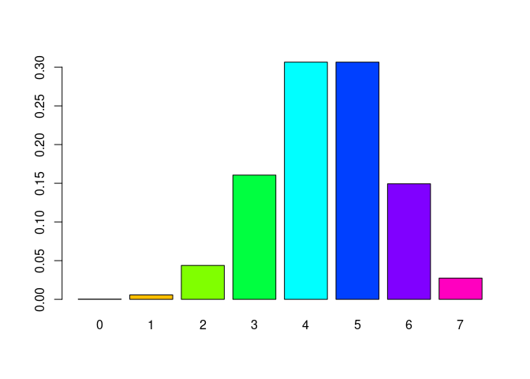

# Introduction

You will need to be able to conduct analyses for one and two way tables.

All theory needs to be understood and applied.

# Problems

1. Conduct the analyses needed to answer 9.23 "Cry Wolf" using the usual chi-square methodology taught


```r
cryw = matrix(c(3,231,
                37,166), nr=2,nc=2, byrow=TRUE)
rownames(cryw)= c("TRUE_Alert", "FALSE_Alert")
colnames(cryw)= c("NoResp", "Resp")
cryw
```

```
##             NoResp Resp
## TRUE_Alert       3  231
## FALSE_Alert     37  166
```

```r
crywtab=as.table(cryw)
chisq.test(crywtab,correct = FALSE)
```

```
## 
## 	Pearson's Chi-squared test
## 
## data:  crywtab
## X-squared = 37.532, df = 1, p-value = 8.992e-10
```

According to the $\chi ^2$ test, we can reject the NULL, that the alert and the response are independent, as implausible at the 0.05 level. However, less than 80% of the cells have values $\geq 5$, which violates an assumption of the $\chi ^2$ test.


2. Do the same analysis using the exact fisher test `fisher.test()`


```r
fisher.test(cryw)
```

```
## 
## 	Fisher's Exact Test for Count Data
## 
## data:  cryw
## p-value = 2.549e-10
## alternative hypothesis: true odds ratio is not equal to 1
## 95 percent confidence interval:
##  0.01137333 0.18980711
## sample estimates:
## odds ratio 
## 0.05856263
```

According to the exact fisher test, we reject the NULL hypothesis that the type of alert and the response are independent as implausible.

3. Now perform the HIV test as done in Chapter 9 except use chi square methods and the  following code:

```r
## HIV testing
tab = matrix(c(9,22,
               5,2),
             nr=2,
             nc=2, 
             byrow = TRUE)
rownames(tab)=c("unvacc","vacc")
colnames(tab) = c("Neg", "Pos")
tab
```

```
##        Neg Pos
## unvacc   9  22
## vacc     5   2
```

```r
tab=as.table(tab)
chisq.test(tab,cor=FALSE)
```

```
## Warning in chisq.test(tab, cor = FALSE): Chi-squared approximation may be
## incorrect
```

```
## 
## 	Pearson's Chi-squared test
## 
## data:  tab
## X-squared = 4.4112, df = 1, p-value = 0.0357
```
According to the $\chi ^2$ test, we reject the NULL hypothesis that the two variables are independent as implausible at the 0.05 level.

  + What is the problem with the test?
  
  Less than 80% of the cells have values $\geq 5$, which violates an assumption for the $\chi ^2$ test. 
  
  + Use the following code to conduct the exact Fisher test after you have adjusted it to calculate the correct Pvalue (see the BOOK about this point)
  
  The probability of the contingency table, assuming the NULL hypothesis is true, is 
  

```r
dhyper(9,31,7,14)
```

```
## [1] 0.04378295
```
  
When we calculate the p value, we'll sum all probabilities less than this observed probability. Because the book wants a one-sided test, we'll break when the probability becomes greater than the observed probability.
  

```r
myfisher = function(mat, alpha=0.05){
  rs=rowSums(mat)
  cs=colSums(mat)

  tabprob=dhyper(x=mat[1,1],m=rs[1],n=rs[2],k=cs[1])
  print(tabprob)

  pv=vector(mode="double", length=rs[2]+1)
  for(i in 1:(rs[2]+1)){
    pv[i]=dhyper(x=i-1,m=rs[2],n=rs[1],k=cs[2])
  }
  names(pv)=0:rs[2]
  barplot(pv,col=rainbow(rs[2]+1))
  # the p-value is the probability of observing a result at least as contradictory to the NULL as the observed contingency table, so we sum the p-values that are less than the observed p-value
  v = sum(pv[pv<=tabprob])
  pv_short=c()
  for(i in pv){
    if(round(i,3)<=round(tabprob,3)){
      pv_short=append(pv_short,i)
    if (i>tabprob){
      break
    }
    }
  }
  v=sum(pv_short)
  print(pv_short)
  list(pvals=pv,pval=v, test = ifelse(v > alpha, "accept", "reject"))
}

myfisher(tab)
```

```
## [1] 0.04378295
```

<!-- -->

```
## [1] 0.0002719438 0.0057108192 0.0437829470
```

```
## $pvals
##            0            1            2            3            4 
## 0.0002719438 0.0057108192 0.0437829470 0.1605374725 0.3064806292 
##            5            6            7 
## 0.3064806292 0.1493110758 0.0274244833 
## 
## $pval
## [1] 0.04976571
## 
## $test
## [1] "reject"
```
  
According to the Fisher exact test, we reject the NULL hypothesis of independence as implausible at the 0.05 level.
